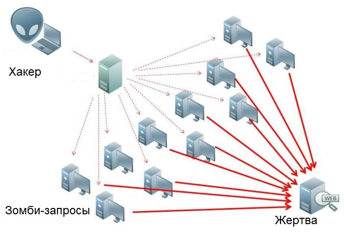
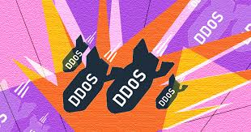
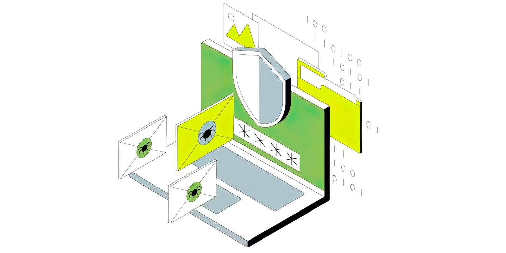

---
## Front matter
lang: ru-RU
title: DoS методы обнаружения DoS-атак и средства защиты от них.
subtitle: Основы информационной безопасности 
author:
  - Лисенков Е.Р.
institute:
  - Российский университет дружбы народов, Москва, Россия

## i18n babel
babel-lang: russian
babel-otherlangs: english

## Formatting pdf
toc: false
toc-title: Содержание
slide_level: 2
aspectratio: 169
section-titles: true
theme: metropolis
header-includes:
 - \metroset{progressbar=frametitle,sectionpage=progressbar,numbering=fraction}
 - '\makeatletter'
 - '\beamer@ignorenonframefalse'
 - '\makeatother'
---

# Информация

## Докладчик

:::::::::::::: {.columns align=center}
::: {.column width="70%"}

  * Лисенков Егор Романович
  * студент
  * Российский университет дружбы народов
  * [1132232881@rudn.ru](mailto:1132232881@rudn.ru)
  * <https://github.com/erlisenkov>

:::
::: {.column width="30%"}

:::
::::::::::::::

# Вводная часть

## Цель работы

Рассмотреть основные типы DoS-атак, методы их обнаружения и способы защиты.

## Актуальность темы
В условиях роста кибератак понимание DoS-атак и методов защиты становится критически важным для обеспечения безопасности сетей и сервисов.

## Введение

Сегодня мы поговорим о DoS-атаках, методах их обнаружения и средствах защиты. Тема актуальна, так как с ростом цифровизации увеличивается и количество кибератак, направленных на нарушение доступности сервисов. Цель этой презентации — разобраться, как работают DoS-атаки, как их можно обнаружить и какие меры защиты существуют. (рис. 1)

{#fig:001 width=100%}

## Что такое DoS-атака?

DoS-атака, или атака на отказ в обслуживании, — это кибератака, целью которой является нарушение доступности сервиса или ресурса для легитимных пользователей. Злоумышленники пытаются перегрузить сервер, сеть или приложение, чтобы сделать их недоступными. Например, это может быть перегрузка канала связи или исчерпание ресурсов сервера, таких как память или процессор.

{#fig:002 width=100%}

## Типы DoS-атак

DoS-атаки можно разделить на несколько типов. Классическая DoS-атака исходит от одного источника, например, когда злоумышленник отправляет огромное количество запросов на сервер. Более сложный тип — это DDoS-атака, которая использует множество источников, таких как ботнет, координирующий атаку с тысяч устройств. Также существуют атаки на уровне приложений, например, HTTP-флуд или Slowloris, которые эксплуатируют уязвимости в программном обеспечении.

{#fig:003 width=100%}

## Методы обнаружения DoS-атак

Для обнаружения DoS-атак используются различные методы. Один из них — анализ сетевого трафика, который позволяет выявить аномалии в объеме данных. Для этого часто применяются системы обнаружения вторжений (IDS). Другой метод — мониторинг ресурсов сервера, таких как использование CPU, памяти и дискового пространства. Также полезен статистический анализ, который сравнивает текущие показатели с историческими данными для выявления отклонений.

{#fig:004 width=100%}

## Средства защиты от DoS-атак

Для защиты от DoS-атак существует несколько подходов. Один из них — фильтрация трафика с помощью брандмауэров и систем предотвращения вторжений (IPS). Другой способ — ограничение количества запросов от одного IP-адреса, что помогает снизить нагрузку на сервер. Также эффективна балансировка нагрузки, которая распределяет трафик между несколькими серверами, чтобы избежать перегрузки.

{#fig:005 width=100%}

## Использование CDN

Один из современных способов защиты — это использование CDN, или сети доставки контента. CDN состоит из распределенных серверов, которые помогают справляться с нагрузкой, фильтруя вредоносные запросы и ускоряя доставку контента. Это не только повышает производительность, но и обеспечивает дополнительный уровень безопасности.

{#fig:005 width=100%}

## Облачные решения для защиты

Многие облачные провайдеры предлагают встроенные механизмы защиты от DoS-атак. Например, AWS Shield, Cloudflare и Google Cloud Armor предоставляют масштабируемые решения, которые автоматически обновляются для противодействия новым угрозам. Использование облачных технологий позволяет организациям сосредоточиться на своих задачах, не беспокоясь о кибербезопасности.

{#fig:005 width=100%}

## Проактивные меры защиты

Помимо технических решений, важно принимать проактивные меры. Регулярное обновление программного обеспечения помогает устранять уязвимости, которые могут быть использованы злоумышленниками. Резервное копирование данных обеспечивает их доступность в случае атаки. Также важно обучать персонал, чтобы повысить осведомленность о киберугрозах и способах их предотвращения.

{#fig:005 width=100%}

## Примеры успешной защиты

Рассмотрим несколько примеров успешной защиты от DoS-атак. Компания X использовала Cloudflare для отражения DDoS-атаки объемом 1 Тбит/с, что позволило ей сохранить доступность своих сервисов. Организация Y внедрила систему балансировки нагрузки, что снизило время простоя на 90%. Эти кейсы показывают, что современные технологии могут эффективно противостоять даже самым мощным атакам.

{#fig:005 width=100%}

## Заключение

В заключение хочется подчеркнуть, что DoS-атаки остаются серьезной угрозой для бизнеса, но современные методы обнаружения и защиты позволяют минимизировать риски. Комплексный подход к безопасности, включающий как технические решения, так и проактивные меры, является ключом к успешной защите. Рекомендуется внедрять многоуровневую защиту и регулярно проводить аудит безопасности, чтобы быть готовым к любым угрозам.

{#fig:005 width=100%}

# Спасибо за внимание!

