---
## Front matter
lang: ru-RU
title: Лабораторная работа №1
subtitle: Основы информационной безопасности 
author:
  - Лисенков Е.Р.
institute:
  - Российский университет дружбы народов, Москва, Россия

## i18n babel
babel-lang: russian
babel-otherlangs: english

## Formatting pdf
toc: false
toc-title: Содержание
slide_level: 2
aspectratio: 169
section-titles: true
theme: metropolis
header-includes:
 - \metroset{progressbar=frametitle,sectionpage=progressbar,numbering=fraction}
 - '\makeatletter'
 - '\beamer@ignorenonframefalse'
 - '\makeatother'
---

# Информация

## Докладчик

:::::::::::::: {.columns align=center}
::: {.column width="70%"}

  * Лисенков Егор Романович
  * студент
  * Российский университет дружбы народов
  * [1132232881@rudn.ru](mailto:1132232881@rudn.ru)
  * <https://github.com/erlisenkov>

:::
::: {.column width="30%"}

:::
::::::::::::::

# Вводная часть

## Цель работы

Цель данной лабораторной работы - изучить основы программирования в оболочке ОС UNIX/Linux, научиться писать небольшие командные файлы.

# Задания

Скачать Rocky Linux на виртуальную машину.

## Выполнение лабораторной работы

## Настройка Virtual Box.

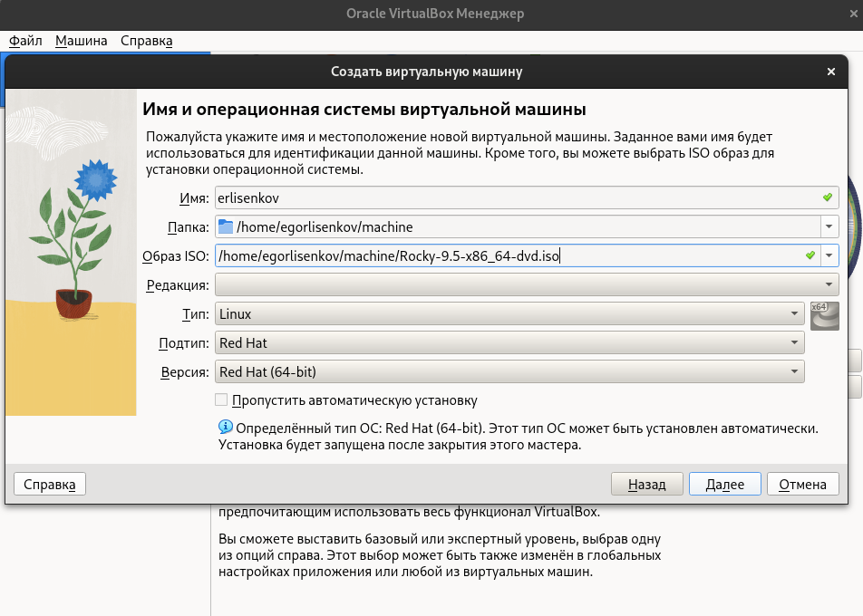{#fig:001 width=100%}

## Внутренние настройки (рис.2) 

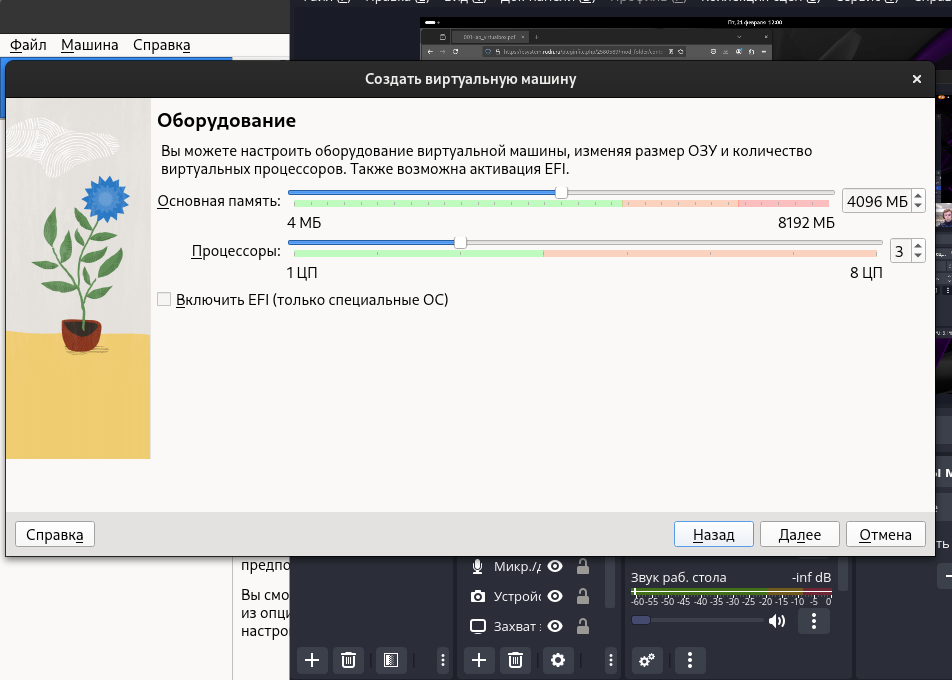{#fig:002 width=100%}

## Общая настройка (рис. 3)

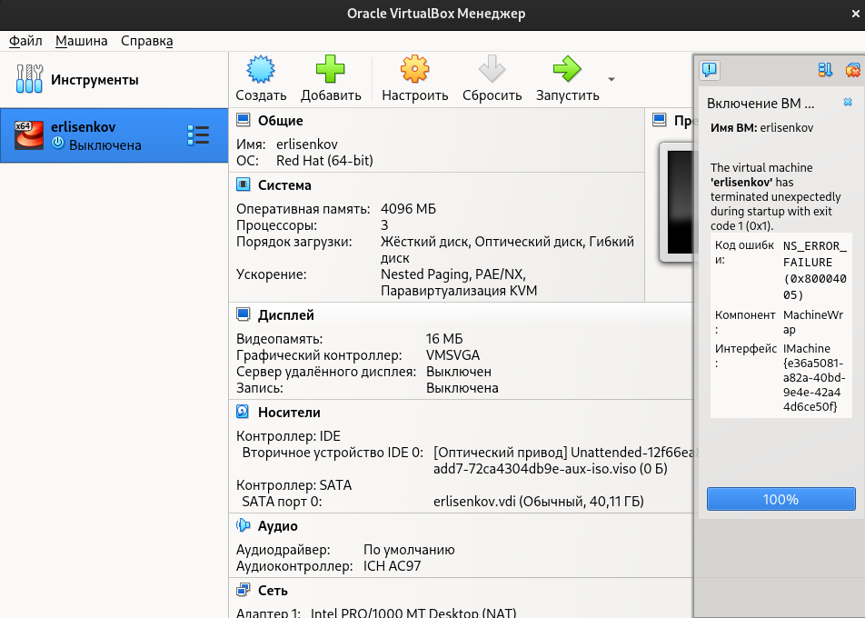{#fig:003 width=100%}

## Общая настройка (рис.4)

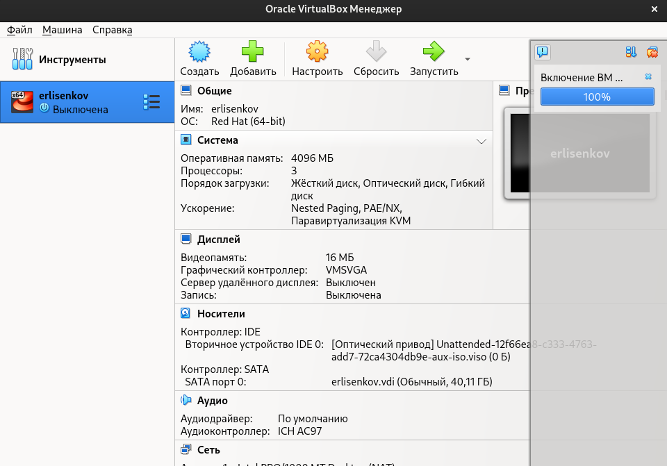{#fig:004 width=100%}

## Запуск Linux (рис.5).

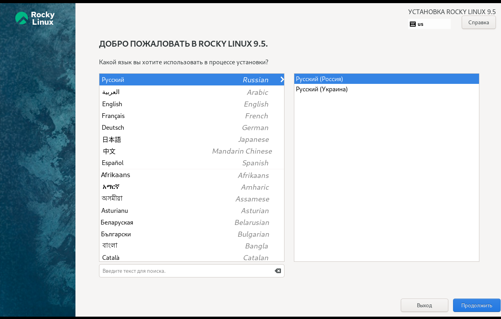{#fig:005 width=100%}

## Выбор доп ПО (рис.6)

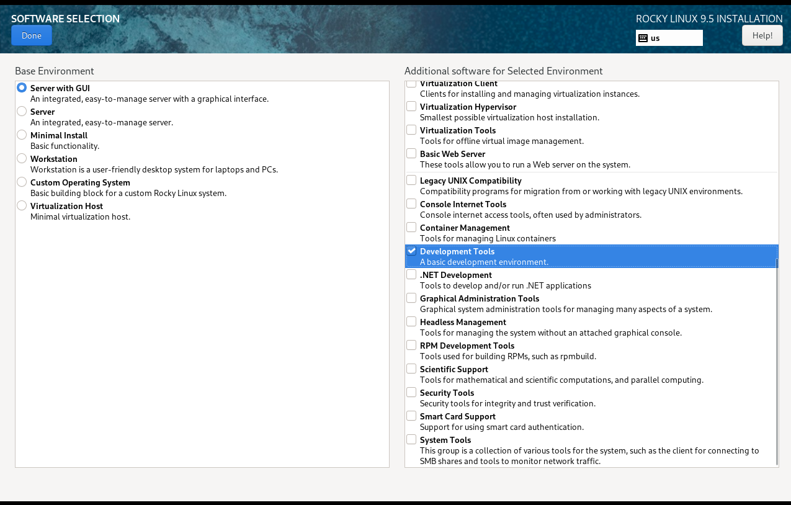{#fig:006 width=100%}

## Отключение KDUMP (рис. 7)

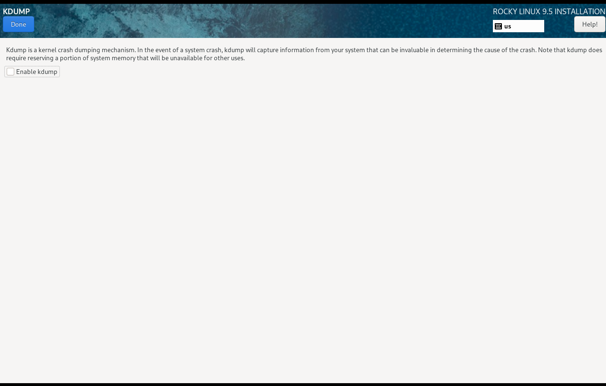{#fig:007 width=100%}

## Сеть и имя узла

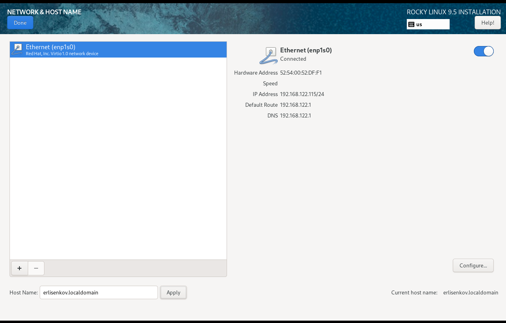{#fig:008 width=100%}

## Установка пароля для root

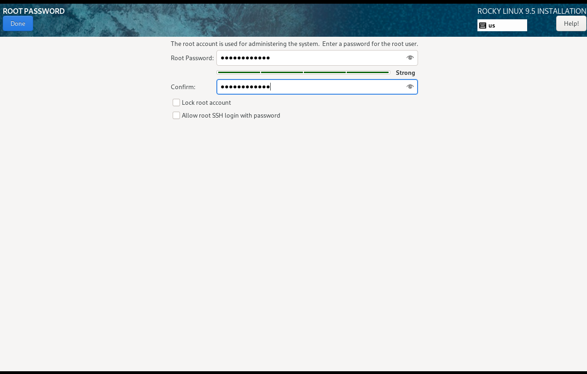{#fig:009 width=100%}

## Установка пароля для пользователя

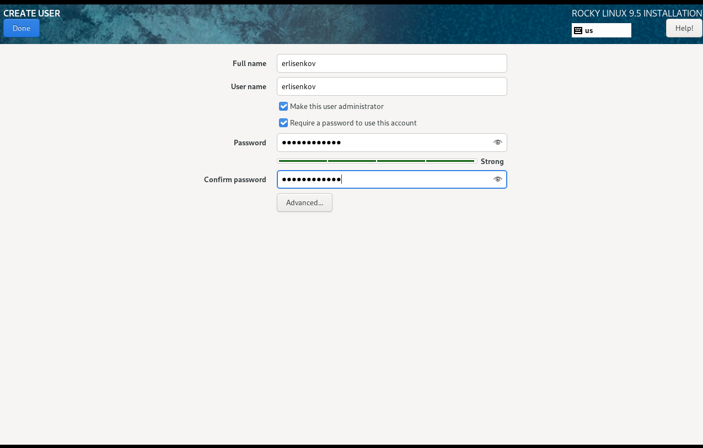{#fig:010 width=100%}

## Завершение настройки

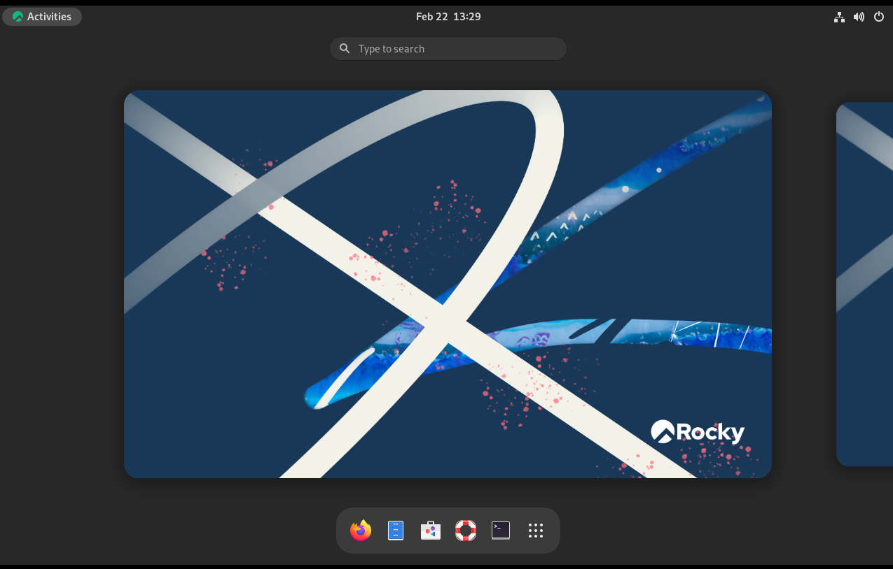{#fig:011 width=100%}

## Вывод информации о системе

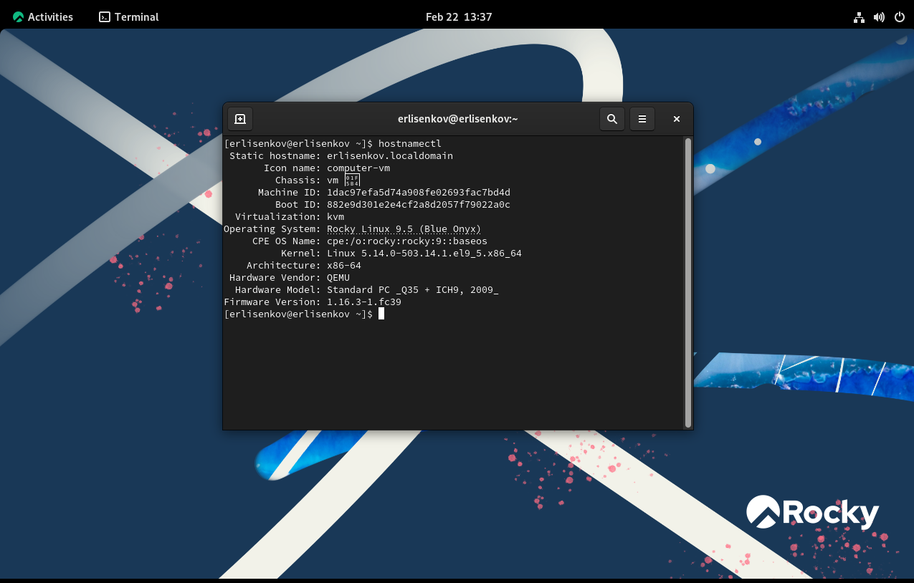{#fig:012 width=100%}

## Выполнение домашнего задания

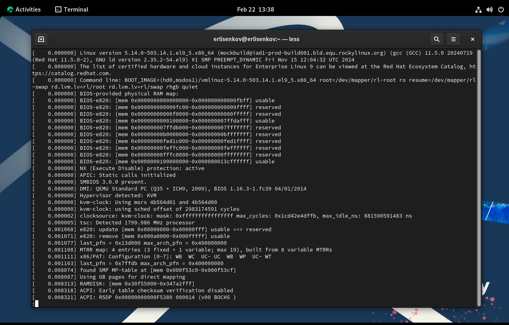{#fig:013 width=100%}

## Выполнение домашнего задания

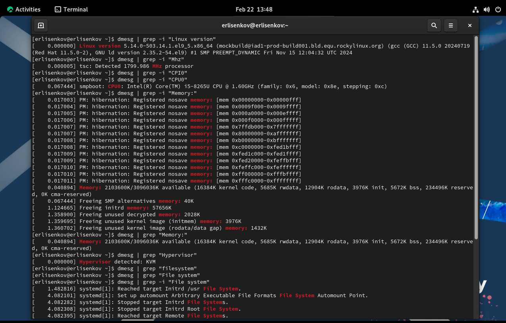{#fig:014 width=100%}

# Выводы

Я усвоил материал и готов к дальнейшему изучению линукс!
