---
## Front matter
title: "Отчёт по лабораторной работе №1"
subtitle: "Основы инфрмационной безопасности"
author: "Лисенков Е.Р."

## Generic otions
lang: ru-RU
toc-title: "Содержание"

## Bibliography
bibliography: bib/cite.bib
csl: pandoc/csl/gost-r-7-0-5-2008-numeric.csl

## Pdf output format
toc: true # Table of contents
toc-depth: 2
lof: true # List of figures
lot: true # List of tables
fontsize: 12pt
linestretch: 1.5
papersize: a4
documentclass: scrreprt
## I18n polyglossia
polyglossia-lang:
  name: russian
  options:
	- spelling=modern
	- babelshorthands=true
polyglossia-otherlangs:
  name: english
## I18n babel
babel-lang: russian
babel-otherlangs: english
## Fonts
mainfont: PT Serif
romanfont: PT Serif
sansfont: PT Sans
monofont: PT Mono
mainfontoptions: Ligatures=TeX
romanfontoptions: Ligatures=TeX
sansfontoptions: Ligatures=TeX,Scale=MatchLowercase
monofontoptions: Scale=MatchLowercase,Scale=0.9
## Biblatex
biblatex: true
biblio-style: "gost-numeric"
biblatexoptions:
  - parentracker=true
  - backend=biber
  - hyperref=auto
  - language=auto
  - autolang=other*
  - citestyle=gost-numeric
## Pandoc-crossref LaTeX customization
figureTitle: "Рис."
tableTitle: "Таблица"
listingTitle: "Листинг"
lofTitle: "Список иллюстраций"
lotTitle: "Список таблиц"
lolTitle: "Листинги"
## Misc options
indent: true
header-includes:
  - \usepackage{indentfirst}
  - \usepackage{float} # keep figures where there are in the text
  - \floatplacement{figure}{H} # keep figures where there are in the text
---

# Цель работы

Целью данной работы является приобретение практических навыков
установки операционной системы на виртуальную машину, настройки ми-
нимально необходимых для дальнейшей работы сервисов.

# Задачи

Установить Rocky Linux на виртуальную машину

# Выполнение лабораторной работы

Начинаю настройку вируальной машины, чтобы в последующем установить её (рис.1).

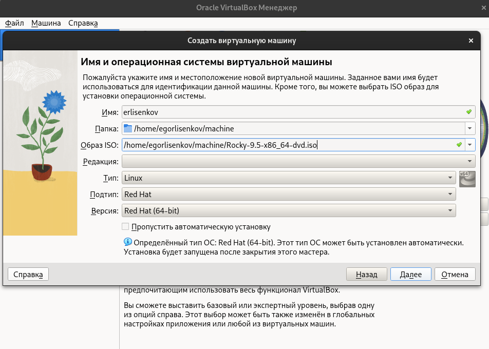{#fig:001 width=100%}

Расширяю память для виртульной машины (рис.2) 

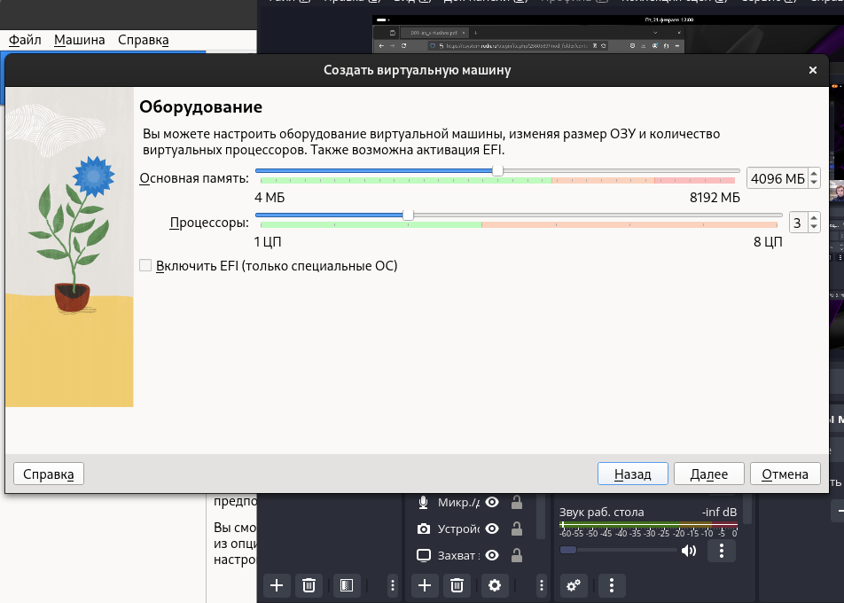{#fig:002 width=100%}

Проверяю окончательные настройки. (рис. 3)

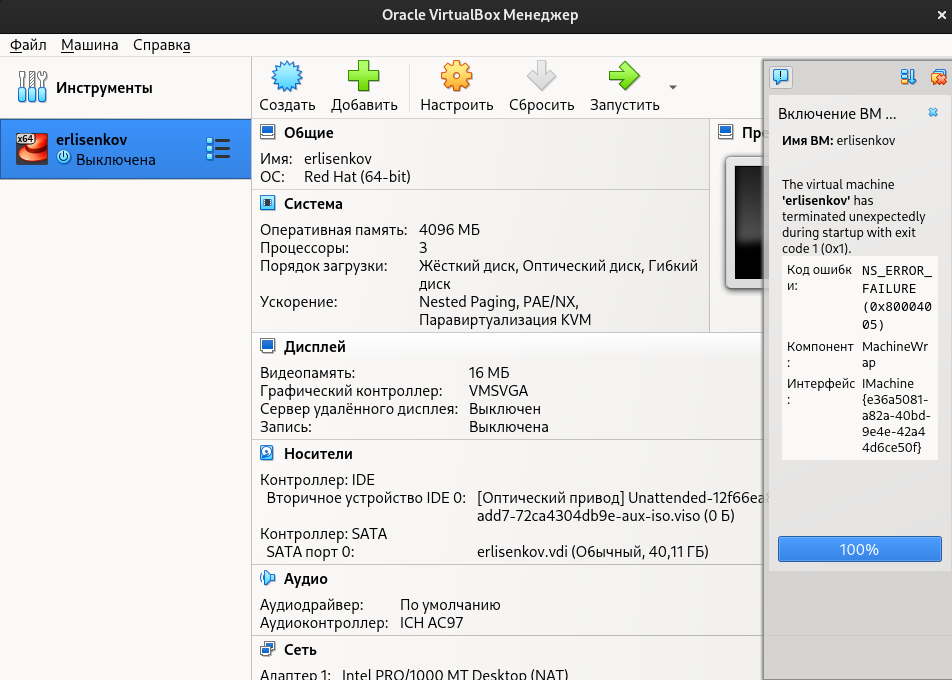{#fig:003 width=100%}

(рис.4)

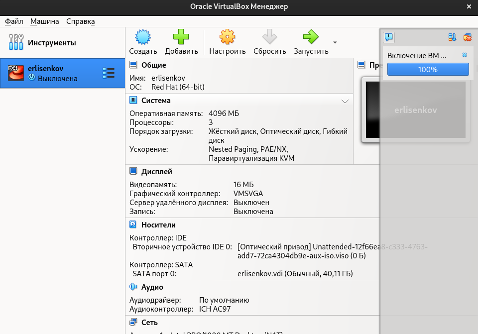{#fig:004 width=100%}

Запускаю виртуальную машину и приступаю к настройке внутренних компонентов. (рис.5).

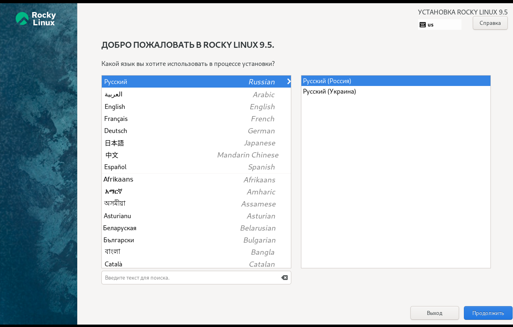{#fig:005 width=100%}

Выбираю инструмент для разработчика чтобы в будущем пользоваться всеми функциями линукса (рис.6)

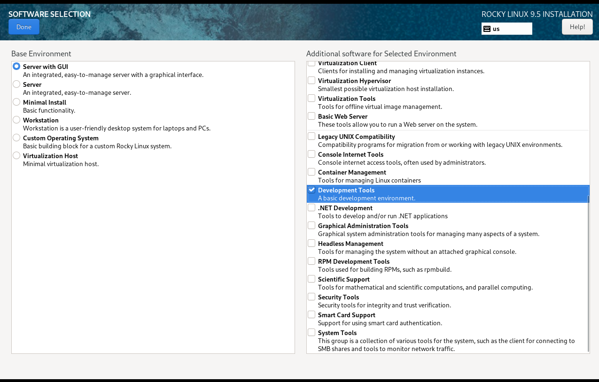{#fig:006 width=100%}

Окно настройки установки: отключение KDUMP (рис. 7)

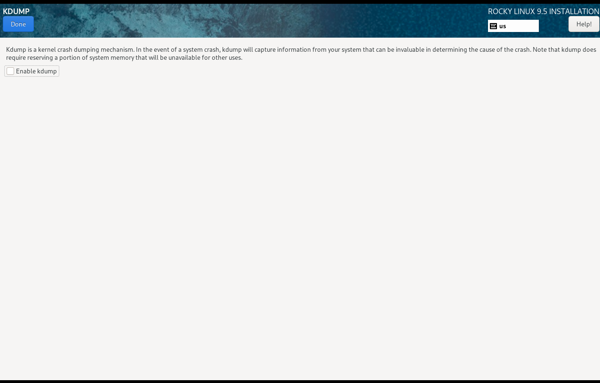{#fig:007 width=100%}

Окно настройки установки: сеть и имя узла(рис.8).

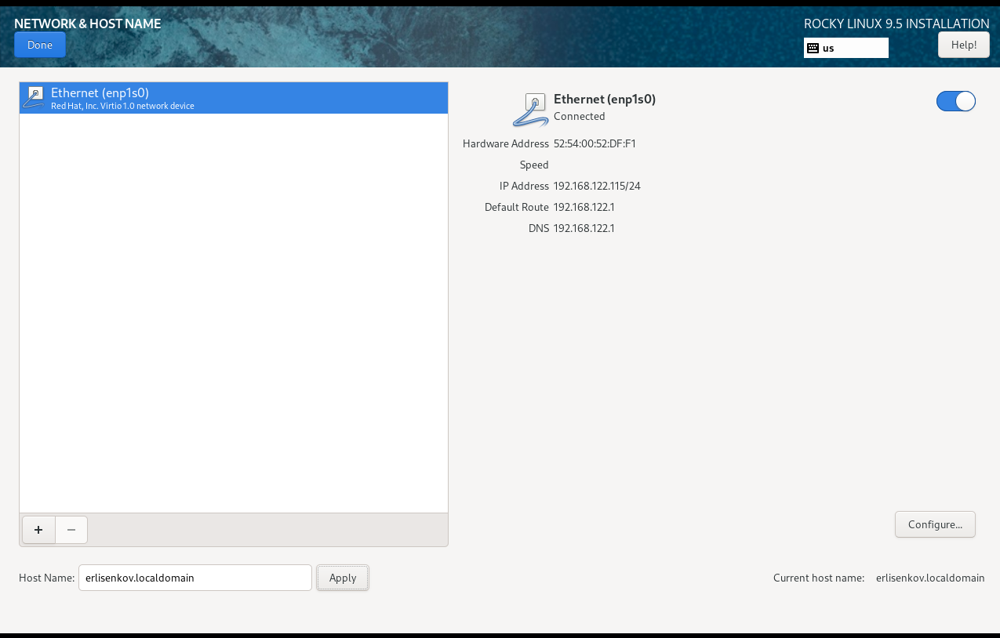{#fig:008 width=100%}

Установка пароля для root (рис.9)

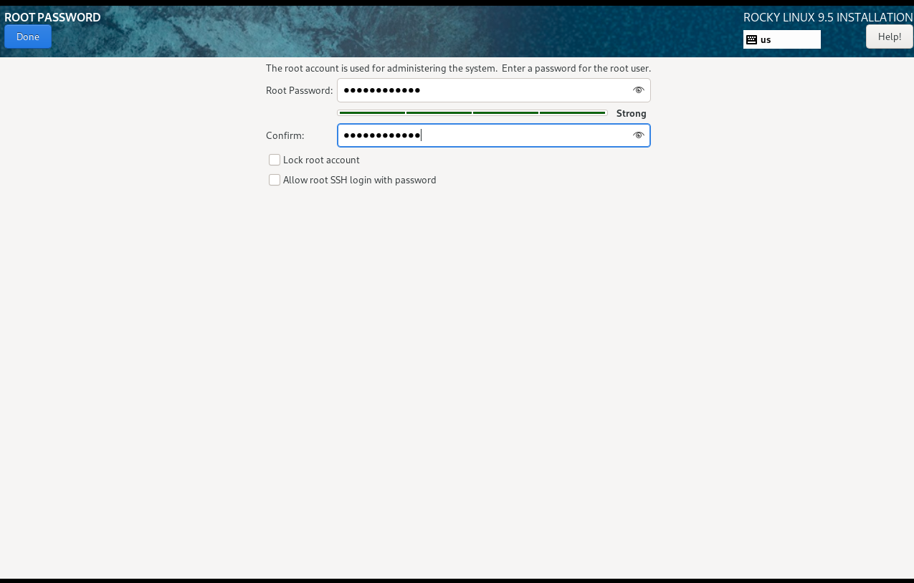{#fig:009 width=100%}

Установка пароля для пользователя с правами администратора (рис. 10)

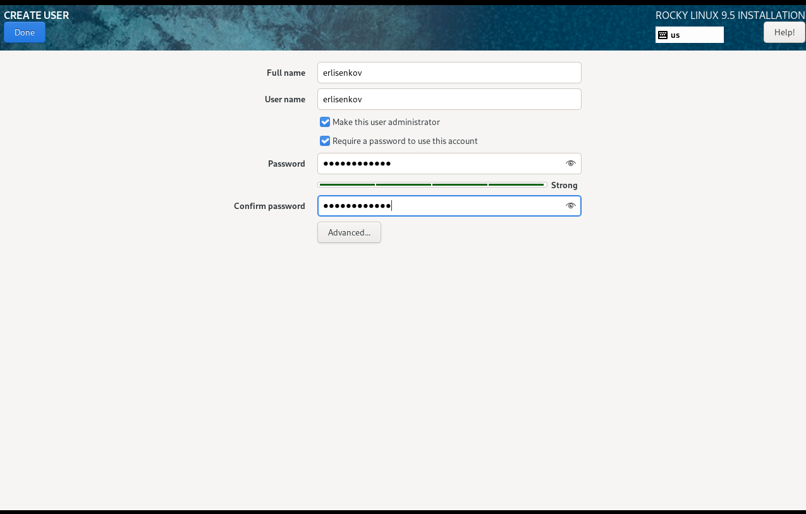{#fig:010 width=100%}

Да здравствует 52 и линукс который успешно скачался (рис. 11)

{#fig:011 width=100%}

Небольшая информация о системе, чтобы понять что мы сделали всё правильно (рис. 12)

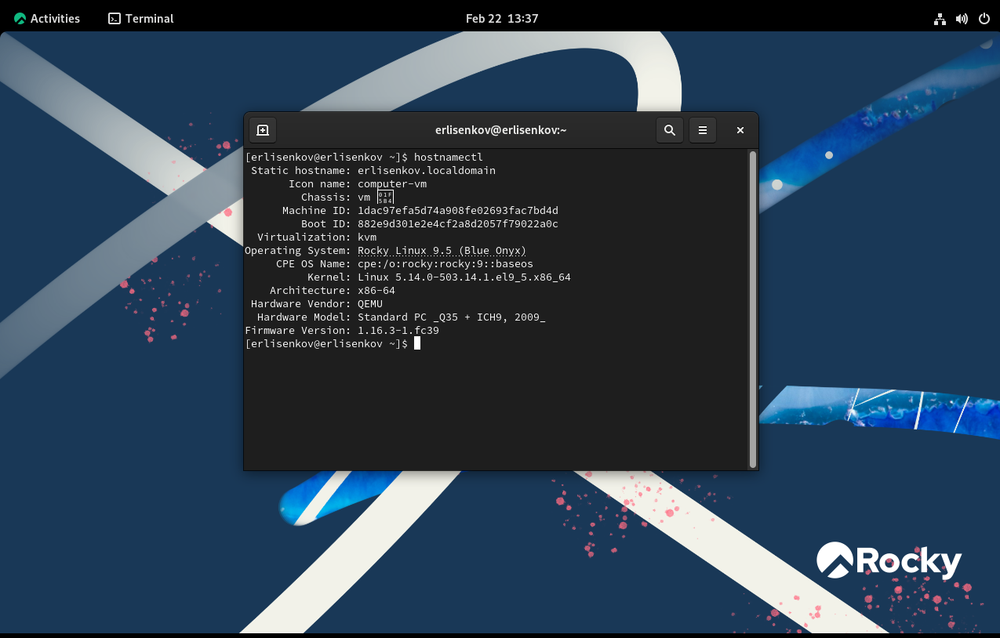{#fig:012 width=100%}

Домашняя работа (рис 13)

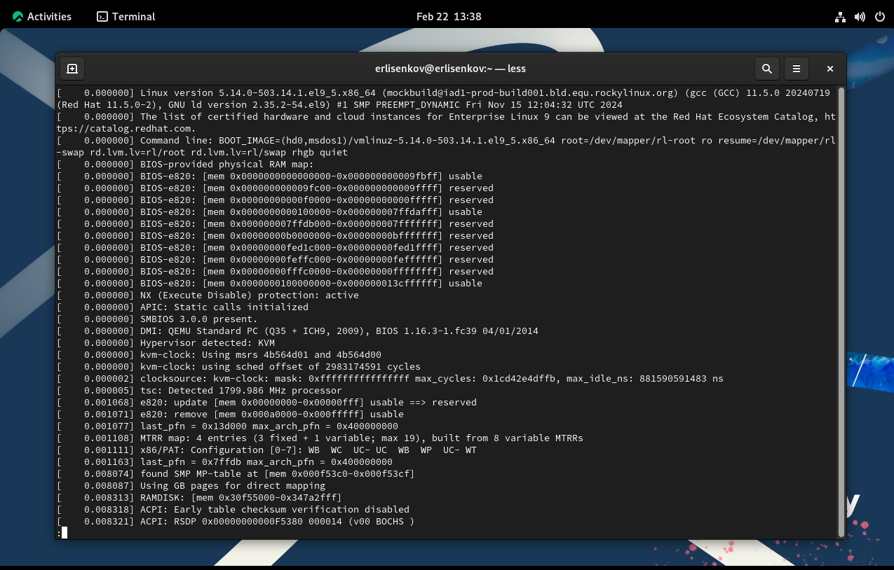{#fig:013 width=100%}

Домашняя работа (рис. 14)

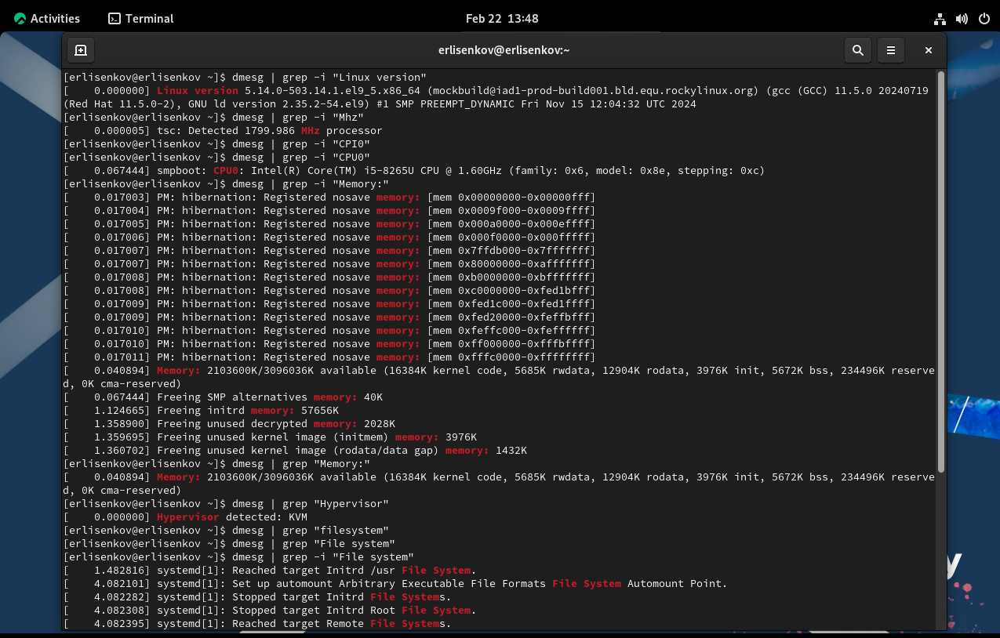{#fig:014 width=100%}

# Выводы

Я усвоил материал и готов к дальнейшему изучению линукс!

# Ответы на контрольные вопросы

## Какую информацию содержит учётная запись пользователя? 

Учётная запись пользователя в Linux содержит следующую информацию: имя пользователя (Username) — уникальное имя для идентификации пользователя; UID (User ID) — уникальный числовой идентификатор пользователя; группа (Group) — основная группа, к которой принадлежит пользователь, а также дополнительные группы; GID (Group ID) — числовой идентификатор основной группы; домашний каталог (Home Directory) — каталог, назначенный пользователю для хранения его файлов; оболочка (Shell) — команда оболочки, которая запускается при входе пользователя в систему.

## Укажите команды терминала и приведите примеры.

Для получения справки по команде используйте man <команда> или <команда> --help. Например, man ls или ls --help. Для перемещения по файловой системе используется cd <путь>, например, cd /home/user. Для просмотра содержимого каталога применяйте ls, например, ls -l /home/user. Чтобы определить объём каталога, используйте du -sh <каталог>, например, du -sh /home/user. Для создания каталогов применяйте mkdir <имя_каталога>, например, mkdir myfolder. Для создания файла используйте touch <имя_файла>, например, touch myfile.txt. Для удаления файла применяйте rm <имя_файла>, например, rm myfile.txt. Для удаления каталога используйте rmdir <имя_каталога> (если пустой) или rm -rf <имя_каталога> (рекурсивно), например, rmdir myfolder или rm -rf myfolder. Для задания прав на файл/каталог используйте chmod <права> <файл/каталог>, например, chmod 755 myfile.txt. Также можно изменить владельца и группу с помощью chown <пользователь>:<группа> <файл/каталог>, например, chown user:group myfile.txt. Для просмотра истории команд используйте history.

## Что такое файловая система? 

Приведите примеры с краткой характеристикой. Файловая система — это способ организации данных на диске или другом накопителе. Она определяет, как данные будут храниться, индексироваться и извлекаться. Примеры файловых систем: ext4 — современная файловая система Linux, поддерживающая большие тома и файлы, имеет журнал операций для надёжности; NTFS — используется в Windows, поддерживает большие файлы и шифрование; FAT32 — старая файловая система, совместимая со многими операционными системами, но с ограничением размера файла (4 ГБ).

## Как посмотреть, какие файловые системы подмонтированы в ОС? 

Используйте команду df -hT для просмотра подключённых файловых систем. Эта команда покажет все подмонтированные файловые системы, их типы и использование дискового пространства.

## Как удалить зависший процесс? 

Чтобы удалить зависший процесс, выполните следующие шаги: найдите PID (идентификатор процесса) с помощью команды ps aux или top, например, ps aux | grep <имя_процесса>. Затем убейте процесс с помощью команды kill <PID> или kill -9 <PID> для принудительного завершения, например, kill 1234 или kill -9 1234.