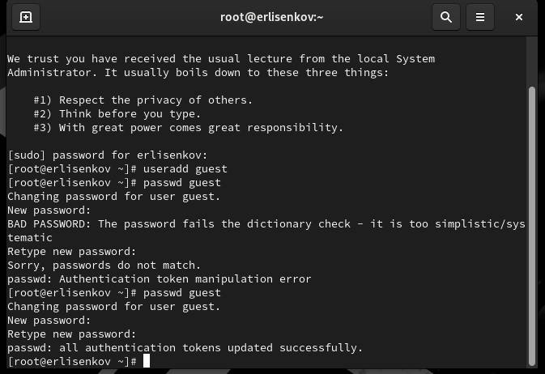
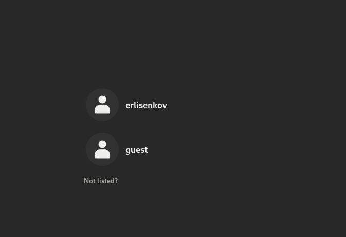
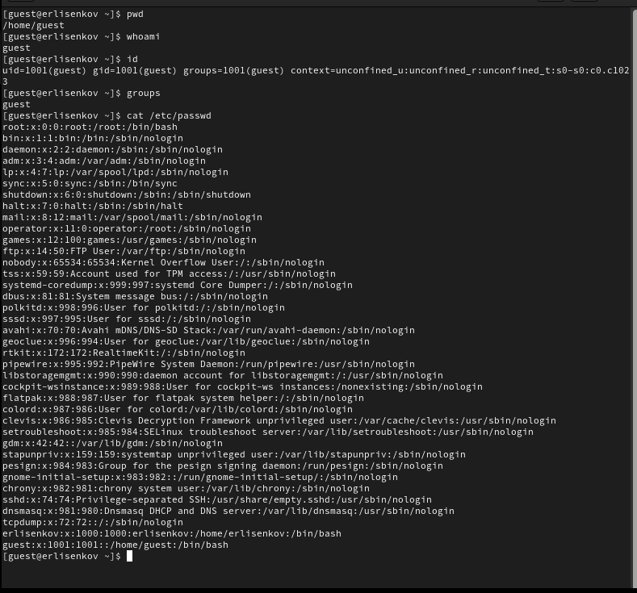
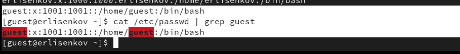
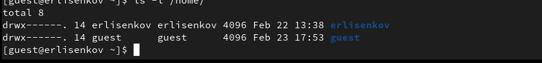
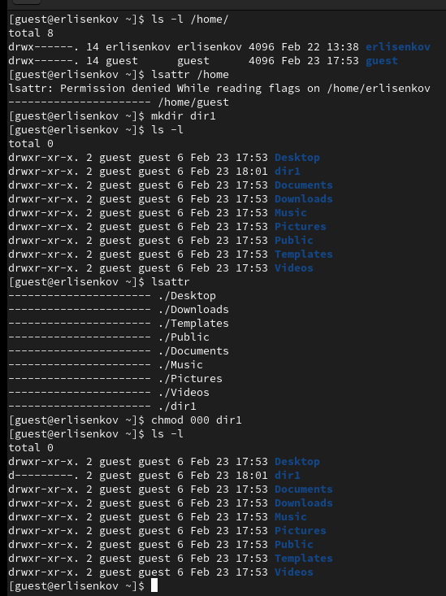
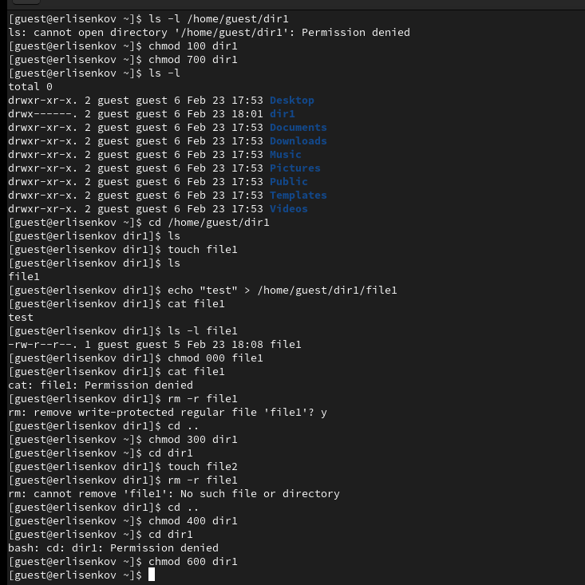

---
## Front matter
title: "Отчёт по лабораторной работе №2"
subtitle: "Основы инфрмационной безопасности"
author: "Лисенков Е.Р."

## Generic otions
lang: ru-RU
toc-title: "Содержание"

## Bibliography
bibliography: bib/cite.bib
csl: pandoc/csl/gost-r-7-0-5-2008-numeric.csl

## Pdf output format
toc: true # Table of contents
toc-depth: 2
lof: true # List of figures
lot: true # List of tables
fontsize: 12pt
linestretch: 1.5
papersize: a4
documentclass: scrreprt
## I18n polyglossia
polyglossia-lang:
  name: russian
  options:
	- spelling=modern
	- babelshorthands=true
polyglossia-otherlangs:
  name: english
## I18n babel
babel-lang: russian
babel-otherlangs: english
## Fonts
mainfont: PT Serif
romanfont: PT Serif
sansfont: PT Sans
monofont: PT Mono
mainfontoptions: Ligatures=TeX
romanfontoptions: Ligatures=TeX
sansfontoptions: Ligatures=TeX,Scale=MatchLowercase
monofontoptions: Scale=MatchLowercase,Scale=0.9
## Biblatex
biblatex: true
biblio-style: "gost-numeric"
biblatexoptions:
  - parentracker=true
  - backend=biber
  - hyperref=auto
  - language=auto
  - autolang=other*
  - citestyle=gost-numeric
## Pandoc-crossref LaTeX customization
figureTitle: "Рис."
tableTitle: "Таблица"
listingTitle: "Листинг"
lofTitle: "Список иллюстраций"
lotTitle: "Список таблиц"
lolTitle: "Листинги"
## Misc options
indent: true
header-includes:
  - \usepackage{indentfirst}
  - \usepackage{float} # keep figures where there are in the text
  - \floatplacement{figure}{H} # keep figures where there are in the text
---

# Цель работы

Получение практических навыков работы в консоли с атрибутами файлов, закрепление теоретических основ дискреционного разграничения доступа в современных системах с открытым кодом на базе ОС Linux1.

# Задачи

Научиться работать с консолью Rocky Linux.

# Выполнение лабораторной работы

В установленной при выполнении предыдущей лабораторной работы операционной системе создам учётную запись пользователя guest (использую учётную запись администратора):

useradd guest

Задам пароль для пользователя guest (использую учётную запись администратора):(рис. 1)(рис. 2)

passwd guest

{#fig:001 width=100%}

{#fig:002 width=100%}

Определю директорию, в которой вы находитесь, командой pwd. Сравню её с приглашением командной строки.  (рис. 3)
Уточню имя пользователя командой whoami.
Уточню имя пользователя, его группу, а также группы, куда вхо-
дит пользователь, командой id. Выведенные значения uid, gid и др. Сравню вывод id с выводом команды groups. (рис. 3)(рис. 4)

{#fig:003 width=100%}

{#fig:004 width=100%}

Определю существующие в системе директории командой (рис.5).

{#fig:005 width=100%}

Проверю, какие расширенные атрибуты установлены на поддиректориях, находящихся в директории /home, командой:
lsattr /home (рис.6)

{#fig:006 width=100%}

Приступлю к выполнению пунктов 11-15 в которых я протестирую функцию комманд разрешения и запрета каких либо возможностей у файлов или целых папок(рис. 7)

{#fig:007 width=100%}

# Выводы

Я усвоил материал и готов к дальнейшему изучению линукс!