---
## Front matter
lang: ru-RU
title: Лабораторная работа №5
subtitle: операционные системы
author:
  - Лисенков Е.Р.
institute:
  - Российский университет дружбы народов, Москва, Россия

## i18n babel
babel-lang: russian
babel-otherlangs: english

## Formatting pdf
toc: false
toc-title: Содержание
slide_level: 2
aspectratio: 169
section-titles: true
theme: metropolis
header-includes:
 - \metroset{progressbar=frametitle,sectionpage=progressbar,numbering=fraction}
 - '\makeatletter'
 - '\beamer@ignorenonframefalse'
 - '\makeatother'
---

# Информация

## Докладчик

:::::::::::::: {.columns align=center}
::: {.column width="70%"}

  * Лисенков Егор Романович
  * студент
  * Российский университет дружбы народов
  * [1132232881@rudn.ru](mailto:1132232881@rudn.ru)
  * <https://github.com/erlisenkov>

:::
::: {.column width="30%"}

:::
::::::::::::::

# Вводная часть

## Цель

- Приобретение практических навыков взаимодействия пользователя с системой посредством командной строки.

## Теоретическое введение

1. Установить необходимое программное обеспечение.
2. Изучить принцип работы менеджера паролей pass.
3. Установить дополнительное программное обеспечение.

# Выполнение лабораторной работы

## Выполнение лабораторной работы

Выполним команду для просмотра списка ключей (рис.1).

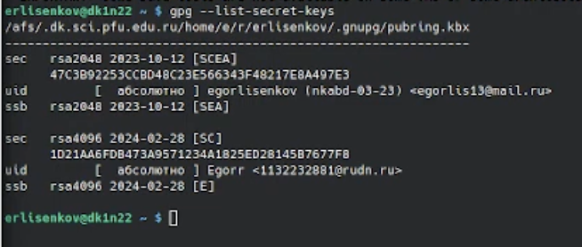{#fig:001 width=100%}

## Инициализируем хранилище (рис.2).

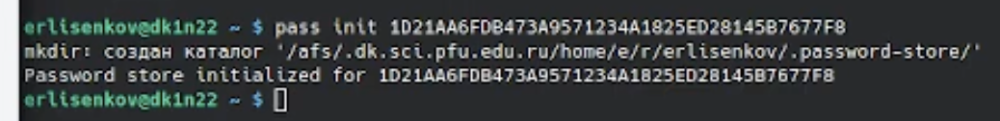{#fig:002 width=100%}

## Синхронизация с git (рис.3 рис.4)

    Создадим структуру git:

    1. pass git init

    Также можно задать адрес репозитория на хостинге (репозиторий необходимо предварительно создать):

    2. pass git remote add origin git@githubcom:<git_username>/<git_repo>.git

    Для синхронизации выполняется следующая команда:

    3. pass git pull

    ## 4. pass git push

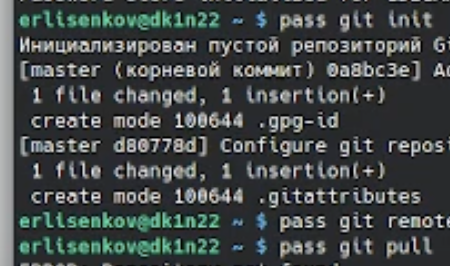{#fig:003 width=100%}

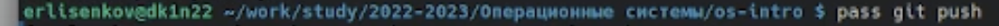{#fig:004 width=100%}

## Скачаем интерфейс для взаимодействия с броузером (native messaging) (рис.5).

    Репозиторий: https://github.com/browserpass/browserpass-native

    Gentoo:

    emerge www-plugins/browserpass

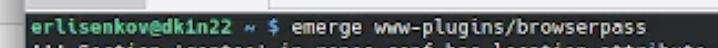{#fig:005 width=100%}

## Сохранение пароля (рис.6 рис.8)

    1.Добавим новый пароль: 

    pass insert [OPTIONAL DIR]/[FILENAME]

    2.Отобразите пароль для указанного имени файла:

    ass [OPTIONAL DIR]/[FILENAME]

    3.Замените существующий пароль:

    pass generate --in-place FILENAME

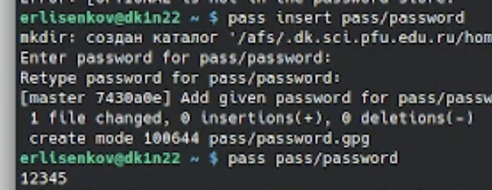{#fig:006 width=100%}

## Следующий

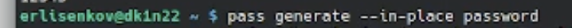{#fig:007 width=100%}

## Установим бинарный файл. Скрипт определяет архитектуру процессора и операционную систему и скачивает необходимый файл (рис.8).

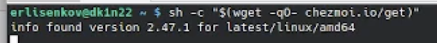{#fig:008 width=100%}

## Установим соединение с git (рис.9)

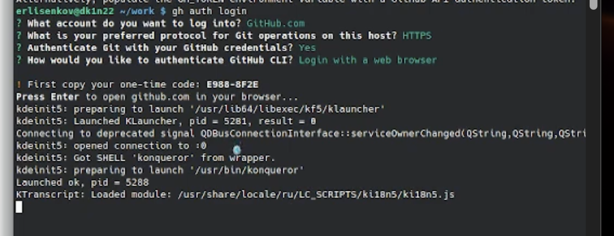{#fig:009 width=100%}

## Создам собственный репозиторий с помощью утилит

    Буду использовать утилиты командной строки для работы с github.

    Создам свой репозиторий для конфигурационных файлов на основе шаблона:

    gh repo create dotfiles --template="yamadharma/dotfiles-template" --private

## Подключу репозитория к своей системе

    Инициализирую chezmoi с вашим репозиторием dotfiles:

    chezmoi init git@github.com:<username>/dotfiles.git

    Проверю, какие изменения внесёт chezmoi в домашний каталог, запустив:

    chezmoi diff

    Если устраит изменения, внесённые chezmoi, запустите:

    chezmoi apply -v

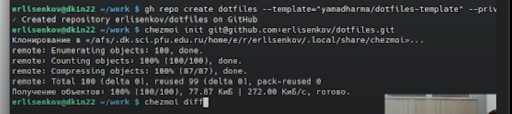{#fig:010 width=100%}

## Ежедневные операции c chezmoi

    Извлеку последние изменения из репозитория и примените их

        Можно извлечь изменения из репозитория и применить их одной командой:

        chezmoi update

        Это запускается git pull --autostash --rebase в вашем исходном каталоге, а затем chezmoi apply.

##    Извлеку последние изменения из своего репозитория и посмотрите, что изменится, фактически не применяя изменения

        Выполню:

        chezmoi git pull -- --autostash --rebase && chezmoi diff

        Это запускается git pull --autostash --rebase в вашем исходном каталоге, а chezmoi diff затем показывает разницу между целевым состоянием, вычисленным из вашего исходного каталога, и фактическим состоянием.

        применяем их:

        chezmoi apply

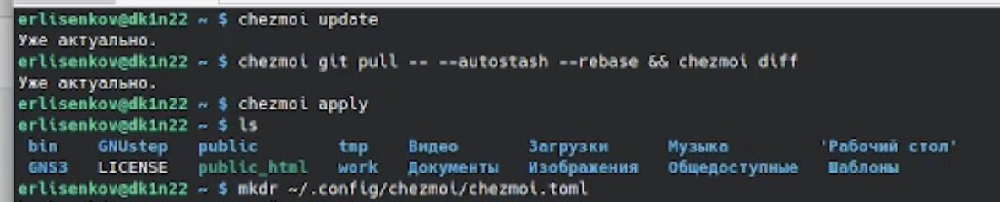{#fig:011 width=100%}

## Следующий

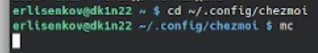{#fig:012 width=100%}

# Выводы

В ходе лабораторной работы я освоила навыки использования менеджера паролей pass.
