---
## Front matter
lang: ru-RU
title: Лабораторная работа №6
subtitle: Jперационные системы
author:
  - Лисенков Е.Р.
institute:
  - Российский университет дружбы народов, Москва, Россия

## i18n babel
babel-lang: russian
babel-otherlangs: english

## Formatting pdf
toc: false
toc-title: Содержание
slide_level: 2
aspectratio: 169
section-titles: true
theme: metropolis
header-includes:
 - \metroset{progressbar=frametitle,sectionpage=progressbar,numbering=fraction}
 - '\makeatletter'
 - '\beamer@ignorenonframefalse'
 - '\makeatother'
---

# Информация

## Докладчик

:::::::::::::: {.columns align=center}
::: {.column width="70%"}

  * Лисенков Егор Романович
  * студент
  * Российский университет дружбы народов
  * [1132232881@rudn.ru](mailto:1132232881@rudn.ru)
  * <https://github.com/erlisenkov>

:::
::: {.column width="30%"}

:::
::::::::::::::

# Вводная часть

## Цель работы

- Приобретение практических навыков взаимодействия пользователя с системой посредством командной строки.

## Теоретическое введение

В операционной системе типа Linux взаимодействие пользователя с системой обычно
осуществляется с помощью командной строки посредством построчного ввода ко-
манд. При этом обычно используется командные интерпретаторы языка shell: /bin/sh ;
/bin/csh ; /bin/ksh.

Командой в операционной системе называется записанный по
специальным правилам текст (возможно с аргументами), представляющий собой ука-
зание на выполнение какой-либо функций (или действий) в операционной системе.
Обычно первым словом идёт имя команды, остальной текст — аргументы или опции,
конкретизирующие действие.

Файловая система ОС типа Linux — иерархическая система каталогов,
подкаталогов и файлов, которые обычно организованы и сгруппированы по функ-
циональному признаку. Самый верхний каталог в иерархии называется корневым
и обозначается символом / . Корневой каталог содержит системные файлы и другие
каталоги.

## Выполнение лабораторной работы

# Выполнение лабораторной работы

Определим полное имя вашего домашнего каталога. Далее относительно этого каталога будут выполняться последующие упражнения. (рис.1)

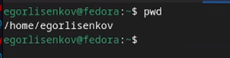{#fig:001 width=100%}

## Перейду в каталог /tmp.

Перехожу в каталог /tmp и просматриваю его содержимое.

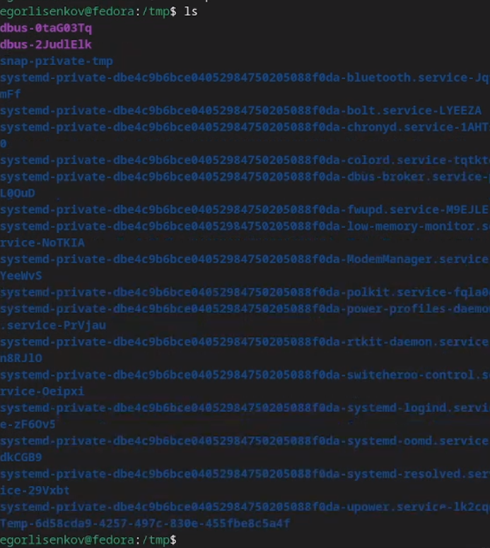{#fig:002 width=100%}

## NEXT

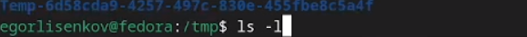{#fig:003 width=100%}

## NEXT

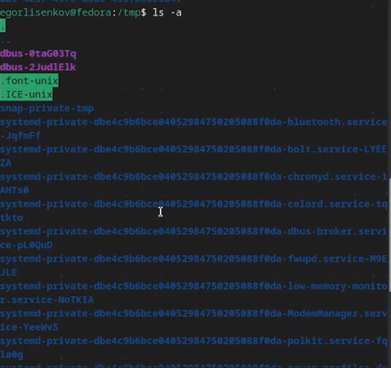{#fig:004 width=100%}

## Определю, есть ли в каталоге /var/spool подкаталог с именем cron? (рис.5 рис.6)

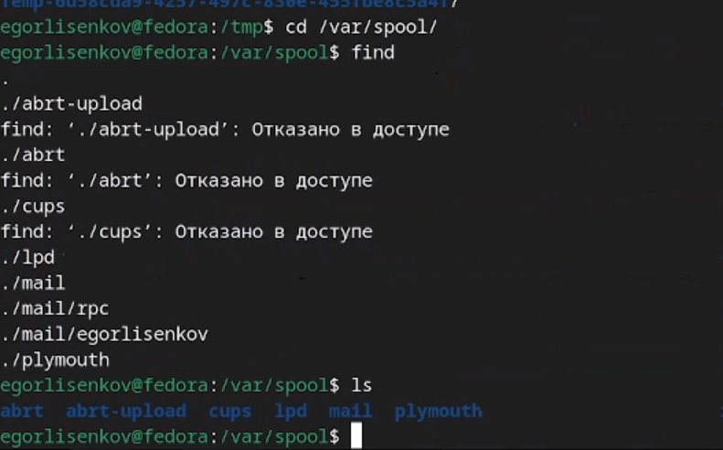{#fig:005 width=100%}

## NEXT

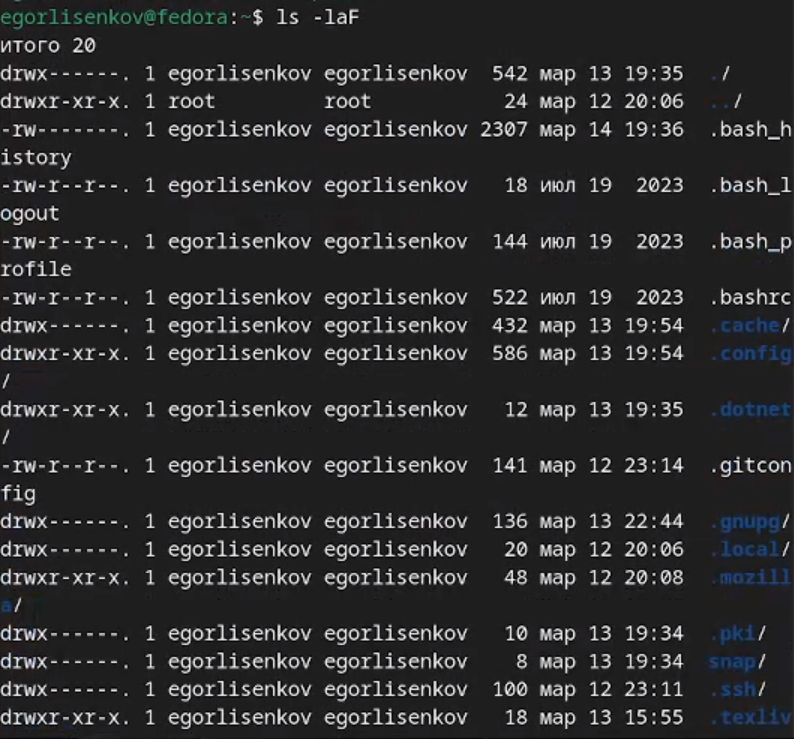{#fig:006 width=100%}

## В домашнем каталоге 
создам новый каталог с именем newdir.

В каталоге ~/newdir создам новый каталог с именем morefun.

В домашнем каталоге создам одной командой три новых каталога с именами letters, memos, misk. Затем удалю эти каталоги одной командой.

## Попробую удалить 

ранее созданный каталог ~/newdir командой rm. Проверю, был ли каталог удалён

## Удалю каталог 

~/newdir/morefun из домашнего каталога. Проверьте, был ли каталог удалён.

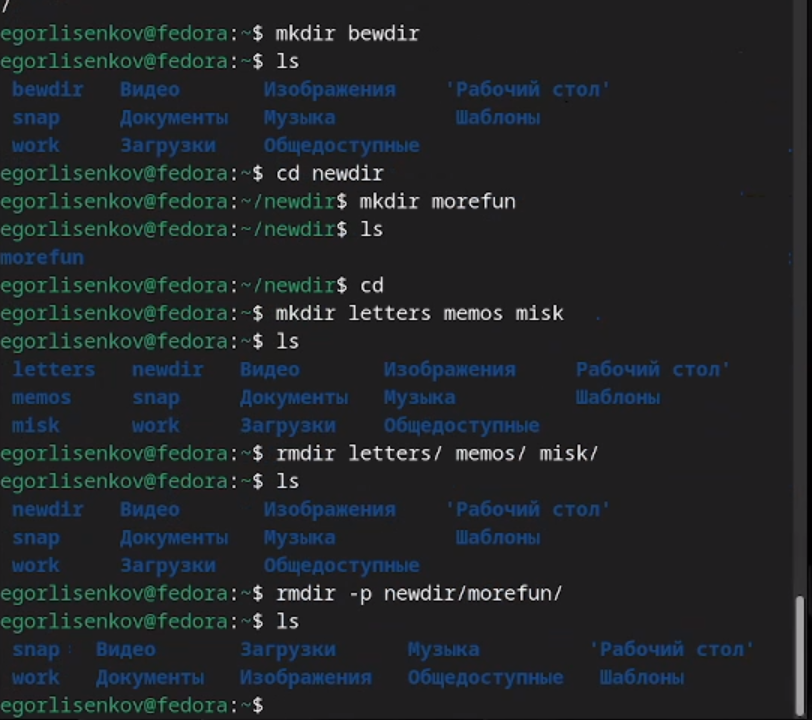{#fig:007 width=100%}

## С помощью команды man определю, какую опцию команды ls нужно использовать для просмотра содержимое не только указанного каталога, но и подкаталогов,входящих в него.

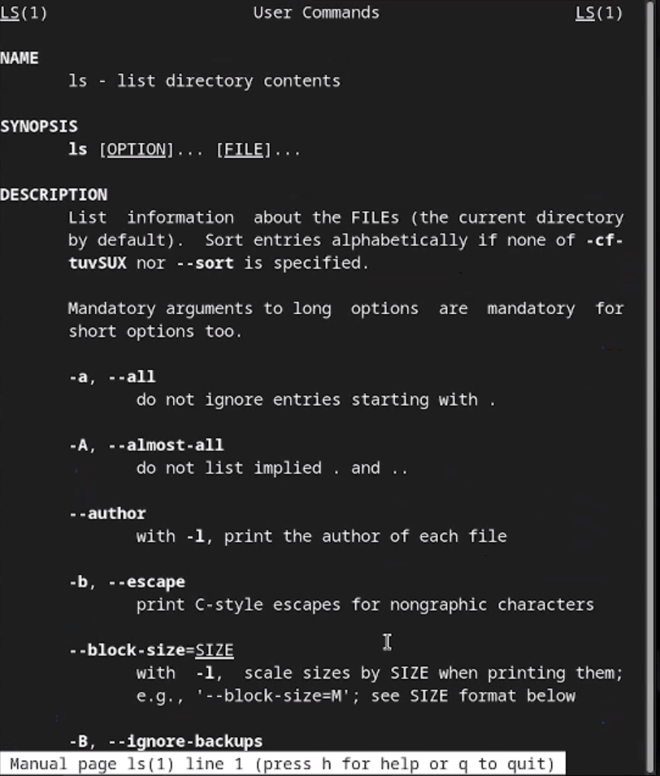{#fig:008 width=100%}

## С помощью команды man определю набор опций команды ls, позволяющий отсортировать по времени последнего изменения выводимый список содержимого каталога

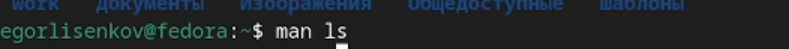{#fig:009 width=100%}

## NEXT

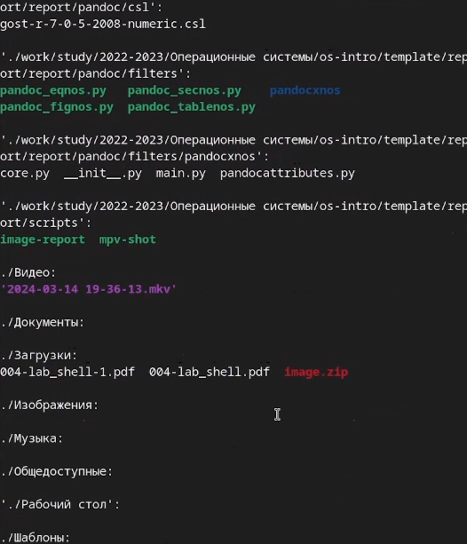{#fig:010 width=100%}

## NEXT

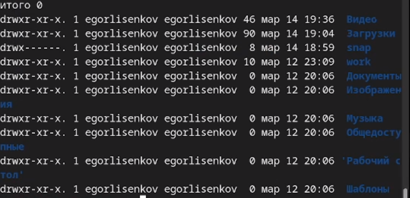{#fig:011 width=100%}

## Использую 

команду man для просмотра описания следующих команд: cd, pwd, mkdir,rmdir, rm.

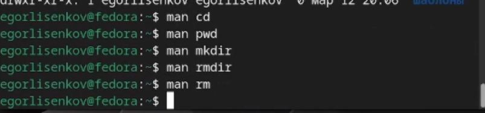{#fig:012 width=100%}

## Использую информацию, 

полученную при помощи команды history, выполню модификацию и исполнение нескольких команд из буфера команд

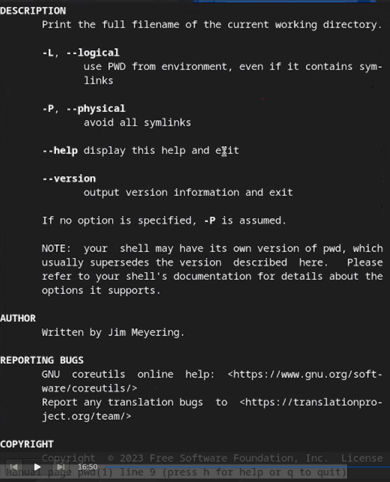{#fig:013 width=100%}

## NEXT

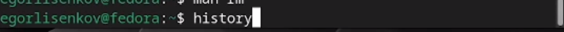{#fig:014 width=100%}

## NEXT

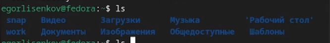{#fig:015 width=100%}

## NEXT

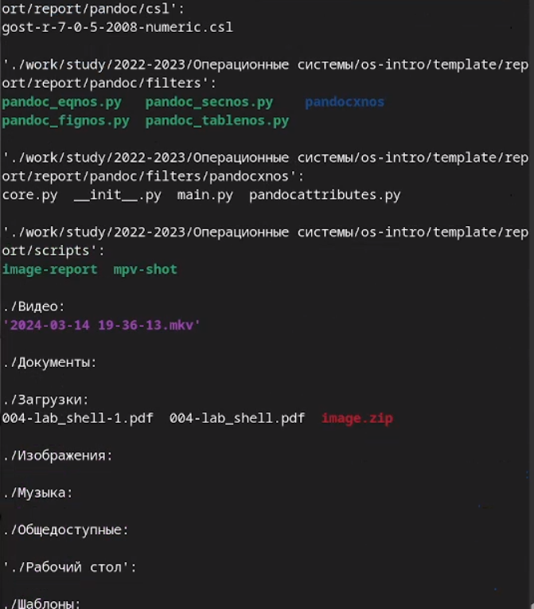{#fig:016 width=100%}

## Выводы

Вся проделанная работа была очень полезна для меня!
