---
## Front matter
title: "Отчёт по лабораторной работе №6"
subtitle: "Операционные системы"
author: "Лисенков Е.Р."

## Generic otions
lang: ru-RU
toc-title: "Содержание"

## Bibliography
bibliography: bib/cite.bib
csl: pandoc/csl/gost-r-7-0-5-2008-numeric.csl

## Pdf output format
toc: true # Table of contents
toc-depth: 2
lof: true # List of figures
lot: true # List of tables
fontsize: 12pt
linestretch: 1.5
papersize: a4
documentclass: scrreprt
## I18n polyglossia
polyglossia-lang:
  name: russian
  options:
	- spelling=modern
	- babelshorthands=true
polyglossia-otherlangs:
  name: english
## I18n babel
babel-lang: russian
babel-otherlangs: english
## Fonts
mainfont: PT Serif
romanfont: PT Serif
sansfont: PT Sans
monofont: PT Mono
mainfontoptions: Ligatures=TeX
romanfontoptions: Ligatures=TeX
sansfontoptions: Ligatures=TeX,Scale=MatchLowercase
monofontoptions: Scale=MatchLowercase,Scale=0.9
## Biblatex
biblatex: true
biblio-style: "gost-numeric"
biblatexoptions:
  - parentracker=true
  - backend=biber
  - hyperref=auto
  - language=auto
  - autolang=other*
  - citestyle=gost-numeric
## Pandoc-crossref LaTeX customization
figureTitle: "Рис."
tableTitle: "Таблица"
listingTitle: "Листинг"
lofTitle: "Список иллюстраций"
lotTitle: "Список таблиц"
lolTitle: "Листинги"
## Misc options
indent: true
header-includes:
  - \usepackage{indentfirst}
  - \usepackage{float} # keep figures where there are in the text
  - \floatplacement{figure}{H} # keep figures where there are in the text
---

# Цель работы

Приобретение практических навыков взаимодействия пользователя с системой посредством командной строки.

# Задание

1. Определите полное имя вашего домашнего каталога. Далее относительно этого ката-
лога будут выполняться последующие упражнения.
2. Выполните следующие действия:
2.1. Перейдите в каталог /tmp .
2.2. Выведите на экран содержимое каталога /tmp . Для этого используйте команду ls
с различными опциями. Поясните разницу в выводимой на экран информации.
2.3. Определите, есть ли в каталоге /var/spool подкаталог с именем cron ?
2.4. Перейдите в Ваш домашний каталог и выведите на экран его содержимое. Опре-
делите, кто является владельцем файлов и подкаталогов?
3. Выполните следующие действия:
3.1. В домашнем каталоге создайте новый каталог с именем newdir .
3.2. В каталоге ~/newdir создайте новый каталог с именем morefun .
3.3. В домашнем каталоге создайте одной командой три новых каталога с именами
letters , memos , misk . Затем удалите эти каталоги одной командой.
3.4. Попробуйте удалить ранее созданный каталог ~/newdir командой rm . Проверьте,
был ли каталог удалён.
3.5. Удалите каталог ~/newdir/morefun из домашнего каталога. Проверьте, был ли
каталог удалён.
4. С помощью команды man определите, какую опцию команды ls нужно использо-
вать для просмотра содержимое не только указанного каталога, но и подкаталогов,
входящих в него.
5. С помощью команды man определите набор опций команды ls , позволяющий отсорти-
ровать по времени последнего изменения выводимый список содержимого каталога
с развёрнутым описанием файлов.
6. Используйте команду man для просмотра описания следующих команд: cd , pwd , mkdir ,
rmdir , rm . Поясните основные опции этих команд.
7. Используя информацию, полученную при помощи команды history , выполните мо-
дификацию и исполнение нескольких команд из буфера команд.

# Теоретическое введение

В операционной системе типа Linux взаимодействие пользователя с системой обычно
осуществляется с помощью командной строки посредством построчного ввода ко-
манд. При этом обычно используется командные интерпретаторы языка shell: /bin/sh ;
/bin/csh ; /bin/ksh.

Командой в операционной системе называется записанный по
специальным правилам текст (возможно с аргументами), представляющий собой ука-
зание на выполнение какой-либо функций (или действий) в операционной системе.
Обычно первым словом идёт имя команды, остальной текст — аргументы или опции,
конкретизирующие действие.

Файловая система ОС типа Linux — иерархическая система каталогов,
подкаталогов и файлов, которые обычно организованы и сгруппированы по функ-
циональному признаку. Самый верхний каталог в иерархии называется корневым
и обозначается символом / . Корневой каталог содержит системные файлы и другие
каталоги.

# Выполнение лабораторной работы

Определим полное имя вашего домашнего каталога. Далее относительно этого ката-
лога будут выполняться последующие упражнения. (рис.1)

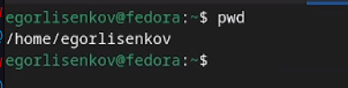{#fig:001 width=100%}

Перейду в каталог /tmp.

Выведу на экран содержимое каталога /tmp. Для этого использую команду ls
с различными опциями. Объясню разницу в выводимой на экран информации.(рис.2 рис.3 рис.4)

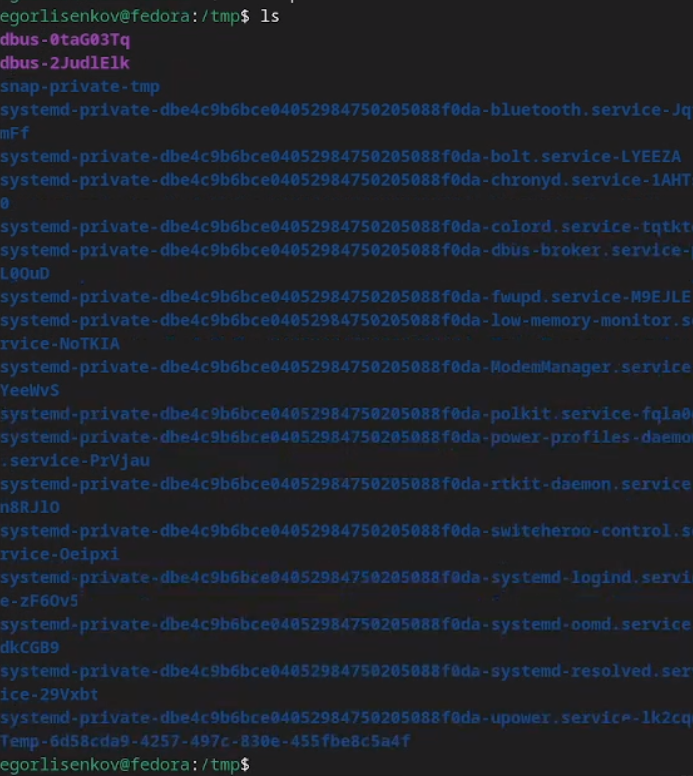{#fig:002 width=100%}
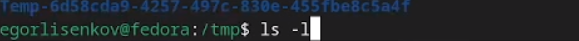{#fig:003 width=100%}
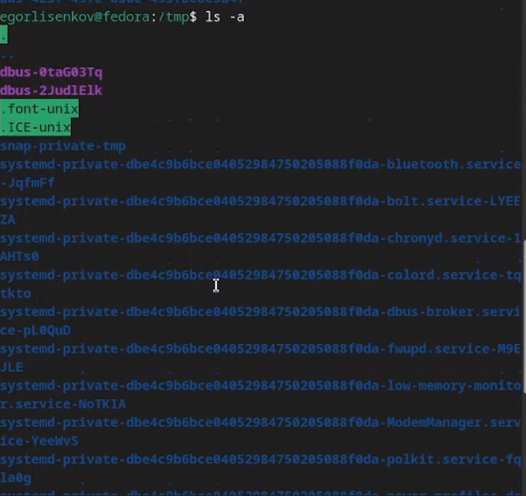{#fig:004 width=100%}

Определю, есть ли в каталоге /var/spool подкаталог с именем cron? (рис.5 рис.6)

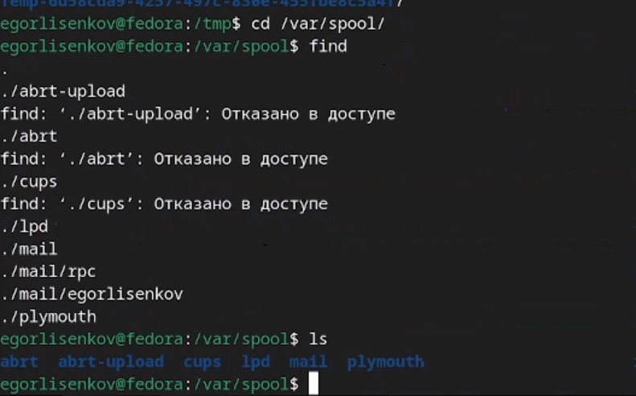{#fig:005 width=100%}
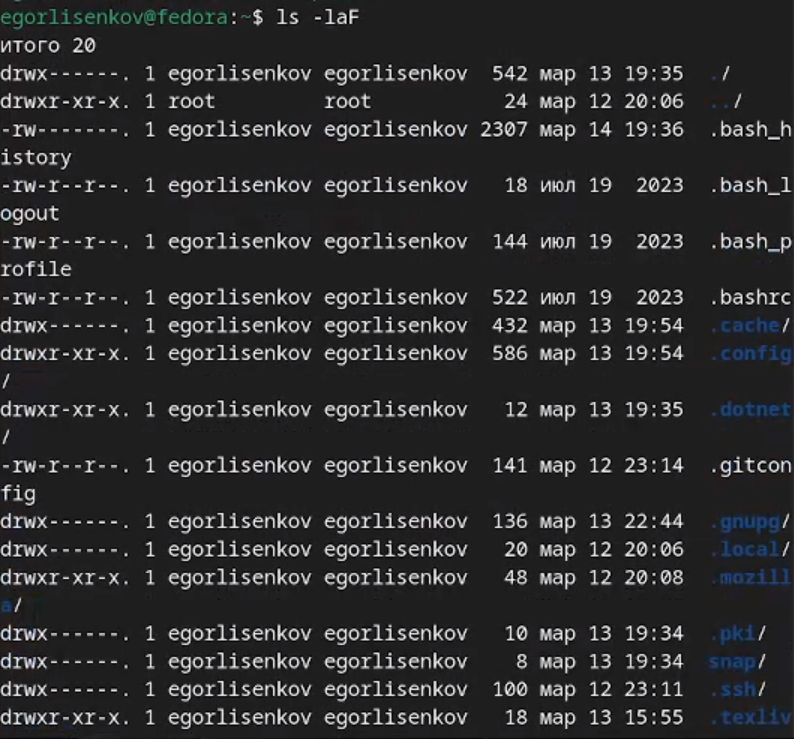{#fig:006 width=100%}

В домашнем каталоге создам новый каталог с именем newdir.

В каталоге ~/newdir создам новый каталог с именем morefun.

В домашнем каталоге создам одной командой три новых каталога с именами
letters, memos, misk. Затем удалю эти каталоги одной командой.

Попробую удалить ранее созданный каталог ~/newdir командой rm. Проверю,
был ли каталог удалён

Удалю каталог ~/newdir/morefun из домашнего каталога. Проверьте, был ли
каталог удалён.

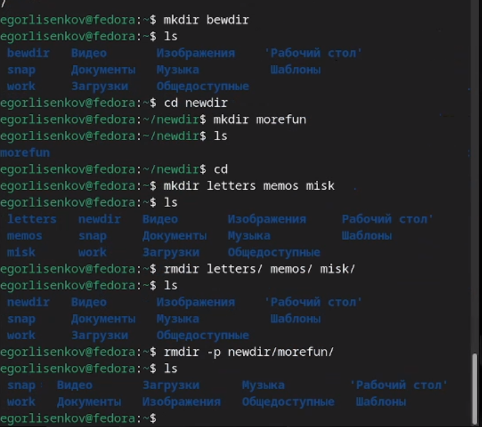{#fig:007 width=100%}

С помощью команды man определю, какую опцию команды ls нужно использовать для просмотра содержимое не только указанного каталога, но и подкаталогов,
входящих в него.

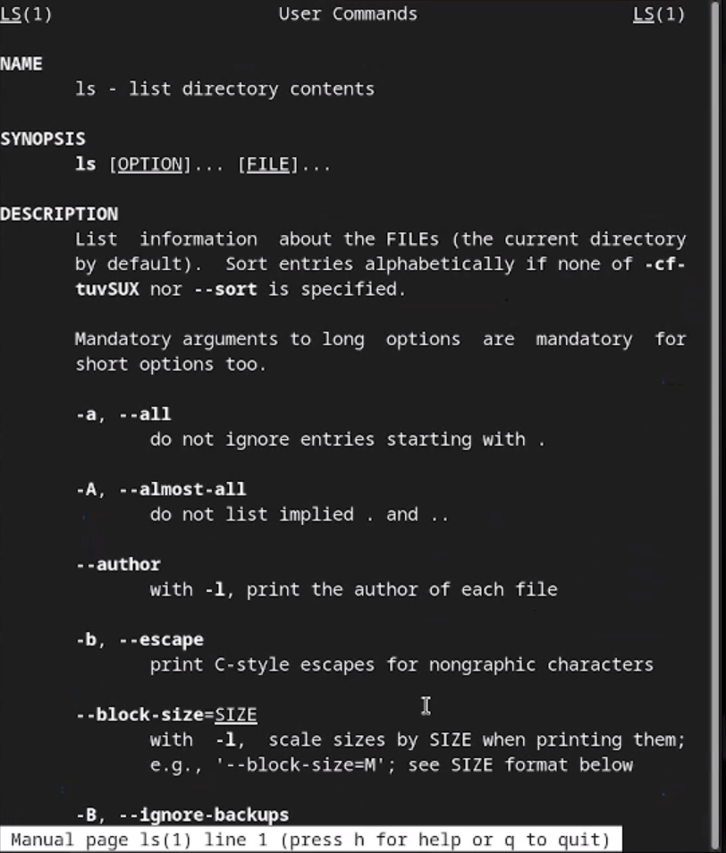{#fig:008 width=100%}

С помощью команды man определю набор опций команды ls, позволяющий отсортировать по времени последнего изменения выводимый список содержимого каталога

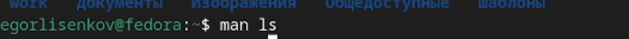{#fig:009 width=100%}

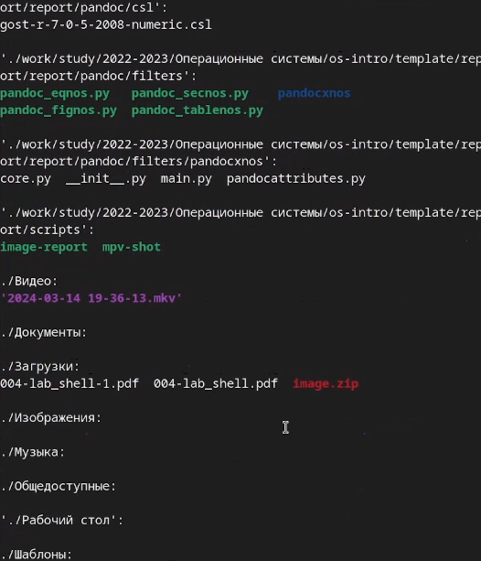{#fig:010 width=100%}

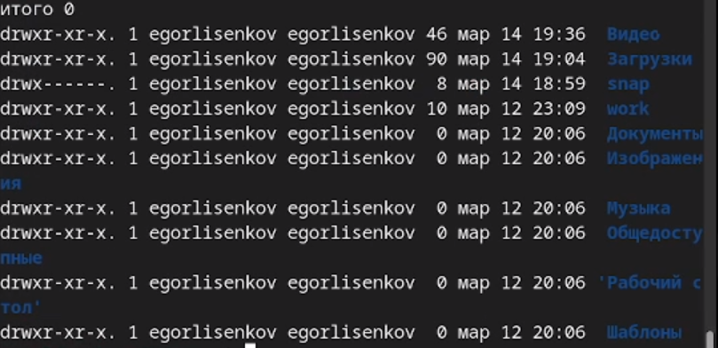{#fig:011 width=100%}

Использую команду man для просмотра описания следующих команд: cd, pwd, mkdir,
rmdir, rm.

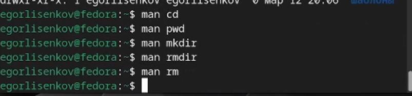{#fig:012 width=100%}

Использую информацию, полученную при помощи команды history, выполню мо-
дификацию и исполнение нескольких команд из буфера команд

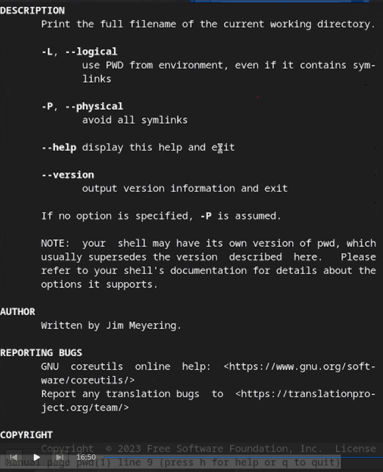{#fig:013 width=100%}
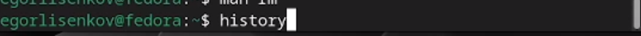{#fig:014 width=100%}
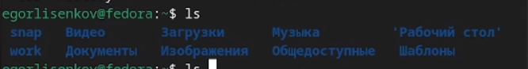{#fig:015 width=100%}
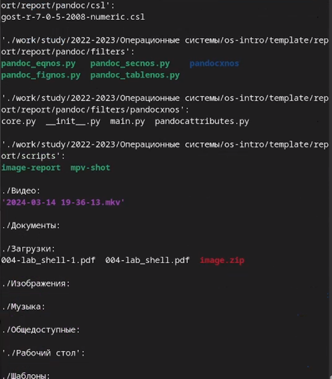{#fig:016 width=100%}

# Выводы

В ходе лабораторной работы я освоил навыки использования менеджера паролей pass.

# Ответы на контрольные вопросы

1. Командная строка это интерфейс взаимодействия с операционной системой, который позволяет пользователю вводить команды для выполнения различных задач

2. Для определения абсолютного пути текущего каталога в командной строке можно использовать команду pwd (print working directory). Например, pwd выведет абсолютный путь текущего каталога.

3. Для определения только типов файлов и их имен в текущем каталоге можно использовать команду '1ѕ с опцией -1 (long listing format). Например, *1ѕ -1 покажет типы файлов и их имена.

4. Для отображения информации о скрытых файлах в командной строке можно использовать опцию а с командой 1ѕ. Например, 1ѕ а покажет скрытые файлы в текущем каталоге.

5. Для удаления файла используется команда гт, а для удаления каталога команда rm -г. Нельзя удалить файл и каталог одной и той же командой. Примеры: гm file.txt для удаления файла и rm -r directory для удаления каталога.

6. Информацию о последних выполненных пользователем командах можно вывести с помощью команды history.

7. Для модифицированного выполнения команд из истории можно использовать символ "!" с номером команды. Например, 15 выполнит пятую команду из истории.

8. Примеры запуска нескольких команд в одной строке:

command1; command2: выполнить соmmand1, затем соmmand2.

command1 && command2: выполнить command1, если command1 успешно завершится, выполнить соmmand2.

command1 || command2: выполнить command1, если command1 завершится неудачно, выполнить соmmand2.

9. Символы экранирования используются для обозначения специальных символов в командах. Например, "\n' обозначает новую строку.

10. После выполнения команды 15 -1 информация о файлах будет выведена в виде списка с дополнительными подробностями, такими как права доступа, владелец файла, размер и дата изменения 2.

11. Относительный путь к файлу указывает на расположение файла относительно текущего каталога, например,../folder/file.txt". Абсолютный путь указывает на полное расположение файла от корневого каталога, например, "/home/user/folder/file.txt".

12. Информацию об интересующей вас команде можно получить, например, с помощью команды тап", которая предоставляет руководство по использованию конкретной команды.

13. Для автоматического дополнения вводимых команд используется клавиша Tab.
