---
## Front matter
lang: ru-RU
title: Лабораторная работа №8
subtitle: операционные системы
author:
  - Лисенков Е.Р.
institute:
  - Российский университет дружбы народов, Москва, Россия

## i18n babel
babel-lang: russian
babel-otherlangs: english

## Formatting pdf
toc: false
toc-title: Содержание
slide_level: 2
aspectratio: 169
section-titles: true
theme: metropolis
header-includes:
 - \metroset{progressbar=frametitle,sectionpage=progressbar,numbering=fraction}
 - '\makeatletter'
 - '\beamer@ignorenonframefalse'
 - '\makeatother'
---

# Информация

## Докладчик

:::::::::::::: {.columns align=center}
::: {.column width="70%"}

  * Лисенков Егор Романович
  * студент
  * Российский университет дружбы народов
  * [1132232881@rudn.ru](mailto:1132232881@rudn.ru)
  * <https://github.com/erlisenkov>

:::
::: {.column width="30%"}

:::
::::::::::::::

# Вводная часть

## Цель работы

Цель данной лабораторной работы - ознакомление с инструментами поиска файлов и фильтрации текстовых данных, а также приобретение практических навыков по управлению процессами (и заданиями), по проверке использования диска и по обслуживанию файловых систем.

# Выполнение лабораторной работы

## Выполнение лабораторной работы

Осуществлю вход в систему, используя соответствующее имя пользователя. Запишу в файл file.txt названия файлов, содержащихся в каталоге /etc. Допишу в этот же файл названия файлов, содержащихся в вашем домашнем каталоге.(рис.1).

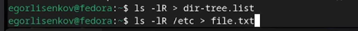{#fig:001 width=100%}

## Выведу имена всех файлов 

из file.txt, имеющих расширение .conf, после чего запишу их в новый текстовой файл conf.txt. (рис.2) (рис. 3)

{#fig:002 width=100%}

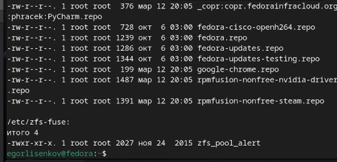{#fig:003 width=100%}

## (рис.4)

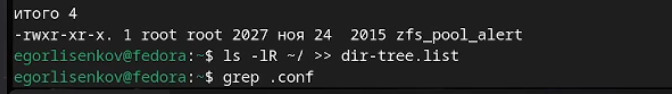{#fig:004 width=100%}

## (рис.5).

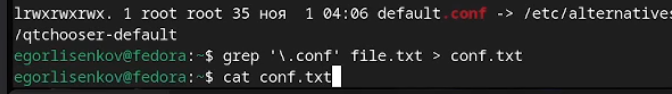{#fig:005 width=100%}

## (рис.6)

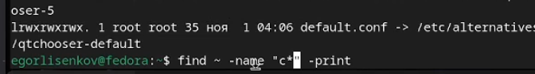{#fig:006 width=100%}

## Определю, 

какие файлы в вашем домашнем каталоге имеют имена, начинавшиеся с символа c. (рис. 7)

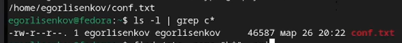{#fig:007 width=100%}

## Выведу на экран (по странично) 

имена файлов из каталога /etc, начинающиеся с символа h. (рис.8).

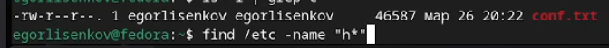{#fig:008 width=100%}

## Задачи

1. Запустите в фоновом режиме процесс, который будет записывать в файл ~/logfile
файлы, имена которых начинаются с log.
2. Удалите файл ~/logfile.
3. Запустите из консоли в фоновом режиме редактор gedit. (рис.9)

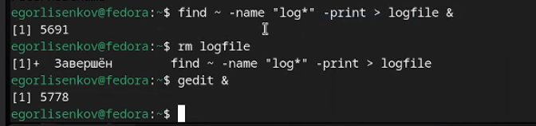{#fig:009 width=100%}

## Определю идентификатор 

процесса gedit, используя команду ps, конвейер и фильтр grep.(рис. 10)

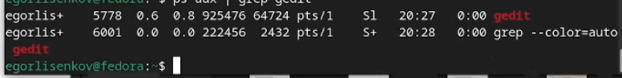{#fig:010 width=100%}

## (рис. 11)

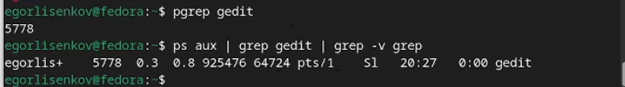{#fig:011 width=100%}

## Прочту справку (man) 

команды kill, после чего использую её для завершения процесса gedit. (рис. 12)

{#fig:012 width=100%}

## (рис 13)

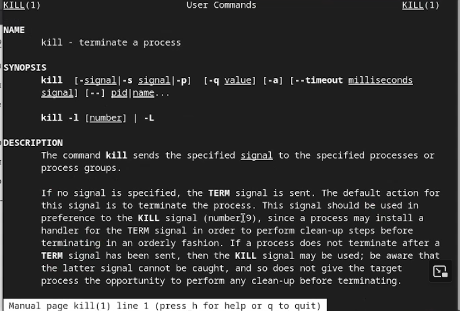{#fig:013 width=100%}

## (рис. 14)

{#fig:014 width=100%}

## (рис. 15)

{#fig:015 width=100%}

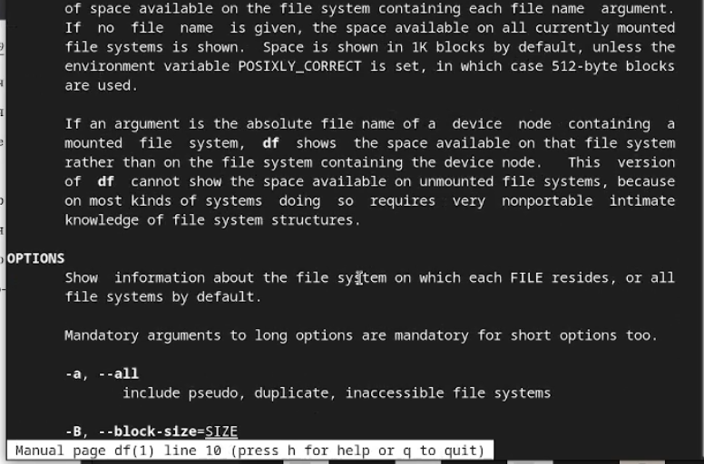{#fig:016 width=100%}

## Выполню команды df и du,

 предварительно получив более подробную информацию об этих командах, с помощью команды man (рис. 17)

{#fig:017 width=100%}

## (рис. 18)

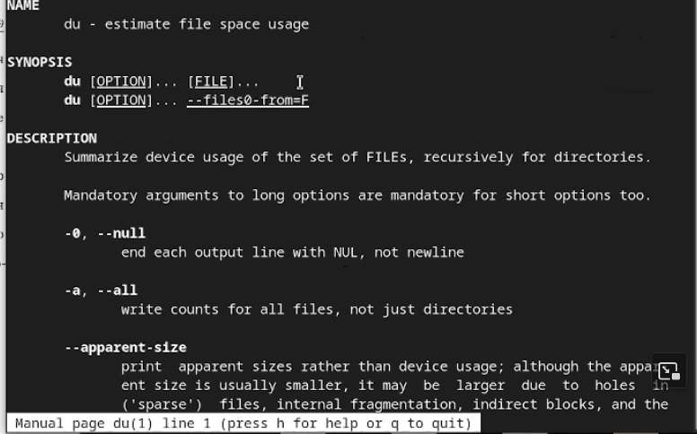{#fig:018 width=100%}

## (рис. 19)

{#fig:019 width=100%}

## Воспользовавшись справкой 

команды find, выведу имена всех директорий, имеющихся в вашем домашнем каталоге. (рис. 20)

{#fig:020 width=100%}

# Выводы

Я усвоил материал и готов к дальнейшему изучению линукс!

# Ответы на контрольные вопросы

## 1

Какие потоки ввода вывода вы знаете? В системе по умолчанию открыто три специальных потока: – stdin — стандартный поток ввода (по умолчанию: клавиатура), файловый дескриптор 0; – stdout — стандартный поток вывода (по умолчанию: консоль), файловый дескриптор 1; – stderr — стандартный поток вывод сообщений об ошибках (по умолчанию: консоль), файловый дескриптор 2.

## 2 

Объясните разницу между операцией > и ». Этот знак > - перенаправление ввода/вывода, а » - перенаправление в режиме добавления.

## 3

Что такое конвейер? Конвейер (pipe) служит для объединения простых команд или утилит в цепочки, в которых результат работы предыдущей команды передаётся последующей.

## 4

Что такое процесс? Чем это понятие отличается от программы? Главное отличие между программой и процессом заключается в том, что программа - это набор инструкций, который позволяет ЦПУ выполнять определенную задачу, в то время как процесс - это исполняемая программа.

## 5

Что такое PID и GID? PPID - (parent process ID) идентификатор родительского процесса. Процесс может порождать и другие процессы. UID, GID - реальные идентификаторы пользователя и его группы, запустившего данный процесс.

## 6

Что такое задачи и какая команда позволяет ими управлять? Запущенные фоном программы называются задачами (jobs). Ими можно управлять с помощью команды jobs, которая выводит список запущенных в данный момент задач.

## 7

Найдите информацию об утилитах top и htop. Каковы их функции?

Команда htop похожа на команду top по выполняемой функции: они обе показывают информацию о процессах в реальном времени, выводят данные о потреблении системных ресурсов и позволяют искать, останавливать и управлять процессами.

У обеих команд есть свои преимущества. Например, в программе htop реализован очень удобный поиск по процессам, а также их фильтрация. В команде top это не так удобно — нужно знать кнопку для вывода функции поиска.

Зато в top можно разделять область окна и выводить информацию о процессах в соответствии с разными настройками. В целом top намного более гибкая в настройке отображения процессов.

## 8

Назовите и дайте характеристику команде поиска файлов. Приведите примеры использования этой команды.

Команда find - это одна из наиболее важных и часто используемых утилит системы Linux. Это команда для поиска файлов и каталогов на основе специальных условий. Ее можно использовать в различных обстоятельствах, например, для поиска файлов по разрешениям, владельцам, группам, типу, размеру и другим подобным критериям.

Утилита find предустановлена по умолчанию во всех Linux дистрибутивах, поэтому вам не нужно будет устанавливать никаких дополнительных пакетов. Это очень важная находка для тех, кто хочет использовать командную строку наиболее эффективно.

Команда find имеет такой синтаксис: find [папка] [параметры] критерий шаблон [действие] Пример: find /etc -name "p*" -print

## 9

Можно ли по контексту (содержанию) найти файл? Если да, то как? find / -type f -exec grep -H 'текстДляПоиска' {} ;

## 10 

Как определить объем свободной памяти на жёстком диске? С помощью команды df -h.

## 11

Как определить объем вашего домашнего каталога? С помощью команды du -s.

## 12

Как удалить зависший процесс? С помощью команды kill% номер задачи.