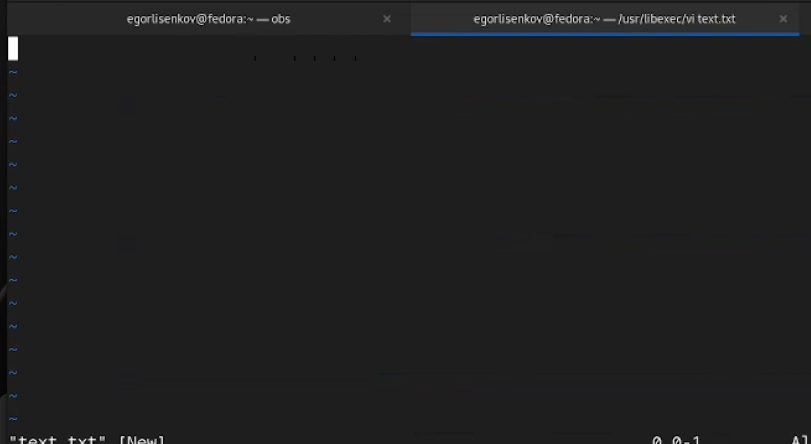
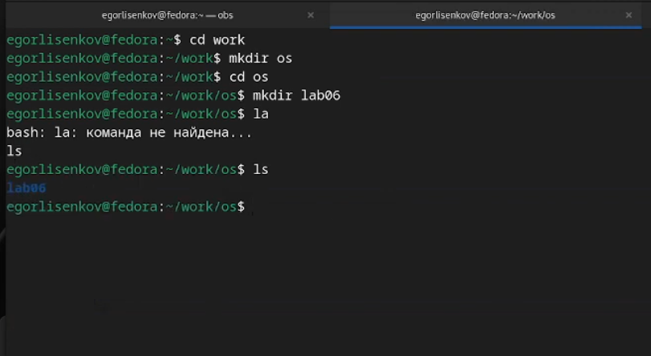
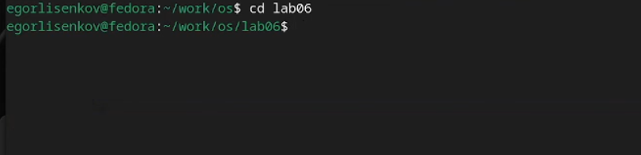
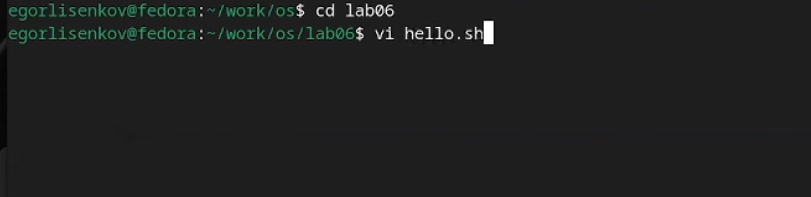
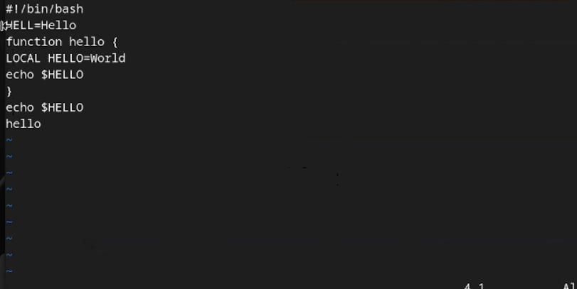
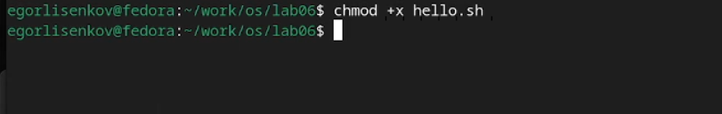
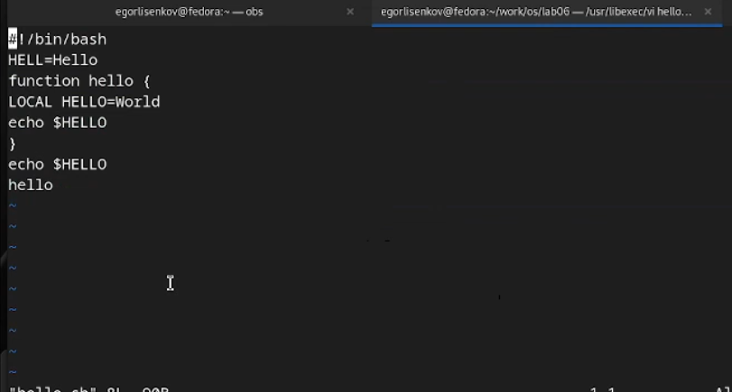
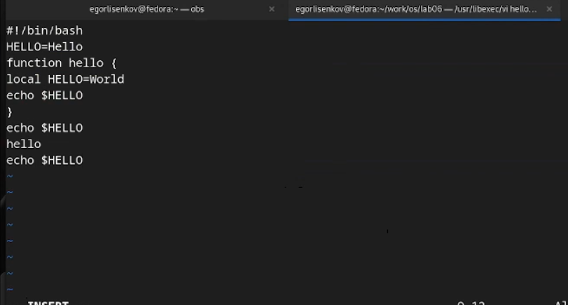

---
## Front matter
lang: ru-RU
title: Лабораторная работа №10
subtitle: операционные системы
author:
  - Лисенков Е.Р.
institute:
  - Российский университет дружбы народов, Москва, Россия

## i18n babel
babel-lang: russian
babel-otherlangs: english

## Formatting pdf
toc: false
toc-title: Содержание
slide_level: 2
aspectratio: 169
section-titles: true
theme: metropolis
header-includes:
 - \metroset{progressbar=frametitle,sectionpage=progressbar,numbering=fraction}
 - '\makeatletter'
 - '\beamer@ignorenonframefalse'
 - '\makeatother'
---

# Информация

## Докладчик

:::::::::::::: {.columns align=center}
::: {.column width="70%"}

  * Лисенков Егор Романович
  * студент
  * Российский университет дружбы народов
  * [1132232881@rudn.ru](mailto:1132232881@rudn.ru)
  * <https://github.com/erlisenkov>

:::
::: {.column width="30%"}

:::
::::::::::::::

# Вводная часть

## Цель работы

Цель данной лабораторной работы - познакомиться с операционной системой Linux, получить практические навыки работы с редактором vi, установленным по умолчанию практически во всех дистрибутивах.

# Выполнение лабораторной работы

## Выполнение лабораторной работы

## Проверю команду vi text.txt (рис.1).

{#fig:001 width=100%}

## Создам каталог с именем ~/work/os/lab06. (рис.2) 

{#fig:002 width=100%}

## Перейду во вновь созданный каталог. (рис. 3)

{#fig:003 width=100%}

## Вызову vi и создайте файл hello.sh (рис.4)

{#fig:004 width=100%}

## Нажму клавишу i и введу следующий текст. 
Буду редактировать и после закрою :wq (рис.5).

{#fig:005 width=100%}

## Сделаю файл исполняемым(рис.6)

{#fig:006 width=100%}

## Открою файл и начну постепенное редактиование (рис. 7)

{#fig:007 width=100%}

## Итоговый результат редактирования (рис.8).

{#fig:008 width=100%}

# Выводы

Я усвоил материал и готов к дальнейшему изучению линукс!

# Ответы на контрольные вопросы

## 1.

 Дайте краткую характеристику режимам работы редактора vi.

- командный режим — предназначен для ввода команд редактирования и навигации по редактируемому файлу;
- режим вставки — предназначен для ввода содержания редактируемого файла;
- режим последней (или командной) строки — используется для записи изменений в файл и выхода из редактора.

## 2. 

Можно нажимать символ q (или q!), если требуется выйти из редактора без сохранения.

## 3. 

Назовите и дайте краткую характеристику командам позиционирования.
- 0 (ноль) — переход в начало строки;
- $ — переход в конец строки;
- G — переход в конец файла;
- n G — переход на строку с номером n.

## 4. 

Что для редактора vi является словом?

Редактор vi предполагает, что слово - это строка символов, которая может включать в себя буквы, цифры и символы подчеркивания.

## 5. 

Каким образом из любого места редактируемого файла перейти в начало (конец) файла?

С помощью G — переход в конец файла

## 6. 

Назовите и дайте краткую характеристику основным группам команд редактирования.

- Вставка текста – а — вставить текст после курсора; – А — вставить текст в конец строки; – i — вставить текст перед курсором; – n i — вставить текст n раз; – I — вставить текст в начало строки.
- Вставка строки – о — вставить строку под курсором; – О — вставить строку над курсором.
- Удаление текста – x — удалить один символ в буфер; – d w — удалить одно слово в буфер; – d $ — удалить в буфер текст от курсора до конца строки; – d 0 — удалить в буфер текст от начала строки до позиции курсора; – d d — удалить в буфер одну строку; – n d d — удалить в буфер n строк.
- Отмена и повтор произведённых изменений – u — отменить последнее изменение; – . — повторить последнее изменение.
- Копирование текста в буфер – Y — скопировать строку в буфер; – n Y — скопировать n строк в буфер; – y w — скопировать слово в буфер.
- Вставка текста из буфера – p — вставить текст из буфера после курсора; – P — вставить текст из буфера перед курсором.
- Замена текста – c w — заменить слово; – n c w — заменить n слов; – c $ — заменить текст от курсора до конца строки; – r — заменить слово; – R — заменить текст.
- Поиск текста – / текст — произвести поиск вперёд по тексту указанной строки символов текст; – ? текст — произвести поиск назад по тексту указанной строки символов текст.

## 7. 

Необходимо заполнить строку символами $. Каковы ваши действия?

Перейти в режим вставки.

## 8. 

Как отменить некорректное действие, связанное с процессом редактирования?

С помощью u — отменить последнее изменение

## 9. 

Назовите и дайте характеристику основным группам команд режима последней строки.

Режим последней строки — используется для записи изменений в файл и выхода из редактора.

## 10.

Как определить, не перемещая курсора, позицию, в которой заканчивается строка?

$ — переход в конец строки

