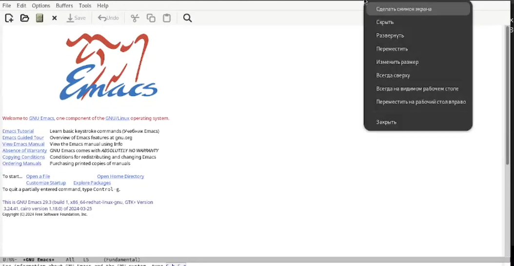
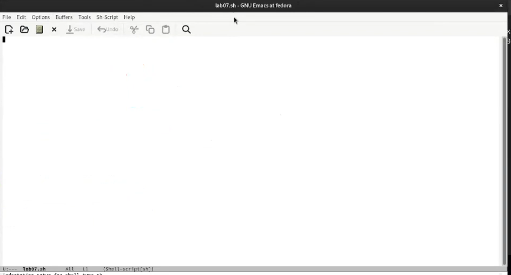
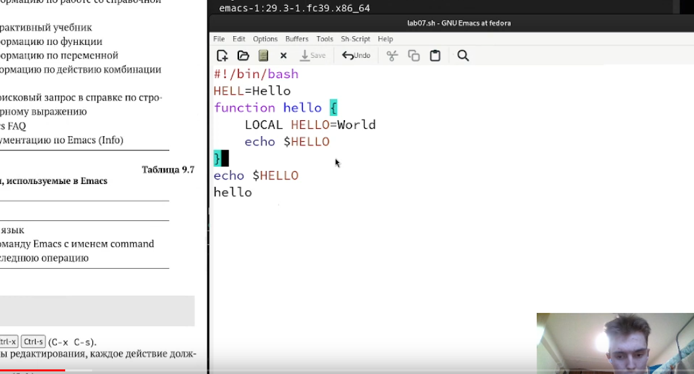
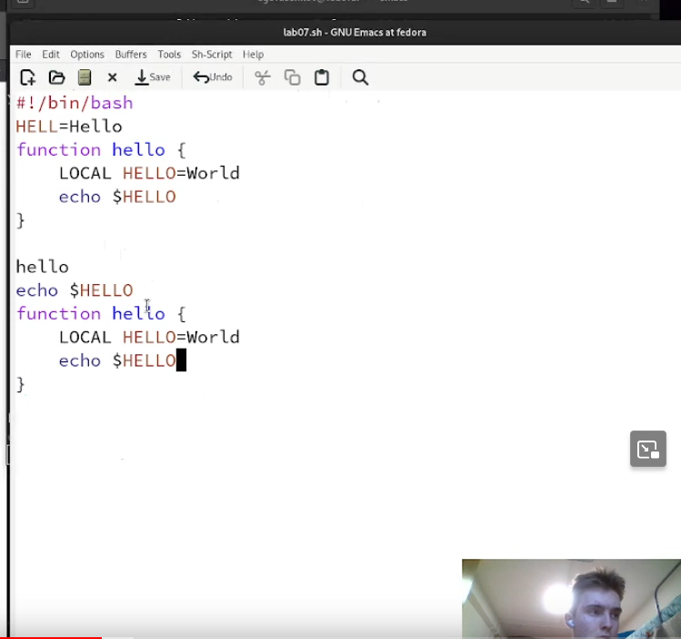
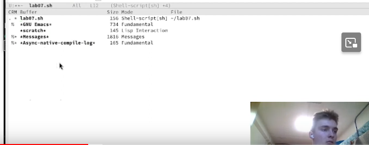
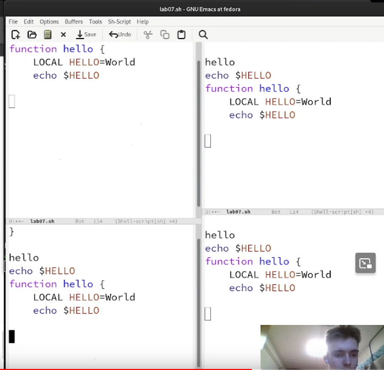
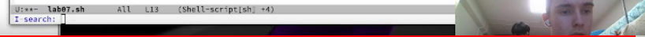
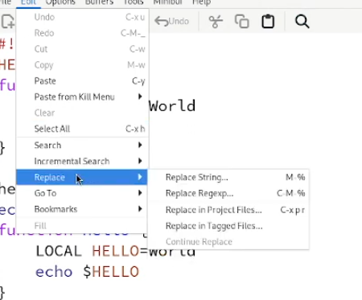

---
## Front matter
lang: ru-RU
title: Лабораторная работа №11
subtitle: операционные системы
author:
  - Лисенков Е.Р.
institute:
  - Российский университет дружбы народов, Москва, Россия

## i18n babel
babel-lang: russian
babel-otherlangs: english

## Formatting pdf
toc: false
toc-title: Содержание
slide_level: 2
aspectratio: 169
section-titles: true
theme: metropolis
header-includes:
 - \metroset{progressbar=frametitle,sectionpage=progressbar,numbering=fraction}
 - '\makeatletter'
 - '\beamer@ignorenonframefalse'
 - '\makeatother'
---

# Информация

## Докладчик

:::::::::::::: {.columns align=center}
::: {.column width="70%"}

  * Лисенков Егор Романович
  * студент
  * Российский университет дружбы народов
  * [1132232881@rudn.ru](mailto:1132232881@rudn.ru)
  * <https://github.com/erlisenkov>

:::
::: {.column width="30%"}

:::
::::::::::::::

# Вводная часть

## Цель работы

Цель данной лабораторной работы - познакомиться с операционной системой Linux. Получить практические навыки работы с редактором Emacs.

# Выполнение лабораторной работы

## Выполнение лабораторной работы

# Выполнение лабораторной работы

## Запускаю emacs (рис.1).

{#fig:001 width=100%}

## Создам файл lab07.sh 
чтобы дальше редактировать его(рис.2) 

{#fig:002 width=100%}

## Напишу тут код программы (рис. 3)

{#fig:003 width=100%}

## Выполняю все написанные команды 
от копирования до перемещения курсором, практикую команды и компбинации клавишь (рис.4)

{#fig:004 width=100%}

## Откроем в буфер и посмотрим 
что запущено (рис.5).

{#fig:005 width=100%}

## Раскроем проект на 4 окна (рис.6)

{#fig:006 width=100%}

## Изучу команду поиска элемента текста (рис. 7)

{#fig:007 width=100%}

## Научусь заменять текст в редакторе (рис.8).

{#fig:008 width=100%}

# Выводы

Я усвоил материал и готов к дальнейшему изучению линукс!

# Ответы на контрольные вопросы

## 1. Кратко охарактеризуйте редактор emacs.

Emacs — один из наиболее мощных и широко распространённых редакторов, используемых в мире UNIX. Написан на языке высокого уровня Lisp.

## 2. Какие особенности данного редактора могут сделать его сложным для освоения новичком?

Большое разнообразие сложных комбинаций клавиш, которые необходимы для редактирования файла и в принципе для работа с Emacs.

## 3. Своими словами опишите, что такое буфер и окно в терминологии emacs’а.

Буфер - это объект в виде текста. Окно - это прямоугольная область, в которой отображен буфер.

## 4. Можно ли открыть больше 10 буферов в одном окне?

Да, можно.

## 5. Какие буферы создаются по умолчанию при запуске emacs?

Emacs использует буферы с именами, начинающимися с пробела, для внутренних целей. Отчасти он обращается с буферами с такими именами особенным образом — например, по умолчанию в них не записывается информация для отмены изменений.

## 6. Какие клавиши вы нажмёте, чтобы ввести следующую комбинацию C-c | и C-c C-|?

Ctrl + c, а потом | и Ctrl + c Ctrl + |

## 7. Как поделить текущее окно на две части?

С помощью команды Ctrl + x 3 (по вертикали) и Ctrl + x 2 (по горизонтали).

## 8. В каком файле хранятся настройки редактора emacs?

Настройки emacs хранятся в файле . emacs, который хранится в домашней дирректории пользователя. Кроме этого файла есть ещё папка . emacs.

## 9. Какую функцию выполняет клавиша и можно ли её переназначить?

Выполняет функцию стереть, думаю можно переназначить.

## 10. Какой редактор вам показался удобнее в работе vi или emacs? Поясните почему.

Для меня удобнее был редактор Emacs, так как у него есть командая оболочка. А vi открывается в терминале, и выглядит своеобразно.