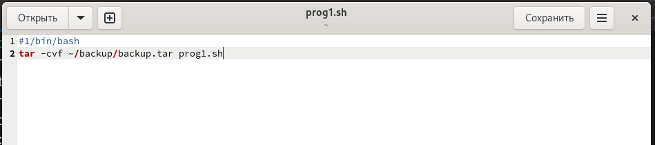
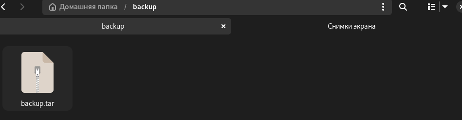
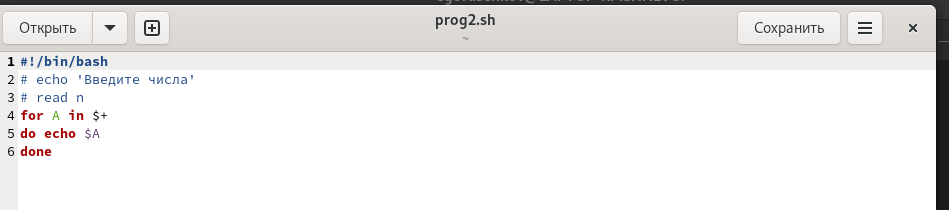
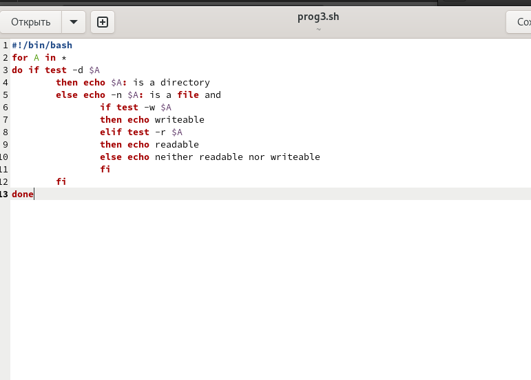
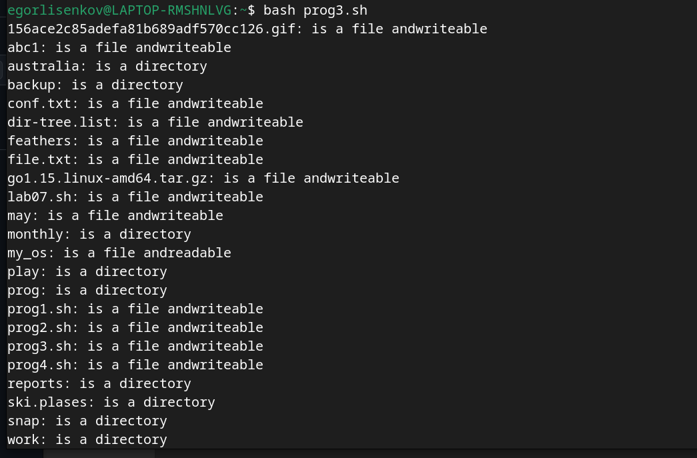
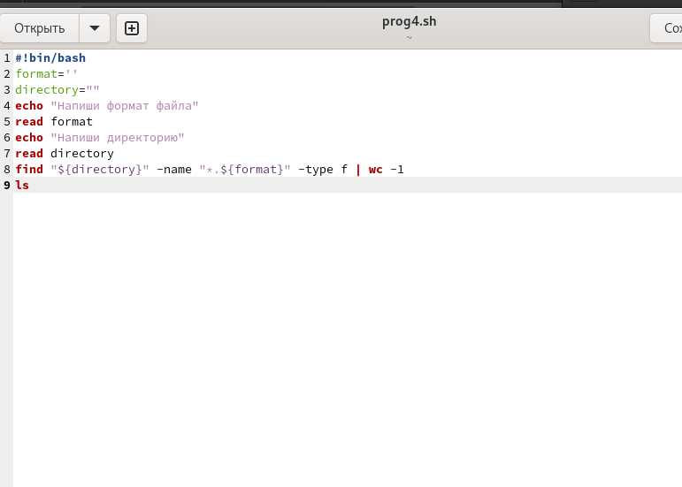
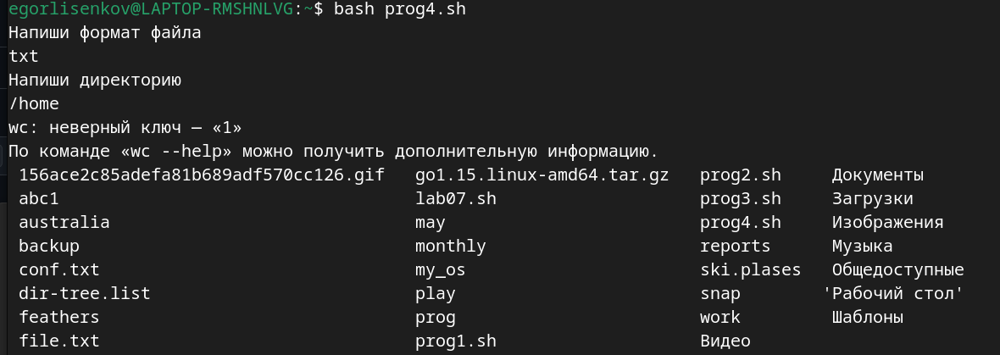

---
## Front matter
lang: ru-RU
title: Лабораторная работа №12
subtitle: операционные системы
author:
  - Лисенков Е.Р.
institute:
  - Российский университет дружбы народов, Москва, Россия

## i18n babel
babel-lang: russian
babel-otherlangs: english

## Formatting pdf
toc: false
toc-title: Содержание
slide_level: 2
aspectratio: 169
section-titles: true
theme: metropolis
header-includes:
 - \metroset{progressbar=frametitle,sectionpage=progressbar,numbering=fraction}
 - '\makeatletter'
 - '\beamer@ignorenonframefalse'
 - '\makeatother'
---

# Информация

## Докладчик

:::::::::::::: {.columns align=center}
::: {.column width="70%"}

  * Лисенков Егор Романович
  * студент
  * Российский университет дружбы народов
  * [1132232881@rudn.ru](mailto:1132232881@rudn.ru)
  * <https://github.com/erlisenkov>

:::
::: {.column width="30%"}

:::
::::::::::::::

# Вводная часть

## Цель работы

Цель данной лабораторной работы - изучить основы программирования в оболочке ОС UNIX/Linux, научиться писать небольшие командные файлы.

# Задания

## 1.

Написать скрипт, который при запуске будет делать резервную копию самого себя (то
есть файла, в котором содержится его исходный код) в другую директорию backup
в вашем домашнем каталоге. При этом файл должен архивироваться одним из архиваторов на выбор zip, bzip2 или tar. Способ использования команд архивации
необходимо узнать, изучив справку.
## 2.

Написать пример командного файла, обрабатывающего любое произвольное число
аргументов командной строки, в том числе превышающее десять. Например, скрипт
может последовательно распечатывать значения всех переданных аргументов.
## 3.

Написать командный файл — аналог команды ls (без использования самой этой команды и команды dir). Требуется, чтобы он выдавал информацию о нужном каталоге
и выводил информацию о возможностях доступа к файлам этого каталога.
## 4.

Написать командный файл, который получает в качестве аргумента командной строки
формат файла (.txt, .doc, .jpg, .pdf и т.д.) и вычисляет количество таких файлов
в указанной директории. Путь к директории также передаётся в виде аргумента командной строки

# Выполнение лабораторной работы

## Выполнение лабораторной работы

## Напишу первую программу (рис.1).

{#fig:001 width=100%}

## Её работа (рис.2) 

{#fig:002 width=100%}

## Напишу вторую программу (рис. 3)

{#fig:003 width=100%}

## Напишу 3 программу (рис.4)

{#fig:004 width=100%}

## Её работа (рис.5).

{#fig:005 width=100%}

## Напишу 4 программу (рис.6)

{#fig:006 width=100%}

## Её работа (рис. 7)

{#fig:007 width=100%}

# Выводы

Я усвоил материал и готов к дальнейшему изучению линукс!