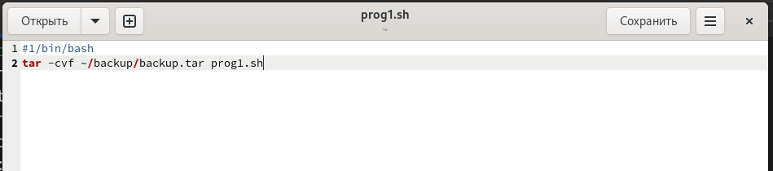
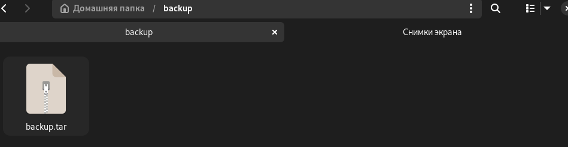
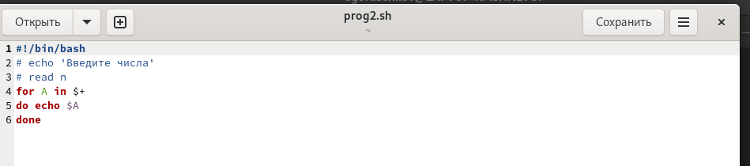
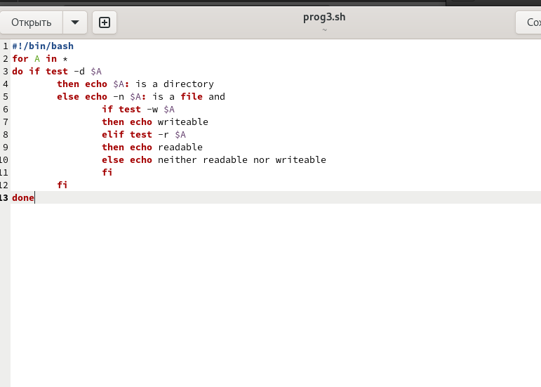
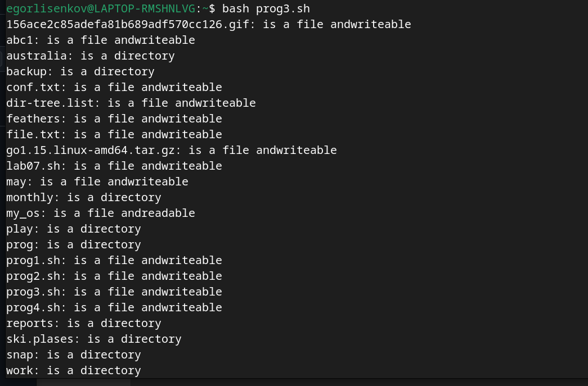
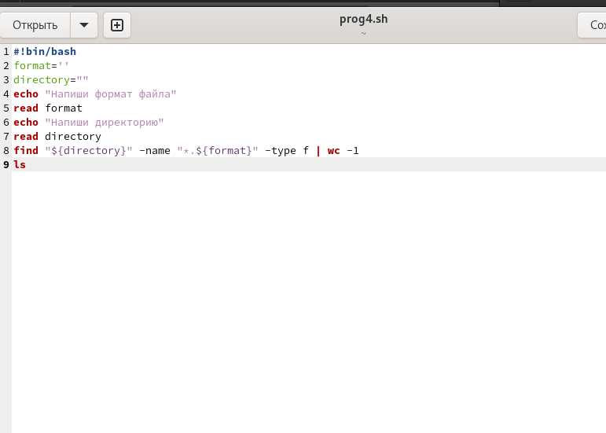
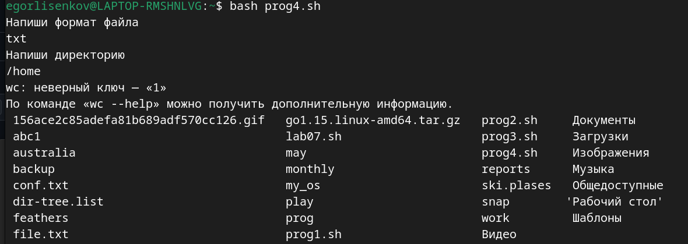

---
## Front matter
title: "Отчёт по лабораторной работе №12"
subtitle: "Операционные системы"
author: "Лисенков Е.Р."

## Generic otions
lang: ru-RU
toc-title: "Содержание"

## Bibliography
bibliography: bib/cite.bib
csl: pandoc/csl/gost-r-7-0-5-2008-numeric.csl

## Pdf output format
toc: true # Table of contents
toc-depth: 2
lof: true # List of figures
lot: true # List of tables
fontsize: 12pt
linestretch: 1.5
papersize: a4
documentclass: scrreprt
## I18n polyglossia
polyglossia-lang:
  name: russian
  options:
	- spelling=modern
	- babelshorthands=true
polyglossia-otherlangs:
  name: english
## I18n babel
babel-lang: russian
babel-otherlangs: english
## Fonts
mainfont: PT Serif
romanfont: PT Serif
sansfont: PT Sans
monofont: PT Mono
mainfontoptions: Ligatures=TeX
romanfontoptions: Ligatures=TeX
sansfontoptions: Ligatures=TeX,Scale=MatchLowercase
monofontoptions: Scale=MatchLowercase,Scale=0.9
## Biblatex
biblatex: true
biblio-style: "gost-numeric"
biblatexoptions:
  - parentracker=true
  - backend=biber
  - hyperref=auto
  - language=auto
  - autolang=other*
  - citestyle=gost-numeric
## Pandoc-crossref LaTeX customization
figureTitle: "Рис."
tableTitle: "Таблица"
listingTitle: "Листинг"
lofTitle: "Список иллюстраций"
lotTitle: "Список таблиц"
lolTitle: "Листинги"
## Misc options
indent: true
header-includes:
  - \usepackage{indentfirst}
  - \usepackage{float} # keep figures where there are in the text
  - \floatplacement{figure}{H} # keep figures where there are in the text
---

# Цель работы

Цель данной лабораторной работы - изучить основы программирования в оболочке ОС UNIX/Linux, научиться писать небольшие командные файлы.

# Задачи

## Задание по mc

1. Написать скрипт, который при запуске будет делать резервную копию самого себя (то
есть файла, в котором содержится его исходный код) в другую директорию backup
в вашем домашнем каталоге. При этом файл должен архивироваться одним из архиваторов на выбор zip, bzip2 или tar. Способ использования команд архивации
необходимо узнать, изучив справку.
2. Написать пример командного файла, обрабатывающего любое произвольное число
аргументов командной строки, в том числе превышающее десять. Например, скрипт
может последовательно распечатывать значения всех переданных аргументов.
3. Написать командный файл — аналог команды ls (без использования самой этой команды и команды dir). Требуется, чтобы он выдавал информацию о нужном каталоге
и выводил информацию о возможностях доступа к файлам этого каталога.
4. Написать командный файл, который получает в качестве аргумента командной строки
формат файла (.txt, .doc, .jpg, .pdf и т.д.) и вычисляет количество таких файлов
в указанной директории. Путь к директории также передаётся в виде аргумента командной строки

## Программа №1

```shell
#!/bin/bash
tar -cvf ~/backup/backup.tar prog1.sh
```

## Программа №2

```shell
#!/bin/bash
for A in $*
    do echo $A
done
```

## Программа №3

```shell
#!/bin/bash
for A in *
do
    if test -d "$A"
    then
        echo "$A^ is a directory"
    else
        echo -n "$A: is a file and "
        if test -w $A
        then
            echo writeable
                if test -r $A
```

## Программа №3 (продолжение)

```shell
                then
                    echo "readable"
            else
                echo "neither readable or writeable"
                fi
            fi
        fi
    done
```

## Программа №4

```shell
#!bin/bash
format=""
directory=""
echo "Напишите формат файла"
read format
echo "Напишите директорию"
read directory
find "${directory}" -name "*.${format}" -type f | wc -l
ls
```

# Выполнение лабораторной работы


Напишу первую программу (рис.1).

{#fig:001 width=100%}

Её работа (рис.2) 

{#fig:002 width=100%}

Напишу вторую программу (рис. 3)

{#fig:003 width=100%}

Напишу 3 программу (рис.4)

{#fig:004 width=100%}

Её работа (рис.5).

{#fig:005 width=100%}

Напишу 4 программу (рис.6)

{#fig:006 width=100%}

Её работа (рис. 7)

{#fig:007 width=100%}


# Выводы

Я усвоил материал и готов к дальнейшему изучению линукс!
