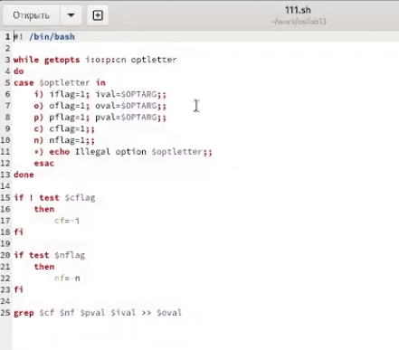
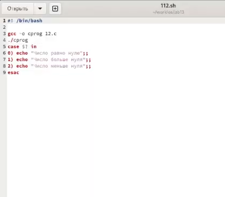
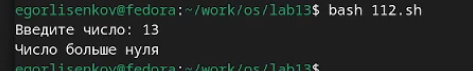
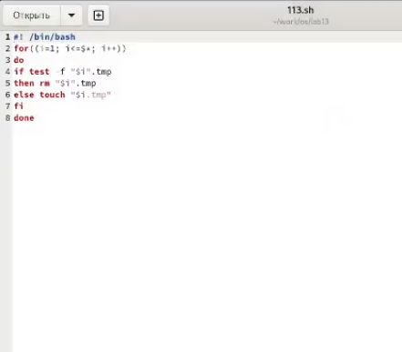
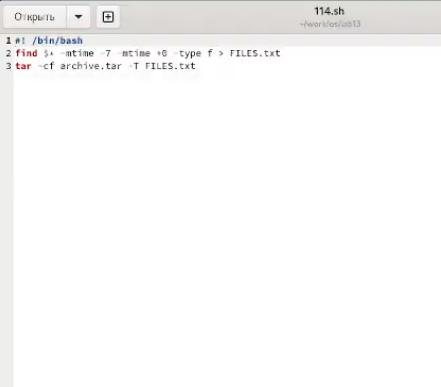
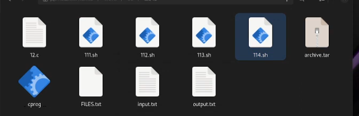
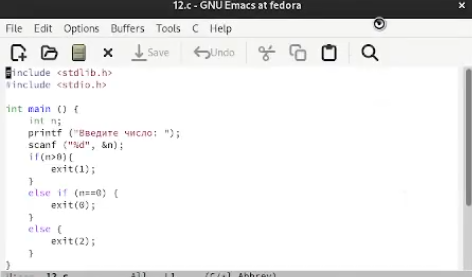

---
## Front matter
lang: ru-RU
title: Лабораторная работа №13
subtitle: операционные системы
author:
  - Лисенков Е.Р.
institute:
  - Российский университет дружбы народов, Москва, Россия

## i18n babel
babel-lang: russian
babel-otherlangs: english

## Formatting pdf
toc: false
toc-title: Содержание
slide_level: 2
aspectratio: 169
section-titles: true
theme: metropolis
header-includes:
 - \metroset{progressbar=frametitle,sectionpage=progressbar,numbering=fraction}
 - '\makeatletter'
 - '\beamer@ignorenonframefalse'
 - '\makeatother'
---

# Информация

## Докладчик

:::::::::::::: {.columns align=center}
::: {.column width="70%"}

  * Лисенков Егор Романович
  * студент
  * Российский университет дружбы народов
  * [1132232881@rudn.ru](mailto:1132232881@rudn.ru)
  * <https://github.com/erlisenkov>

:::
::: {.column width="30%"}

:::
::::::::::::::

# Вводная часть

## Цель работы

Цель данной лабораторной работы - изучить основы программирования в оболочке ОС UNIX, научится писать более
сложные командные файлы с использованием логических управляющих конструкций и циклов.

# Выполнение лабораторной работы

## Выполнение лабораторной работы

# Выполнение лабораторной работы

## Напишу первую программу (рис.1).

{#fig:001 width=100%}

## Сделаю в точности описания вторую программу (рис.2) 

{#fig:002 width=100%}

## А вот и результат 2 программы (рис. 2.1)

{#fig:003 width=100%}

## Сделаю 3 программу (рис.3)

{#fig:004 width=100%}

## Вот и 4 программа (рис.4).

{#fig:005 width=100%}

## Тут результат 4 программы (рис. 4.1)

{#fig:006 width=100%}

## И финальная это 5 программа на C (рис. 5)

{#fig:007 width=100%}

# Выводы

Я усвоил материал и готов к дальнейшему изучению линукс!

# Ответы на контрольные вопросы

## 1.

Каково предназначение команды getopts?

Осуществляет синтаксический анализ командной строки, выделяя флаги, и используется для объявления переменных. Синтаксис команды следующий: getopts option-string variable. Флаги – это опции командной строки, обычно помеченные знаком минус; Например, -F является флагом для команды ls -F. Иногда эти флаги имеют аргументы, связанные с ними. Программы интерпретируют эти флаги, соответствующим образом изменяя свое поведение. Строка опций option-string — это список возможных букв и чисел соответствующего флага. Если ожидается, что некоторый флаг будет сопровождаться некоторым аргументом, то за этой буквой должно следовать двоеточие. Соответствующей переменной присваивается буква данной опции. Если команда getopts может распознать аргумент, она возвращает истину. Принято включать getopts в цикл while и анализировать введенные данные с помощью оператора case. Предположим, необходимо распознать командную строку следующего формата: testprog -ifile_in.txt -ofile_out.doc -L -t -r Вот как выглядит использование оператора getopts в этом случае: while getopts o:i:Ltr optletter do case $optletter in o) oflag=1; oval=$OPTARG;; i) iflag=1; ival=$OPTARG;; L) Lflag=1;; t) tflag=1;; r) rflag=1;; *) echo Illegal option $optletter esac done Функция getopts включает две специальные переменные среды – OPTARG и OPTIND. Если ожидается дополнительное значение, то OPTARG устанавливается в значение этого аргумента (будет равна file_in.txt для опции i и file_out.doc для опции o) . OPTIND является числовым индексом на упомянутый аргумент. Функция getopts также понимает переменные типа массив, следовательно, можно использовать ее в функции не только для синтаксического анализа аргументов функций, но и для анализа введенных пользователем данных.

## 2

Какое отношение метасимволы имеют к генерации имён файлов?

При перечислении имён файлов текущего каталога можно использовать следующие символы: − соответствует произвольной, в том числе и пустой строке; ? − соответствует любому одинарному символу; [c1-c2] − соответствует любому символу, лексикографически находящемуся между символами с1 и с2. Например, echo * − выведет имена всех файлов текущего каталога, что представляет собой простейший аналог команды ls; ls .c − выведет все файлы с последними двумя символами, совпадающими с .c. echo prog.? − выведет все файлы, состоящие из пяти или шести символов, первыми пятью символами которых являются prog.. [a-z] − соответствует произвольному имени файла в текущем каталоге, начинающемуся с любой строчной буквы латинского алфавита.

## 3. 

Какие операторы управления действиями вы знаете?

Часто бывает необходимо обеспечить проведение каких-либо действий циклически и управление дальнейшими действиями в зависимости отрезультатов проверки некоторого условия. Для решения подобных задач язык программирования bash предоставляет возможность использовать такие управляющие конструкции, как for, case, if и while. С точки зрения командного процессора эти управляющие конструкции являются обычными командами и могут использоваться как при создании командных файлов, так и при работе в интерактивном режиме. Команды, реализующие подобные конструкции, по сути, являются операторами языка программирования bash. Поэтому при описании языка программирования bash термин оператор будет использоваться наравне с термином команда. Команды ОС UNIX возвращают код завершения, значение которого может быть использовано для принятия решения о дальнейших действиях. Команда test, например, создана специально для использования в командных файлах. Единственная функция этой команды заключается в выработке кода завершения.

## 4. 

Какие операторы используются для прерывания цикла?

Два несложных способа позволяют вам прерывать циклы в оболочке bash. Команда break завершает выполнение цикла, а команда continue завершает данную итерацию блока операторов. Команда break полезна для завершения цикла while в ситуациях, когда условие перестаёт быть правильным. Команда continue используется в ситуациях, когда больше нет необходимости выполнять блок операторов, но вы можете
захотеть продолжить проверять данный блок на других условных выражениях.

## 5. 

Для чего нужны команды false и true?

Следующие две команды ОС UNIX используются только совместно с управляющими конструкциями языка программирования bash: это команда true, которая всегда возвращает код завершения, равный нулю (т.е. истина), и команда false, которая всегда возвращает код завершения, не равный нулю (т. е. ложь).

## 6. 

Что означает строка if test -f man$s/$i.$s, встреченная в командном файле?

Строка if test -f man$s/$i.$s проверяет, существует ли файл man$s/$i.$s и является ли этот файл обычным файлом. Если данный файл является каталогом, то команда вернет нулевое значение (ложь).

## 7. 

Объясните различия между конструкциями while и until.

Выполнение оператора цикла while сводится к тому, что сначала выполняется последовательность команд (операторов), которую задаёт список-команд в строке, содержащей служебное слово while, а затем, если последняя выполненная команда из этой последовательности команд возвращает нулевой код завершения (истина), выполняется последовательность команд (операторов), которую задаёт список-команд в строке, содержащей служебное слово do, после чего осуществляется безусловный переход на начало оператора цикла while. Выход из цикла будет осуществлён тогда, когда последняя выполненная команда из последовательности команд (операторов), которую задаёт список-команд в строке, содержащей служебное слово while, возвратит ненулевой код завершения (ложь). При замене в операторе цикла while служебного слова while на until условие, при выполнении которого осуществляется выход из цикла, меняется на противоположное. В остальном оператор цикла while и оператор цикла until идентичны.
