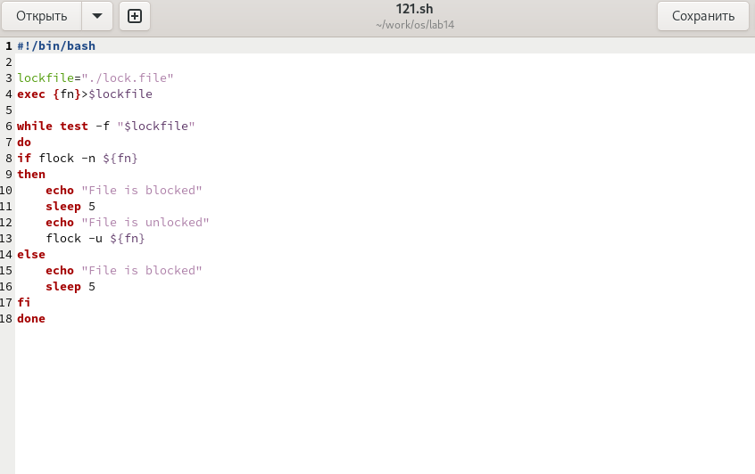
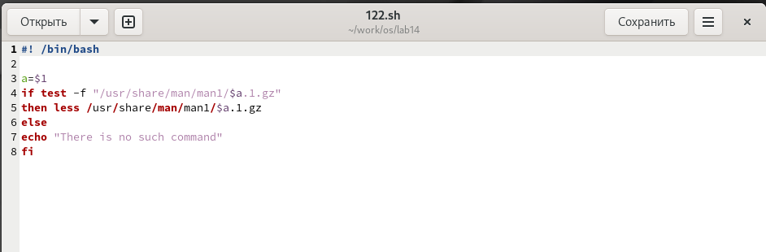
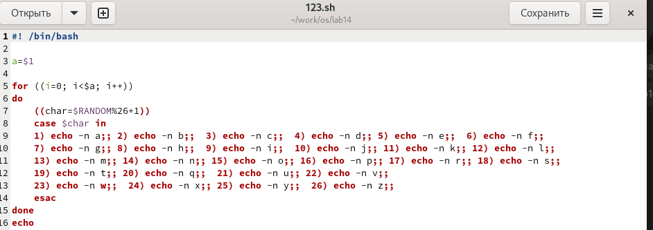

---
## Front matter
lang: ru-RU
title: Лабораторная работа №14
subtitle: операционные системы
author:
  - Лисенков Е.Р.
institute:
  - Российский университет дружбы народов, Москва, Россия

## i18n babel
babel-lang: russian
babel-otherlangs: english

## Formatting pdf
toc: false
toc-title: Содержание
slide_level: 2
aspectratio: 169
section-titles: true
theme: metropolis
header-includes:
 - \metroset{progressbar=frametitle,sectionpage=progressbar,numbering=fraction}
 - '\makeatletter'
 - '\beamer@ignorenonframefalse'
 - '\makeatother'
---

# Информация

## Докладчик

:::::::::::::: {.columns align=center}
::: {.column width="70%"}

  * Лисенков Егор Романович
  * студент
  * Российский университет дружбы народов
  * [1132232881@rudn.ru](mailto:1132232881@rudn.ru)
  * <https://github.com/erlisenkov>

:::
::: {.column width="30%"}


:::
::::::::::::::

# Вводная часть

## Цель работы

Цель данной лабораторной работы - изучить основы программирования в оболочке ОС UNIX, научится писать более
сложные командные файлы с использованием логических управляющих конструкций и циклов.


# Выполнение лабораторной работы

## Выполнение лабораторной работы

# Выполнение лабораторной работы

## Первая программа 

Командный файл, реализующий упрощённый механизм семафоров. Командный файл должен в течение некоторого времени t1 дожидаться освобождения
ресурса, выдавая об этом сообщение, а дождавшись его освобождения, использовать
его в течение некоторого времени t2<>t1, также выдавая информацию о том, что
ресурс используется соответствующим командным файлом (процессом). Запустить
командный файл в одном виртуальном терминале в фоновом режиме, перенаправив
его вывод в другой (> /dev/tty#, где # — номер терминала куда перенаправляется
вывод), в котором также запущен этот файл, но не фоновом, а в привилегированном
режиме. Доработать программу так, чтобы имелась возможность взаимодействия трёх
и более процессов

## Код

{#fig:002 width=70%}

```sh
#!/bin/bash

lockfile="./lock.file"
exec {fn}>$lockfile

while test -f "$lockfile"
do
if flock -n ${fn}
then
    echo "File is blocked"
    sleep 5
    echo "File is unlocked"
    flock -u ${fn}
else
    echo "File is blocked"
    sleep 5
fi
done
```

## Результат работы кода

## Вторая программа

Командный
файл должен получать в виде аргумента командной строки название команды и в виде
результата выдавать справку об этой команде или сообщение об отсутствии справки,
если соответствующего файла нет в каталоге man1


```sh
#! /bin/bash

a=$1
if test -f "/usr/share/man/man1/$a.1.gz"
then less /usr/share/man/man1/$a.1.gz
else
echo "There is no such command"
fi

```
## Код

{#fig:2 width=100%}

## Последняя программа выглядит иначе.

{#fig:4 width=100%}

# Выводы

Я усвоил материал и готов к дальнейшему изучению линукс!

# Ответы на контрольные вопросы


## 1.

Каково предназначение команды getopts?

Найдите синтаксическую ошибку в следующей строке: 1 while [$1 != "exit"]

В данной строчке допущены следующие ошибки: не хватает пробелов после первой скобки [ и перед второй скобкой ] выражение \$1 необходимо взять в “”, потому что эта переменная может содержать пробелы Таким образом, правильный вариант должен выглядеть так: while [ “$1” != "exit" ]

## 2

Как объединить (конкатенация) несколько строк в одну?

Чтобы объединить несколько строк в одну, можно воспользоваться несколькими способами: Первый: VAR1="Hello," VAR2=" World" VAR3="\$VAR1$VAR2" echo "\$VAR3" Результат: Hello, World Второй: VAR1="Hello, " VAR1+=" World" echo "\$VAR1" Результат: Hello, World

## 3. 

Какие операторы управления действиями вы знаете?

Найдите информацию об утилите seq. Какими иными способами можно реализовать её функционал при программировании на bash?

Команда seq в Linux используется для генерации чисел от ПЕРВОГО до ПОСЛЕДНЕГО шага INCREMENT. Параметры: seq LAST: если задан только один аргумент, он создает числа от 1 до LAST с шагом шага, равным 1. Если LAST меньше 1, значение is не выдает. seq FIRST LAST: когда заданы два аргумента, он генерирует числа от FIRST до LAST с шагом 1, равным 1. Если LAST меньше FIRST, он не выдает никаких выходных данных. seq FIRST INCREMENT LAST: когда заданы три аргумента, он генерирует числа от FIRST до LAST на шаге INCREMENT. Если LAST меньше, чем FIRST, он не производит вывод. seq -f «FORMAT» FIRST INCREMENT LAST: эта команда используется для генерации последовательности в форматированном виде. FIRST и INCREMENT являются необязательными. seq -s «STRING» ПЕРВЫЙ ВКЛЮЧЕНО: Эта команда используется для STRING для разделения чисел. По умолчанию это значение равно /n. FIRST и INCREMENT являются необязательными. seq -w FIRST INCREMENT LAST: эта команда используется для выравнивания ширины путем заполнения начальными нулями. FIRST и INCREMENT являются необязательными.

## 4. 

Какой результат даст вычисление выражения \$((10/3))?

Результатом данного выражения \$((10/3)) будет 3, потому что это целочисленное деление без остатка.

## 5. 

Укажите кратко основные отличия командной оболочки zsh от bash.

Отличия командной оболочки zsh от bash: В zsh более быстрое автодополнение для cd с помощью Тab В zsh существует калькулятор zcalc, способный выполнять вычисления внутри терминала В zsh поддерживаются числа с плавающей запятой В zsh поддерживаются структуры данных «хэш» В zsh поддерживается раскрытие полного пути на основенеполных данных В zsh поддерживается замена части пути В zsh есть возможность отображать разделенный экран, такой же как разделенный экран vim

## 6. 

Проверьте, верен ли синтаксис данной конструкции 1 for ((a=1; a <= LIMIT; a++))

for ((a=1; a <= LIMIT; a++)) синтаксис данной конструкции верен, потому что, используя двойные круглые скобки, можно не писать $ перед переменными ().

## 7. 

Сравните язык bash с какими-либо языками программирования. Какие преимущества у bash по сравнению с ними? Какие недостатки?

Преимущества и недостатки скриптового языка bash:

- Один из самых распространенных и ставится по умолчанию в большинстве дистрибутивах Linux, MacOS
- Удобное перенаправление ввода/вывода
- Большое количество команд для работы с файловыми системами Linux
- Можно писать собственные скрипты, упрощающие работу в Linux Недостатки скриптового языка bash:
- Дополнительные библиотеки других языков позволяют выполнить больше действий
- Bash не является языков общего назначения
- Утилиты, при выполнении скрипта, запускают свои процессы, которые, в свою очередь, отражаются на быстроте выполнения этого скрипта
- Скрипты, написанные на bash, нельзя запустить на других операционных системах без дополнительных действий
