---
## Front matter
title: "Отчёт по выполнению внешнего курса"
subtitle: "Операционные системы"
author: "Идрисов Джафер Арсенович"

## Generic otions
lang: ru-RU
toc-title: "Содержание"

## Bibliography
bibliography: bib/cite.bib
csl: pandoc/csl/gost-r-7-0-5-2008-numeric.csl

## Pdf output format
toc: true # Table of contents
toc-depth: 2
lof: true # List of figures
lot: true # List of tables
fontsize: 12pt
linestretch: 1.5
papersize: a4
documentclass: scrreprt
## I18n polyglossia
polyglossia-lang:
  name: russian
  options:
	- spelling=modern
	- babelshorthands=true
polyglossia-otherlangs:
  name: english
## I18n babel
babel-lang: russian
babel-otherlangs: english
## Fonts
mainfont: PT Serif
romanfont: PT Serif
sansfont: PT Sans
monofont: PT Mono
mainfontoptions: Ligatures=TeX
romanfontoptions: Ligatures=TeX
sansfontoptions: Ligatures=TeX,Scale=MatchLowercase
monofontoptions: Scale=MatchLowercase,Scale=0.9
## Biblatex
biblatex: true
biblio-style: "gost-numeric"
biblatexoptions:
  - parentracker=true
  - backend=biber
  - hyperref=auto
  - language=auto
  - autolang=other*
  - citestyle=gost-numeric
## Pandoc-crossref LaTeX customization
figureTitle: "Рис."
tableTitle: "Таблица"
listingTitle: "Листинг"
lofTitle: "Список иллюстраций"
lotTitle: "Список таблиц"
lolTitle: "Листинги"
## Misc options
indent: true
header-includes:
  - \usepackage{indentfirst}
  - \usepackage{float} # keep figures where there are in the text
  - \floatplacement{figure}{H} # keep figures where there are in the text
---

# Цель работы

Овладеть базовыми принципами операционной системы Linux и развить умения, нужные для успешной работы в ней.

# Начало работы 

## 1 раздел

Я дал понять, что мне ясна суть и название курса.

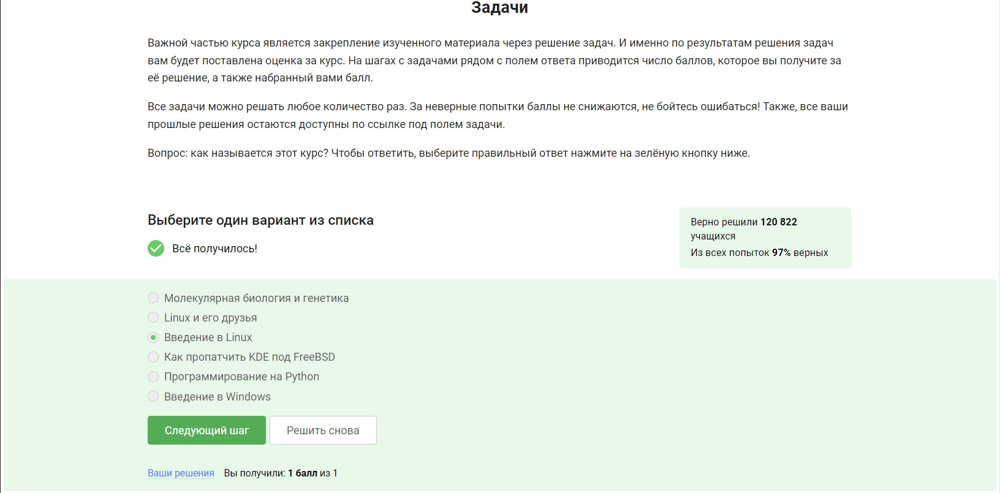{#fig:001 width=70%}

Осознал правила курса.

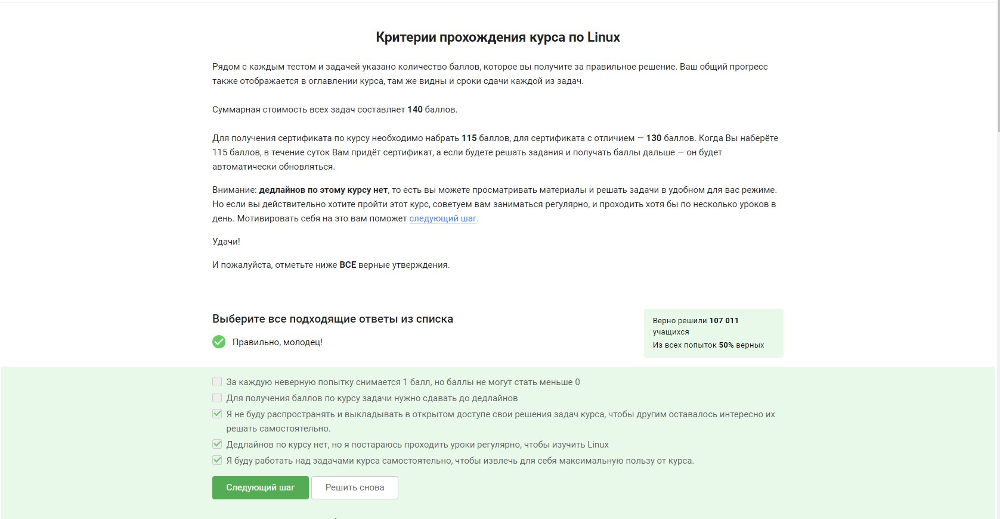{#fig:002 width=70%}

Выбрал подходящее

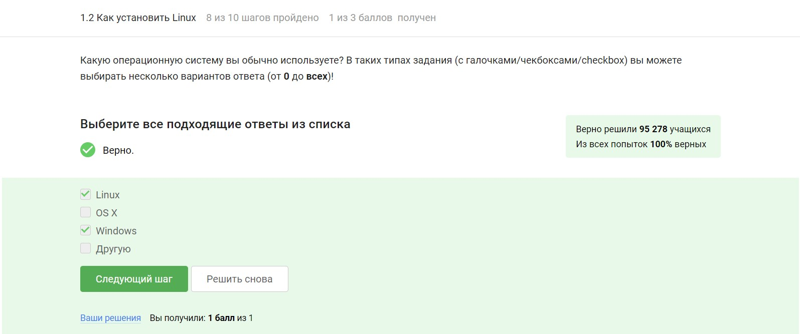{#fig:003 width=70%}

Указал, что знаком с виртуальной машиной

{#fig:004 width=70%}

Указал, что я могу запустить Линукс.

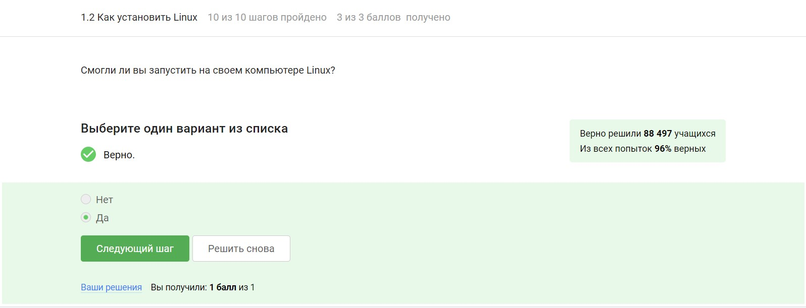{#fig:005 width=70%}

Для выполнения этого задания я создал документ в OpenOffice/LibreOffice Writer, где написал строку "Hello, Linux!" с использованием шрифта FreeMono. Если этот шрифт не был бы доступен, я бы использовал Arial или Times New Roman. После этого я сохранил документ в формате XML (Microsoft Word 2003 XML) или FODT (OpenDocument Text: Flat XML), как требовалось в задании. Такой подход позволяет сохранить структуру документа в формате XML или его аналоге, что упрощает совместимость с другими программами и облегчает обмен файлами.

Это задание дало мне возможность освоить основные функции текстового редактора OpenOffice/LibreOffice Writer и понять, как сохранять документы в различных форматах, включая XML и FODT. Теперь я готов к дальнейшему изучению Linux и использованию его в своих проектах и задачах.

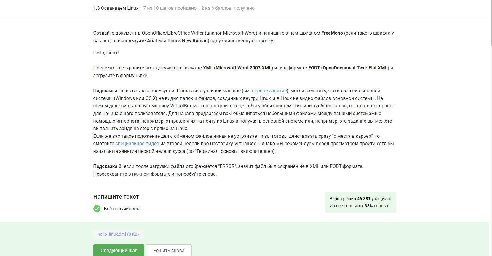{#fig:006 width=70%}

В Linux, особенно в дистрибутиве Ubuntu, установочные пакеты обычно имеют расширение ".deb". Этот формат пакетов применяется в Debian и его производных дистрибутивах, включая Ubuntu. Такие пакеты включают в себя программное обеспечение, а также сведения о зависимостях и инструкции по установке, что облегчает процесс установки и управление программами в Ubuntu.

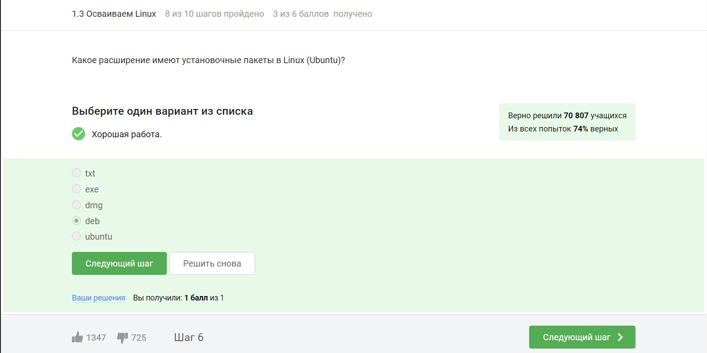{#fig:007 width=70%}

На вкладке "About" (О программе) в плеере VLC можно найти информацию о разработчиках. Первая фамилия в списке авторов — Aimar.

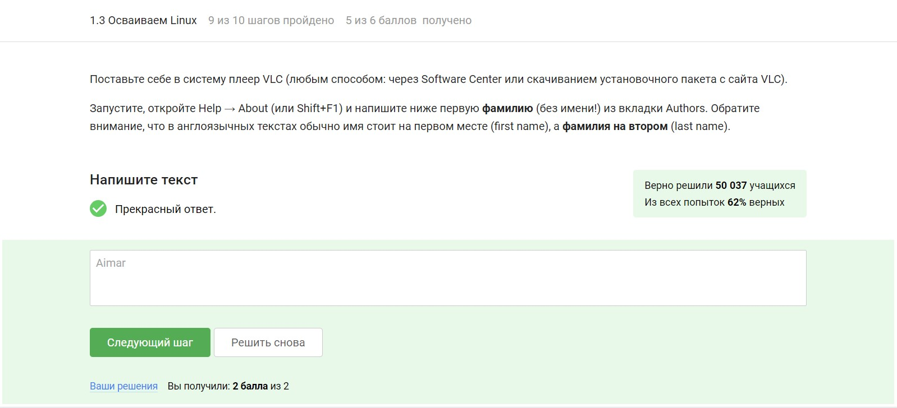{#fig:008 width=70%}

1. Update Manager не используется для обновления ссылок в Software Center. Он предназначен исключительно для управления обновлениями операционной системы и установленного на ней программного обеспечения.

2. Update Manager не подходит для установки новых программ. Он используется только для управления обновлениями, а не для установки нового ПО.

3. Да, основная задача Update Manager — обновление уже установленных программ и компонентов операционной системы. Это позволяет пользователям получать самые свежие версии и исправления для программ и пакетов, установленных на их компьютерах.

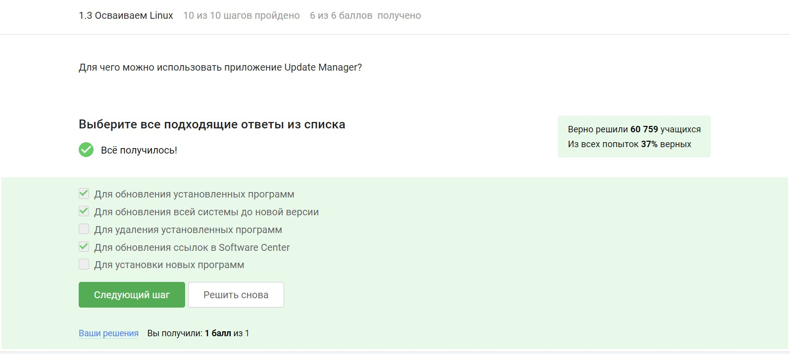{#fig:009 width=70%}

Использую знание русского языка

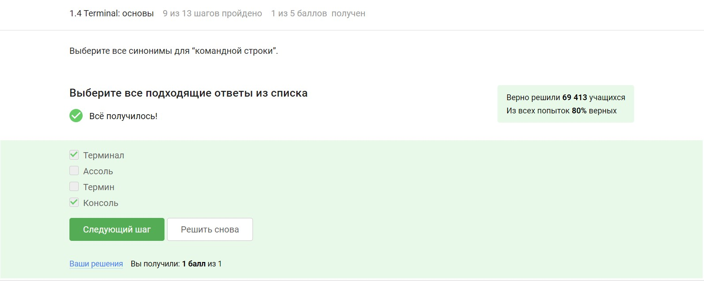{#fig:010 width=70%}

Команда `pwd` предназначена для отображения текущей рабочей директории в командной строке. Она выводит полный путь к директории, в которой вы находитесь в данный момент. Сокращение `pwd` расшифровывается как "print working directory" (печать рабочей директории). Команда показывает, в какой директории вы находитесь относительно корневой файловой системы.

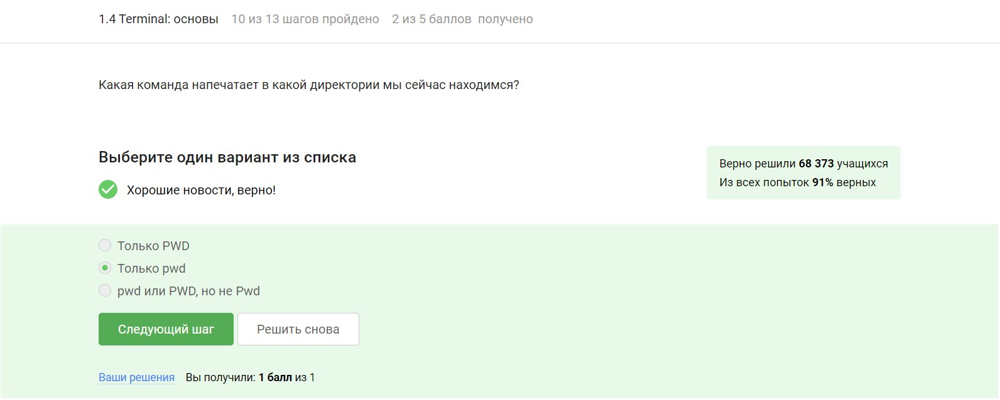{#fig:011 width=70%}

Да, все предложенные команды полностью эквивалентны команде `ls -A --human-readable -l /some/directory`. 


1. Команда `ls --almost-all --human-readable -l /some/directory` использует опцию `--almost-all`, которая эквивалентна `-A`. Обе опции показывают все файлы и папки, включая скрытые, за исключением ссылок на текущую и родительскую директории.
2. Команда `ls --human-readable -A -l /some/directory` - порядок опций не играет роли, поэтому `-A` и `-l` можно использовать в любом порядке.
3. Команда `ls -lAh /some/directory` показывает, что опции могут быть объединены без пробелов, поэтому запись `-lAh` равнозначна `-l -A -h`.
4. Команда `ls -h -A -l /some/directory` аналогична предыдущему примеру, но опции перечислены в другом порядке. Порядок перечисления опций не влияет на результат, так как `-h -A -l` эквивалентно `-l -A -h`.
5. Команда `ls -Ahl /some/directory` показывает, что опции можно объединять без пробелов в любом порядке, поэтому запись `-Ahl` эквивалентна `-A -h -l`.

Все эти команды используют тот же набор опций, что и `ls -A --human-readable -l /some/directory`, и поэтому они полностью эквивалентны.

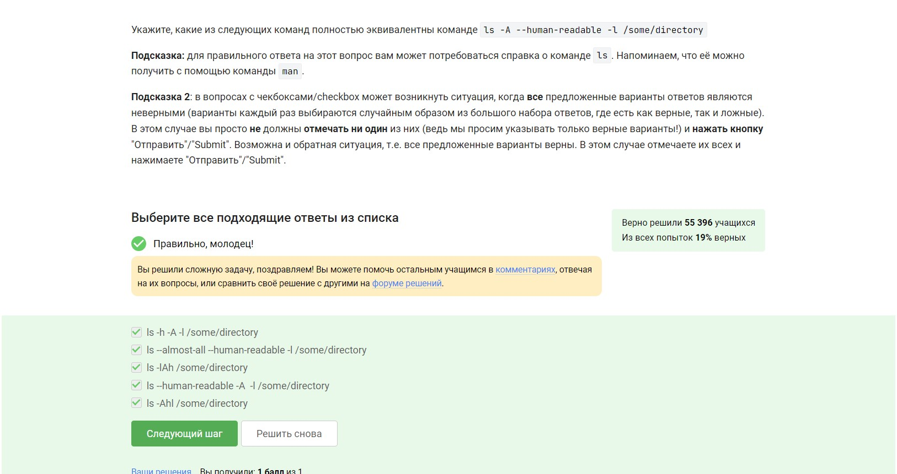{#fig:012 width=70%}

1. Команда `ls ~/Downloads` отображает содержимое директории Downloads, находящейся в домашней директории пользователя. Символ `~` представляет собой сокращение для домашней директории текущего пользователя.
2. Команда `ls ../Downloads` покажет содержимое директории Downloads, находящейся в родительской директории относительно текущей. Это означает, что Downloads расположена на уровень выше текущей директории, например, в /home/bi.
3. Команда `ls /home/bi/Downloads` выведет содержимое директории Downloads, используя абсолютный путь к этой директории.
4. Команда `ls ./../Downloads` отобразит содержимое директории Downloads, используя относительный путь. Сначала она поднимается на уровень выше относительно текущей директории, затем переходит в Downloads.

Все эти команды позволяют отобразить содержимое директории Downloads, находясь в /home/bi/Documents, при этом исключая содержимое других директорий.

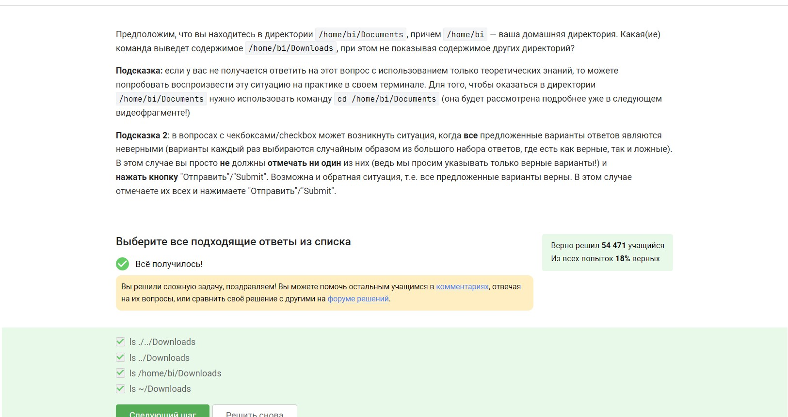{#fig:013 width=70%}

`rm` — это команда для удаления файлов или директорий.

`-r` — это опция команды `rm`, обозначающая рекурсивное удаление. Это значит, что команда `rm` удалит все файлы и поддиректории в указанной директории, включая саму эту директорию. Благодаря этой опции `rm` может удалять целые директории вместе с их содержимым.

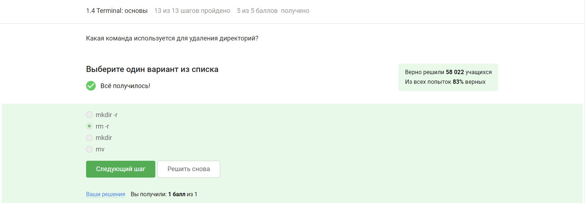{#fig:014 width=70%}

При вводе команды `firefox` в терминале запускается браузер Mozilla Firefox в новом процессе. Если после этого ввести команду `exit` в том же терминале, это завершит текущий терминальный сеанс, но не повлияет на процессы, запущенные из него, такие как Firefox. Таким образом, закрытие терминала не приведет к закрытию браузера Firefox.

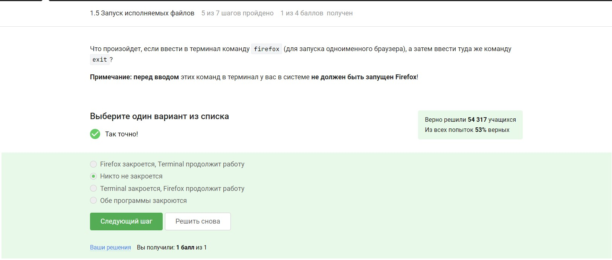{#fig:015 width=70%}

Если запустить команду с символом `&`, программа начнет работать в фоновом режиме, как если бы она была запущена, не блокируя терминал.

`Ctrl+Z`: Это сочетание клавиш приостанавливает выполнение текущего процесса в терминале. Если программа была запущена без символа `&`, использование `Ctrl+Z` приостановит выполнение программы. Если программа была запущена с символом `&`, то при нажатии `Ctrl+Z` процесс также будет приостановлен.

Команда `bg` используется для возобновления приостановленного процесса в фоновом режиме после его приостановки с помощью Ctrl+Z.

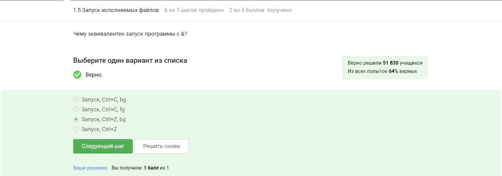{#fig:016 width=70%}

Запустил и увидел

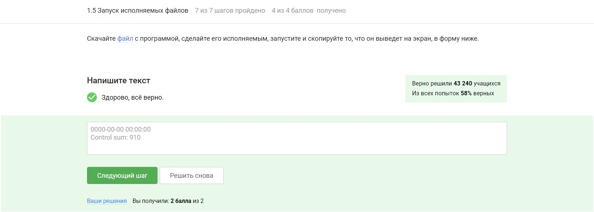{#fig:017 width=70%}

При запуске программы в терминале, её стандартный вывод (stdout) и поток ошибок (stderr) обычно направляются в терминал. Это позволяет пользователю видеть все ошибки или сообщения, которые программа может выдавать, и реагировать на них соответственно.

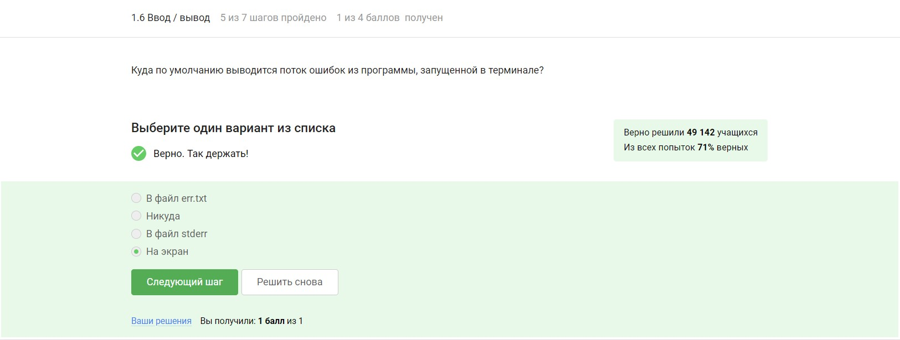{#fig:018 width=70%}

1. Команда `program 2>> file.txt` перенаправляет поток ошибок программы `program` в файл file.txt. Оператор `>>` добавляет ошибки в файл, сохраняя при этом существующие данные или создавая новый файл, если такого файла нет.
2. Команда `program 2> file.txt` также перенаправляет поток ошибок программы `program` в файл file.txt. Однако оператор `>` перезаписывает файл, если он уже существует, вместо добавления новых данных. Таким образом, при первом запуске команда создаст файл file.txt и запишет в него поток ошибок из программы `program`, но при последующих запусках файл будет перезаписываться, а не дополняться.

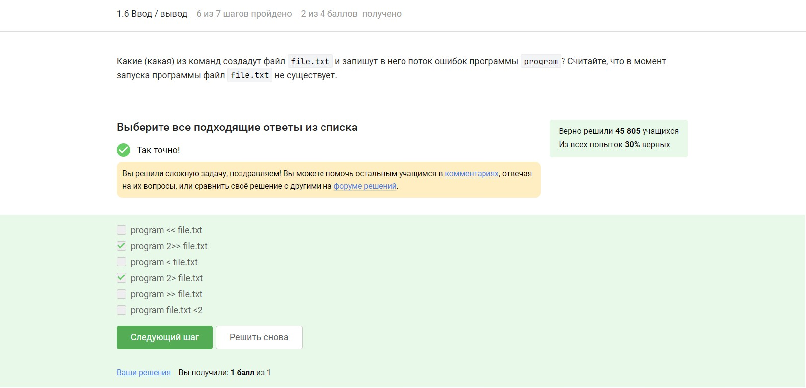{#fig:019 width=70%}

Когда программы объединяются в конвейер, стандартный вывод (stdout) первой программы передается на стандартный вход (stdin) второй программы. Тем не менее, поток ошибок (stderr) каждой программы не передается через конвейер и продолжает выводиться в терминале. Это означает, что если ошибки не перенаправляются специально, они будут отображаться на экране, а не передаваться через конвейер.

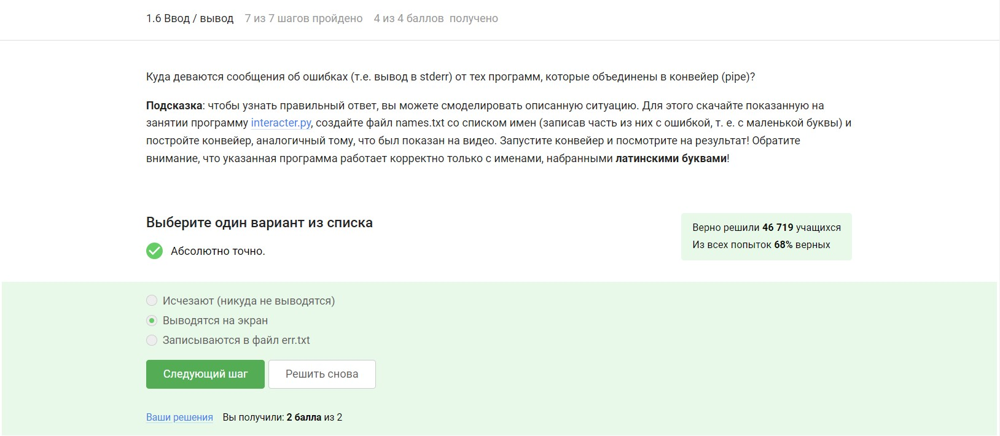{#fig:020 width=70%}

Команда `cd /home/alex/` меняет текущую директорию на `/home/alex/`.

Команда `wget -P /home/alex/Pictures -O 1.jpg http://example.com/example.jpg` скачивает изображение с указанного URL (http://example.com/example.jpg) и сохраняет его в директорию /home/alex/Pictures под именем 1.jpg. Флаг `-O 1.jpg` указывает, что файл будет сохранен под этим именем в указанной директории.

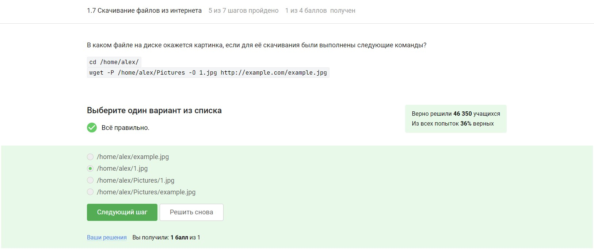{#fig:021 width=70%}

`-q` или `--quiet`: Эти опции подавляют вывод сообщений при выполнении команды `wget`, что позволяет ей работать в тихом режиме без отображения лишней информации на экране.

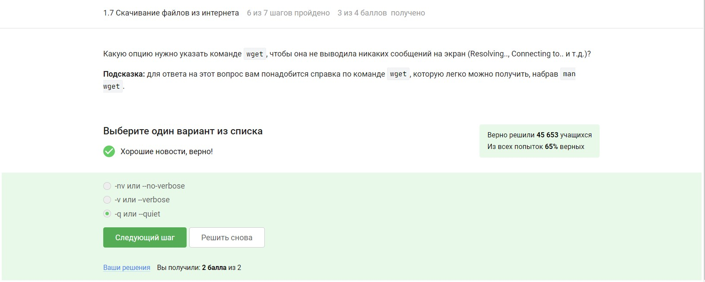{#fig:022 width=70%}

`wget -r`: Эта опция указывает `wget` рекурсивно следовать по ссылкам на веб-странице, чтобы загрузить связанные файлы.

`-l 1`: Эта опция ограничивает глубину рекурсии до 1 уровня, что означает, что `wget` загрузит только те файлы, которые напрямую связаны с начальной страницей.

`-A jpg`: Эта опция указывает `wget` загружать только файлы с расширением `.jpg`.

Таким образом, `wget` скачает все файлы с расширением `.jpg` и HTML-файлы на глубине 1. Однако, поскольку используется опция `-A jpg`, все скачанные HTML-файлы будут удалены после завершения загрузки, поскольку они не соответствуют заданному фильтру.

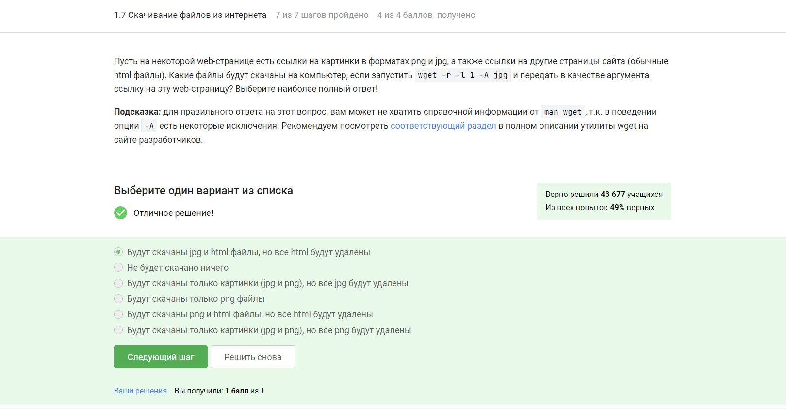{#fig:023 width=70%}

`gzip`: Это архиватор, который сжимает файлы в формат gzip (.gz). Он работает с отдельными файлами, не сохраняя структуру директорий. Обычно после распаковки архива в формате gzip сам архив удаляется по умолчанию.

`zip`: Это архиватор, который сжимает файлы в формат zip (.zip). В отличие от `gzip`, `zip` сохраняет не только один файл, но и структуру директорий, что позволяет архивировать и извлекать целые папки. После распаковки архив zip по умолчанию не удаляется, оставаясь в исходном месте.

{#fig:024 width=70%}

`zip`: Команда `zip` позволяет архивировать файлы и директории в формате .zip.

`tar`: Команда `tar` создает архивы, которые могут содержать файлы и директории, сохраняя их структуру и иерархию.

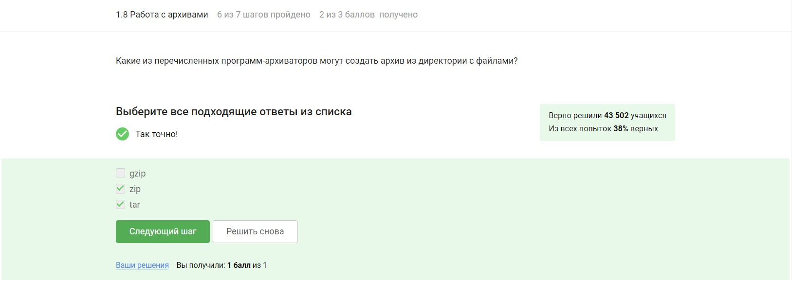{#fig:025 width=70%}

`-c`: Создание нового архива.

`-j`: Применение алгоритма сжатия bzip2 для сжатия файлов.

`-v`: Отображение подробной информации о процессе создания архива.

`-f`: Указание имени архива.

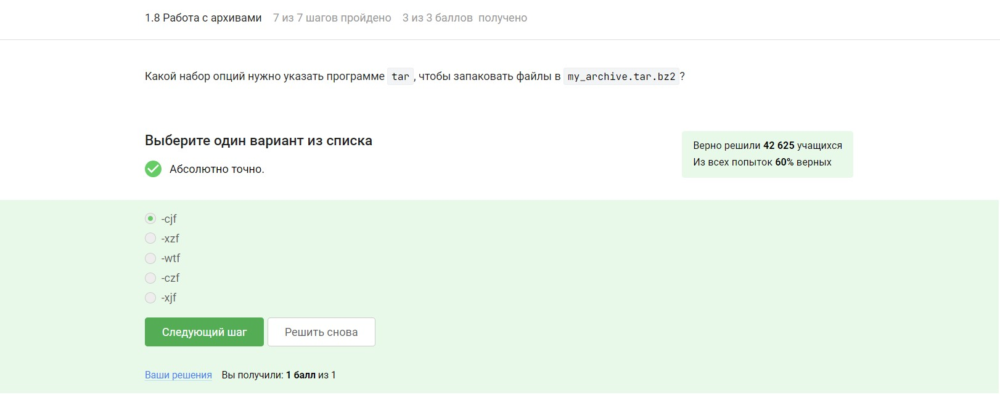{#fig:026 width=70%}

Маска `*.jpg` находит все файлы, чьи имена заканчиваются на `.jpg`, и не включает файлы, например, с именем `Alexey.jpeg`, потому что они не соответствуют этому шаблону.

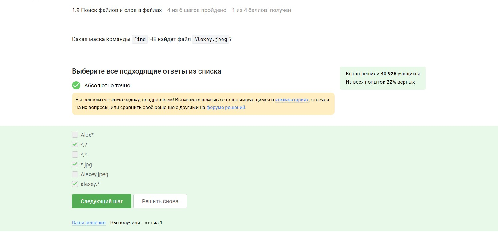{#fig:027 width=70%}

Ищем, учитывая нижний регистр. 

{#fig:028 width=70%}

Программа выполнилась успешно.

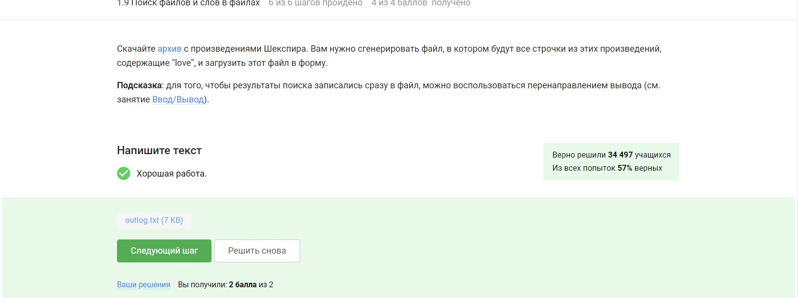{#fig:029 width=70%}

1. Выполнение ресурсоемких вычислений: Удаленные серверы с более мощным оборудованием и большим объемом вычислительных ресурсов могут использоваться для сложных задач, требующих много памяти и времени.

2. Хранение общедоступных данных: Удаленные серверы пригодны для хранения информации, к которой нужен доступ всем пользователям интернета, например, веб-контента, публичных файлов и прочего.

3. Сохранение больших объемов данных: Удаленные серверы обладают большим пространством для хранения, что делает их подходящими для больших массивов данных, таких как архивы, резервные копии или обработка больших данных.

4. Хранение конфиденциальной информации: Удаленные серверы можно настроить для хранения данных, доступ к которым должен быть ограничен определенной группой лиц. Сюда входят данные клиентов, финансовая информация или другие чувствительные сведения.

## 2 РАЗДЕЛ

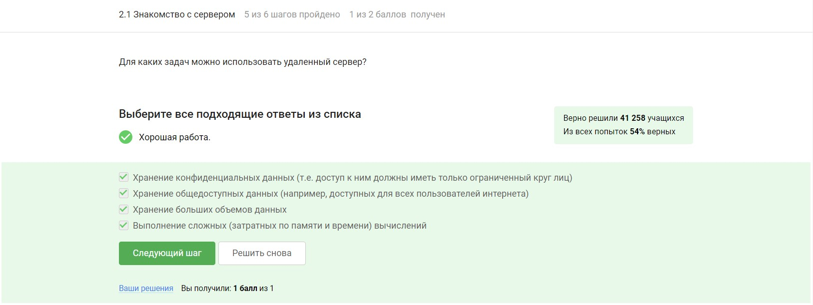{#fig:030 width=70%}

Ключ `id_rsa.pub` — это открытый ключ, который используется для проверки подписи, а не для её создания. Он не содержит приватных данных, поэтому его можно безопасно распространять и применять для аутентификации на удаленных серверах.

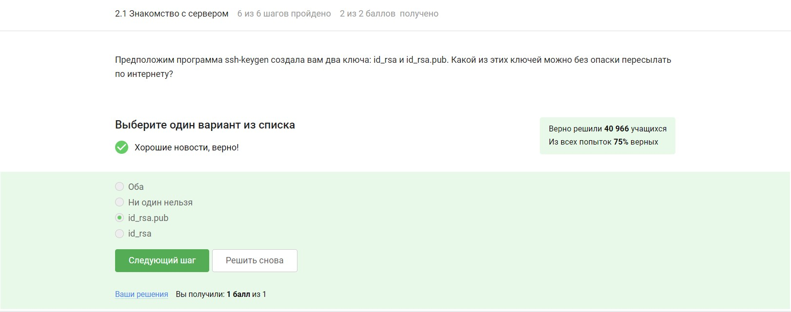{#fig:031 width=70%}

- `scp`: Эта команда предназначена для копирования файлов между компьютерами через SSH.
- `-r`: Этот флаг говорит `scp` выполнить рекурсивное копирование, что означает, что папка `stepic` будет скопирована со всем её содержимым, включая подпапки.
- `stepic`: Имя папки, которую требуется скопировать.
- `username@server`: Указывает имя пользователя и адрес сервера, на который нужно скопировать файлы.
- `~/`: Это символизирует домашнюю директорию пользователя на сервере, куда будут скопированы файлы.

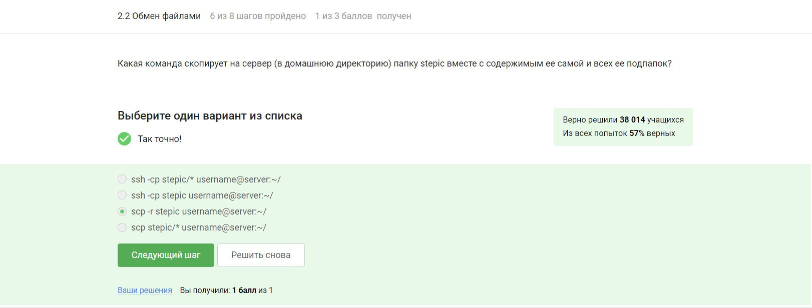{#fig:032 width=70%}

1. **Проверка и восстановление интернет-соединения**: Первым делом убедитесь, что компьютер подключен к интернету. Если соединение отсутствует, его следует настроить или восстановить.
   
2. **Обновление списка пакетов APT**: Команда `sudo apt-get update` обновляет список пакетов из источников APT. Это полезно, если информация о доступных пакетах устарела или изменилась.

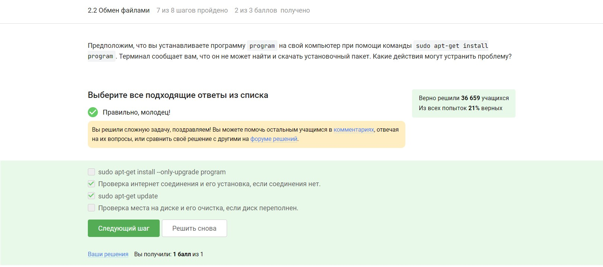{#fig:033 width=70%}

1. **Передача файлов с компьютера на сервер**: Filezilla позволяет загружать файлы с локального компьютера на удаленный сервер.

2. **Передача файлов с сервера на компьютер**: Filezilla также может скачивать файлы с удаленного сервера на локальный компьютер.

Filezilla позволяет просматривать содержимое директорий как на локальном компьютере, так и на удаленном сервере. Её основная функция - передача файлов между локальным компьютером пользователя и удаленным сервером.

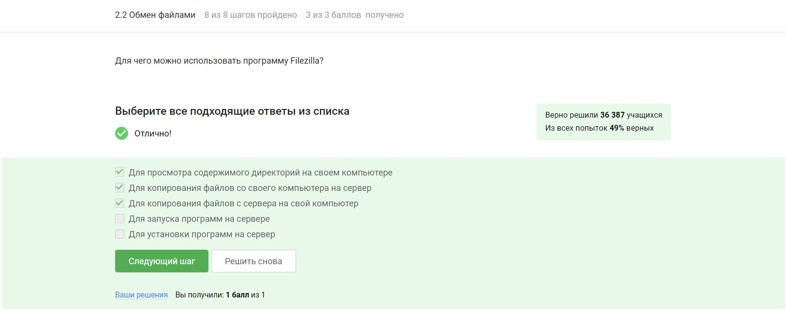{#fig:034 width=70%}

1. **Настроить сервер для отображения графики на удаленном компьютере**: Это может быть сделано различными способами, например, через удаленный рабочий стол или графический сервер (например, X11), что позволит программе выводить графический интерфейс на удаленный компьютер.

2. **Узнать, есть ли терминальная версия этой программы**: В некоторых случаях для программы может существовать командная (CLI) версия, которую можно запустить на сервере без графического интерфейса. Если такая версия доступна, её можно использовать для выполнения задач на сервере, не полагаясь на графический интерфейс.

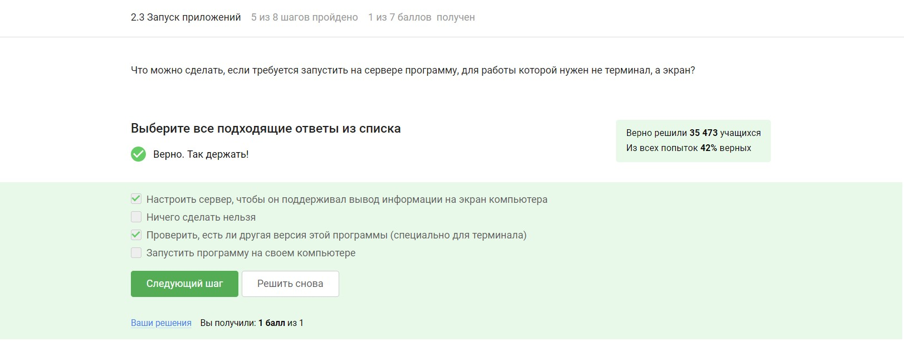{#fig:035 width=70%}

1. **man program**: Команда `man` (сокращение от "manual") отображает справочные страницы программы в терминале. Когда вы вводите `man program`, открывается подробное руководство с описанием программы, доступными опциями и примерами использования.

2. **help program**: Эта команда предоставляет встроенную справку о командах в командной оболочке (например, в bash). Однако, она может быть недоступна для всех программ, работая только для команд, встроенных в оболочку.

3. **program --help**: Многие программы поддерживают опцию `--help`, которая выводит краткое руководство по использованию программы и её параметрам. В некоторых случаях встречаются другие варианты опций, такие как `-help`, `-h`, или `-H`.

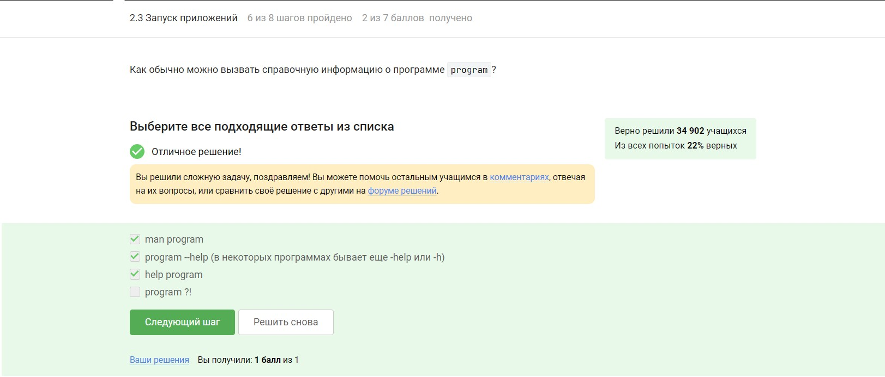{#fig:036 width=70%}

Чтобы узнать, какие форматы данных поддерживает программа FastQC, нужно обратиться к её справочной информации. Это можно сделать, запустив команду `./fastqc --help` в каталоге, где находится исполняемый файл `fastqc`.

Однако, после просмотра справочной информации, оказывается, что в ней нет прямого указания на поддерживаемые форматы данных. Программа FastQC предназначена для анализа качества секвенированных данных и обычно работает с файлами в форматах FASTQ и BAM. Но без точного текста справки невозможно определить, какие форматы данных программа FastQC поддерживает на входе.

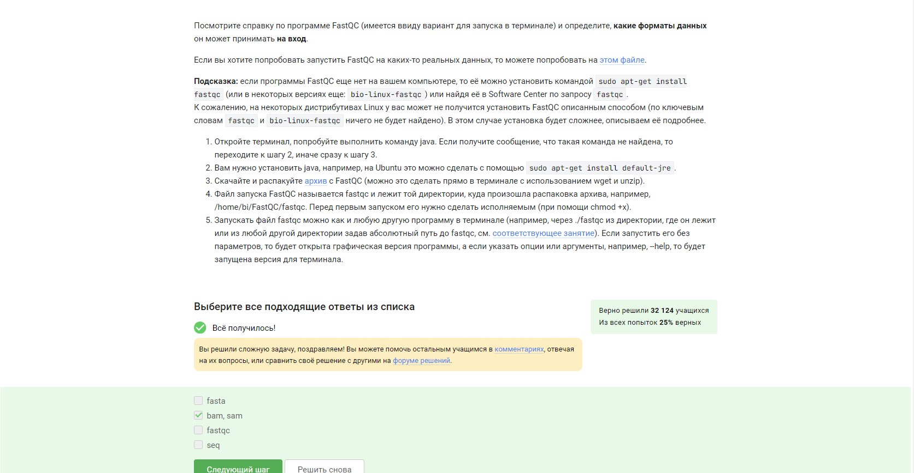{#fig:037 width=70%}

`clustalw`: название исполняемого файла Clustal, представляющего версию программы, которая работает в терминале.

`test.fasta`: имя входного файла, содержащего последовательности для множественного выравнивания.

`-align`: опция, указывающая Clustal на проведение множественного выравнивания последовательностей.

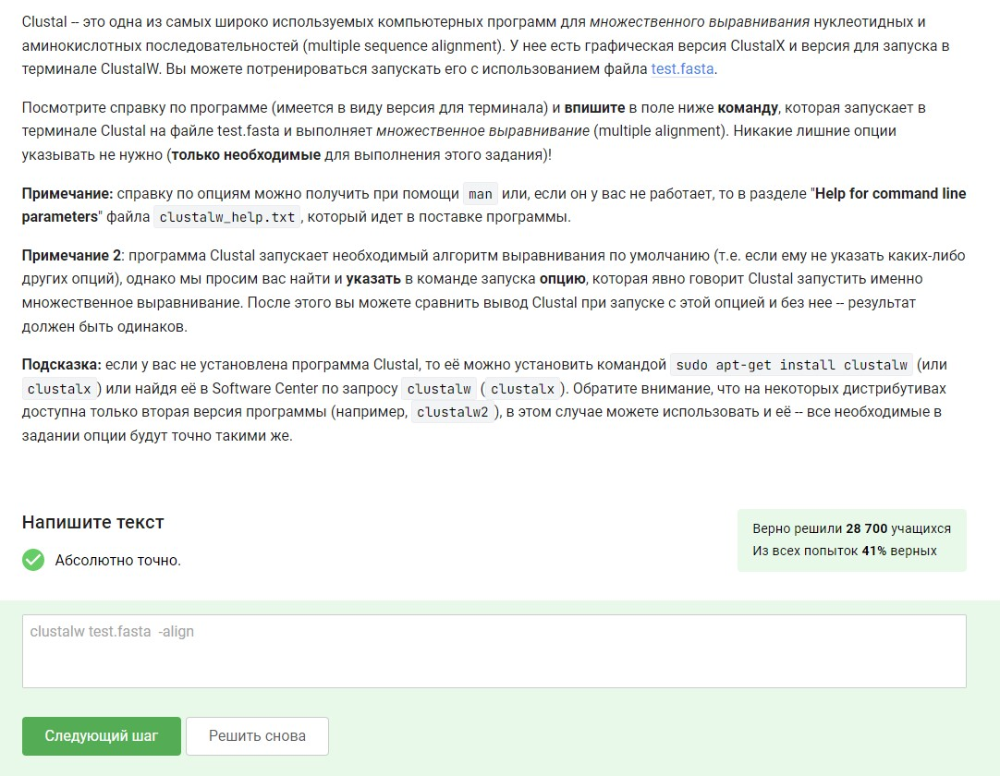{#fig:038 width=70%}

Команда `jobs` отображает список задач, запущенных в фоновом режиме в текущем сеансе терминала. После выполнения предложенной последовательности команд происходит следующее:

1. Команда `fg %1` выводит задачу номер 1 в передний план, возвращая управление программой program1. Однако мы немедленно прерываем ее выполнение комбинацией клавиш Ctrl+C.

2. Затем, `fg %2` переводит задачу номер 2 в передний план, делая активной программу program2. Мы приостанавливаем эту программу, нажав Ctrl+Z.

После этих действий информация о программах program1 и program2 больше не отображается в списке `jobs`, и остаётся информация только о программе program3.

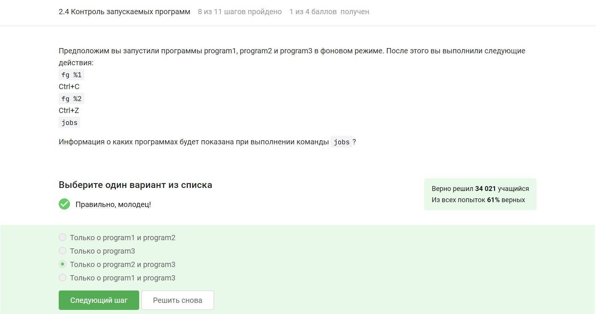{#fig:039 width=70%}

Идентификаторы, используемые в утилитах `jobs`, `top`, и `ps`, имеют разные назначения и работают по разным принципам:

1. **jobs**: Команда `jobs` выводит список заданий, запущенных в текущем сеансе терминала. Здесь идентификаторы представляют собой порядковые номера заданий в рамках этого сеанса. Они могут не быть уникальными и могут меняться по мере завершения или приостановки заданий.

2. **top**: Эта утилита показывает список процессов, работающих в системе. Здесь идентификаторы — это уникальные процессные идентификаторы (PID), которые операционная система присваивает каждому процессу. Эти идентификаторы уникальны в пределах всей системы и не изменяются, пока процесс не завершится.

3. **ps**: Утилита `ps` также показывает список процессов в системе. Идентификаторы процессов здесь — это те же уникальные PIDs, которые присваиваются каждому процессу операционной системой, оставаясь неизменными в течение всего жизненного цикла процесса.

Таким образом, идентификаторы в `jobs` не совпадают с идентификаторами в `top` и `ps`, потому что `jobs` показывает информацию о заданиях в текущем сеансе терминала, в то время как `top` и `ps` отображают данные о процессах в системе в целом.

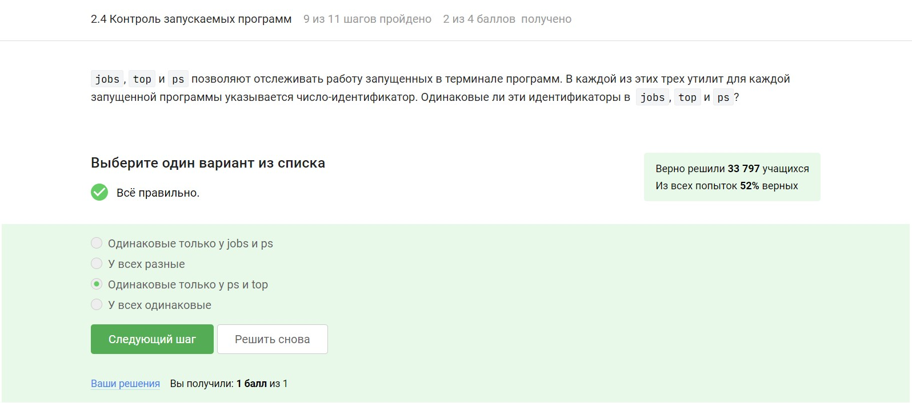{#fig:040 width=70%}

 Команда `kill` в UNIX-подобных системах, включая Linux, предназначена для отправки сигналов процессам. Сигнал номер 9, также известный как SIGKILL, применяется для принудительного завершения процесса. Когда процесс получает этот сигнал, он не может его обработать или выполнить какие-либо действия перед завершением, что приводит к немедленному завершению процесса.

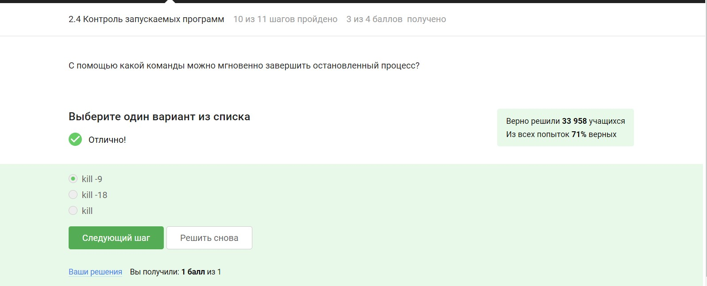{#fig:041 width=70%}

Когда процесс приостанавливается с помощью Ctrl+Z, он переходит в состояние приостановки (Suspended). Если после этого использовать команду `kill` без дополнительных опций, то процесс завершится, как только будет возобновлен. То есть при вводе команды `fg` или `bg` для возобновления приостановленного процесса, он сразу завершится.

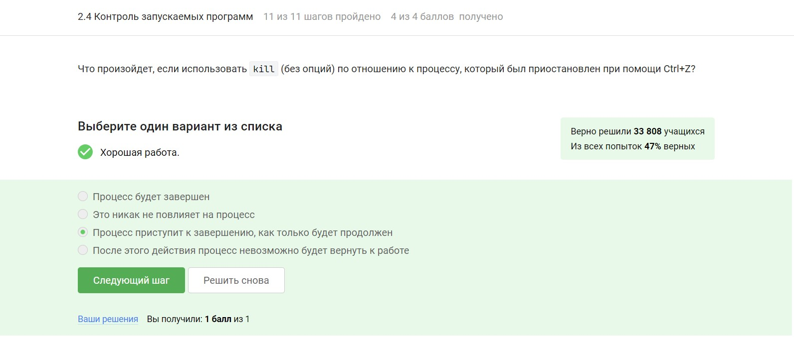{#fig:042 width=70%}

Когда многопоточное приложение приостанавливается с помощью `Ctrl+Z`, все его потоки останавливаются, и оно перестает потреблять процессорные ресурсы. В результате, использование CPU для этого приложения снижается до 0%, поскольку ни один из его потоков не выполняется.

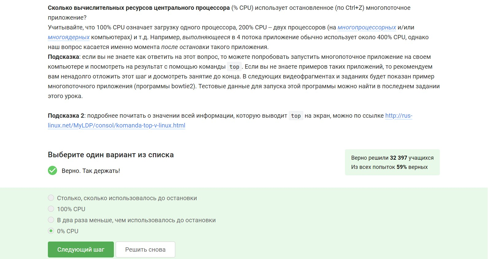{#fig:043 width=70%}

Когда приложение приостанавливается с помощью `Ctrl+Z`, оно не освобождает память, которую использовало в момент приостановки. Следовательно, объем занятой памяти останется на том же уровне, что и в момент остановки приложения.

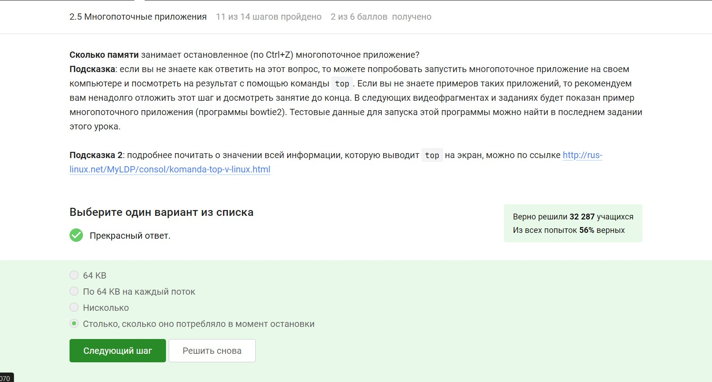{#fig:044 width=70%}

Завершение отдельного потока в многопоточном приложении может быть сложной задачей, так как потоки взаимодействуют с общими ресурсами и данными. Принудительное завершение одного потока может привести к непредсказуемым последствиям для приложения в целом. В большинстве случаев, потоки завершаются вместе с завершением всего приложения. Однако если нужно остановить многопоточное приложение, обычно используется команда `kill` с идентификатором процесса, чтобы завершить его целиком.

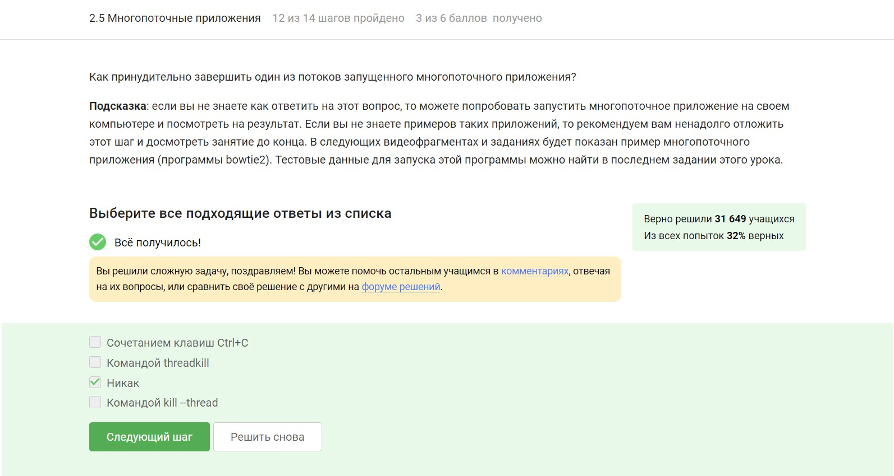{#fig:045 width=70%}

Из двух инструментов Bowtie2, только bowtie2 поддерживает многопоточность. Подпрограмма bowtie2-build, предназначенная для предварительной индексации референсного генома, выполняется последовательно и не может работать в нескольких потоках одновременно.


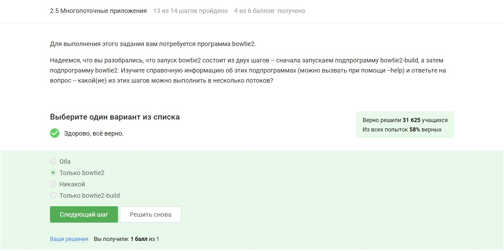{#fig:046 width=70%}

Данный отчет представляет собой результат работы программы bowtie2 и содержит информацию о выравнивании прочтений на референсный геном. Вот что означают эти числа:

- "306174 reads" означает, что обработано всего 306174 прочтения.
- "306174 (100.00%) were unpaired" указывает на то, что все прочтения были одиночными, а не парными.
- "11 (0.00%) aligned 0 times" показывает, что 11 прочтений не удалось выровнять ни разу.
- "305580 (99.81%) aligned exactly 1 time" указывает, что 305580 прочтений были выровнены ровно один раз.
- "583 (0.19%) aligned >1 times" означает, что 583 прочтения были выровнены более одного раза.
- "100.00% overall alignment rate" означает, что общее значение выравнивания составляет 100%.

Эта информация отражает качество и количество выравнивания прочтений на геном.

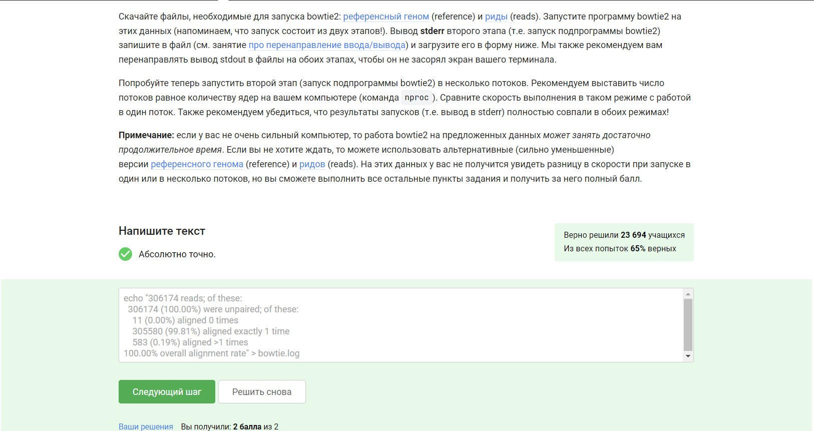{#fig:047 width=70%}

Когда вторая вкладка терминала выполняет команду `fg`, она пытается вернуть в активное состояние приостановленный процесс, который был запущен в первой вкладке. Однако, поскольку вкладки терминала изолированы друг от друга, вторая вкладка не может управлять процессами из первой. В результате терминал выдаст ошибку, указывая, что нет процессов для возобновления, поскольку команда `fg` не может находить процессы из других вкладок.

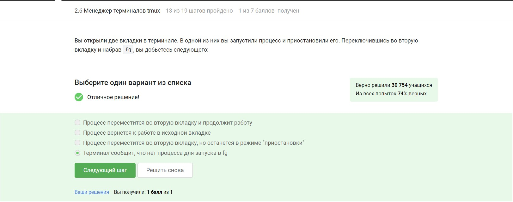{#fig:048 width=70%}

Если в последней вкладке tmux ввести команду `exit`, это приведёт к закрытию этой вкладки и, следовательно, к завершению сеанса tmux, поскольку больше не останется активных окон или вкладок.

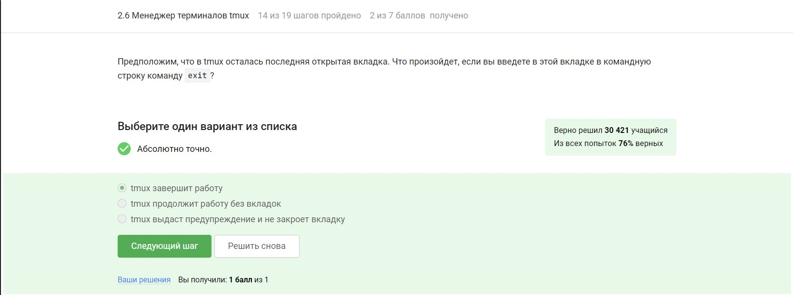{#fig:049 width=70%}

При закрытии терминала соединение с сервером разрывается, но процессы внутри tmux на сервере продолжают работу, так как tmux функционирует в фоновом режиме и сохраняет состояние сессии даже после потери соединения.

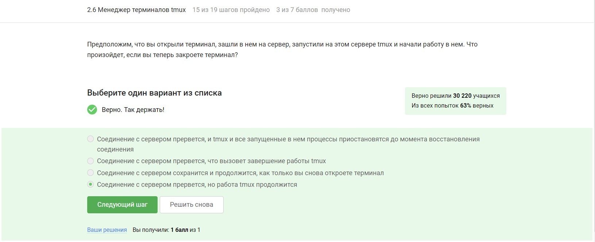{#fig:050 width=70%}

Когда вы закрываете вкладку в tmux, используя комбинацию клавиш `Ctrl+B, X`, tmux закрывает эту вкладку, и все запущенные в ней процессы завершаются.


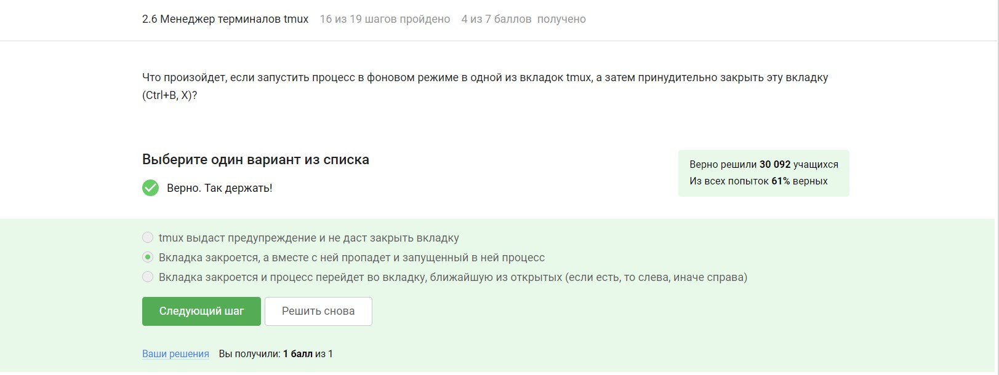{#fig:051 width=70%}

Комбинация клавиш `Ctrl+B, ,` используется в tmux для переименования текущей вкладки.

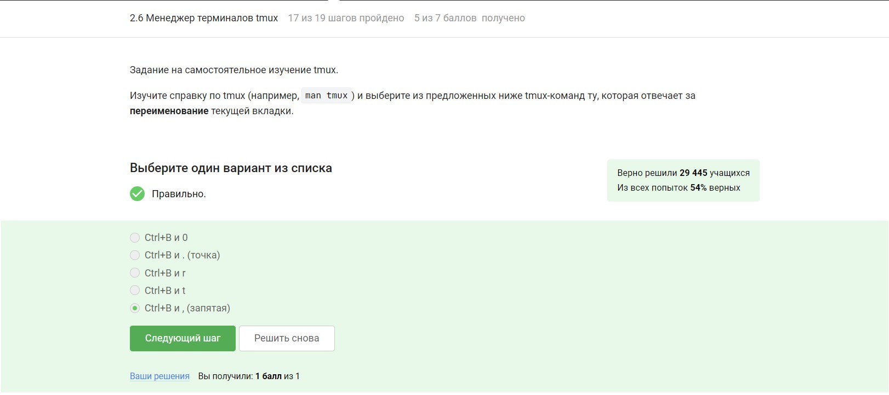{#fig:052 width=70%}

1. **Вкладки можно разделять как горизонтально, так и вертикально**: tmux поддерживает разделение вкладок двумя способами, что позволяет создавать горизонтальные и вертикальные области для одновременной работы с несколькими процессами.

2. **Можно закрывать отдельные "части" вкладки**: tmux позволяет закрывать конкретные области во вкладке, освобождая место или завершая процессы в них.

3. **Команды для разделения применяются только к активной вкладке**: Разделение в tmux действует только на текущую вкладку, не затрагивая другие, что обеспечивает независимое управление каждой вкладкой.

4. **Если разделить вкладку сначала по горизонтали, а затем по вертикали, получится три "части"**: tmux поддерживает комбинированное разделение, что позволяет создавать сложные макеты с тремя или более областями в одной вкладке.

Утверждение, что можно перемещаться между областями в разделенной вкладке с помощью стрелок, неверно, потому что tmux использует другие комбинации клавиш для этого.

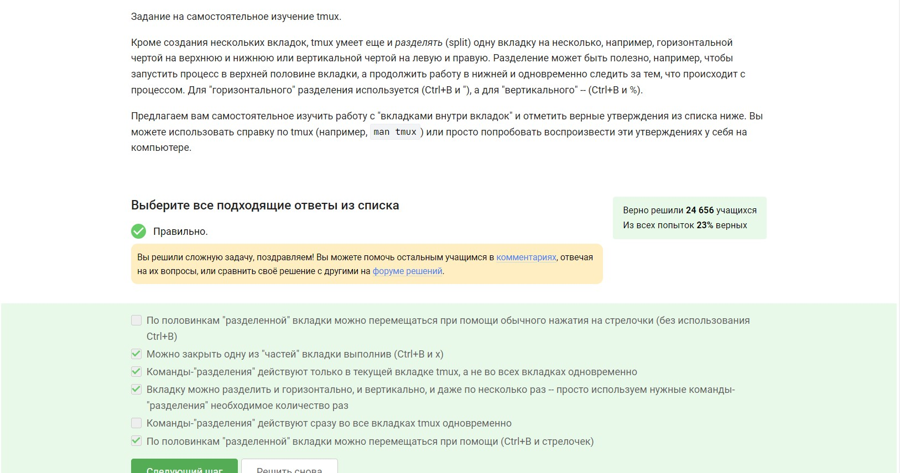{#fig:053 width=70%}

## 3 РАЗДЕЛ

В редакторе Vim команда `:q` используется для выхода. Если в файле были внесены изменения, и вы хотите выйти без их сохранения, можно воспользоваться командой `:q!`. После ввода команды необходимо нажать клавишу Enter.

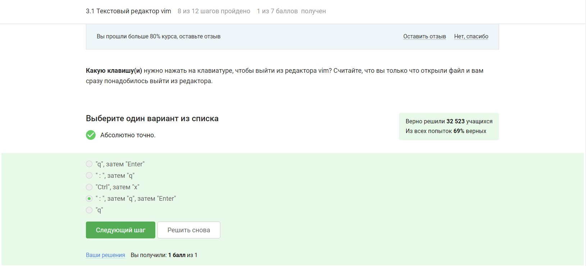{#fig:054 width=70%}

- Разница между `w` и `W` в том, что `w` перемещает курсор по "словам", которые отделены пробелами или другими знаками пунктуации, тогда как `W` перемещает курсор по "большим словам", которые разделены только пробелами. Следовательно, `W` игнорирует все символы, кроме пробелов.
- После 10 нажатий на `W` курсор действительно окажется там же, где и после 10 нажатий на `w`, если строки не содержат "больших слов".

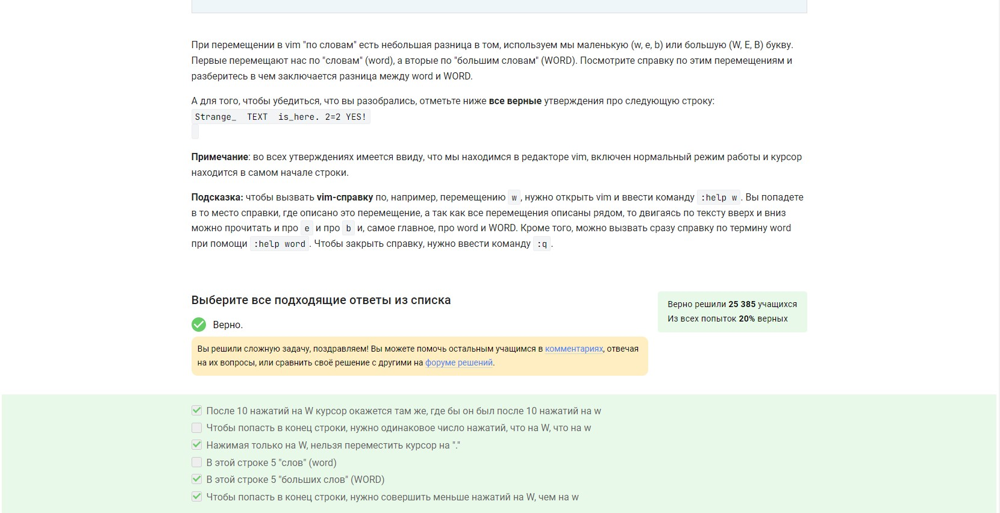{#fig:055 width=70%}


- В первой последовательности клавиш `d2wwywPp` сначала удаляются два слова (two и three), затем курсор перемещается к слову "four", которое копируется (`yw`), после чего оно вставляется дважды (`Pp`).
- Во второй последовательности клавиш `d2w$$bifour four <<Esc>>` сначала удаляются два слова (one и two), затем курсор перемещается к концу строки (`$$`), после чего перед словом "five" вставляется "four four four".

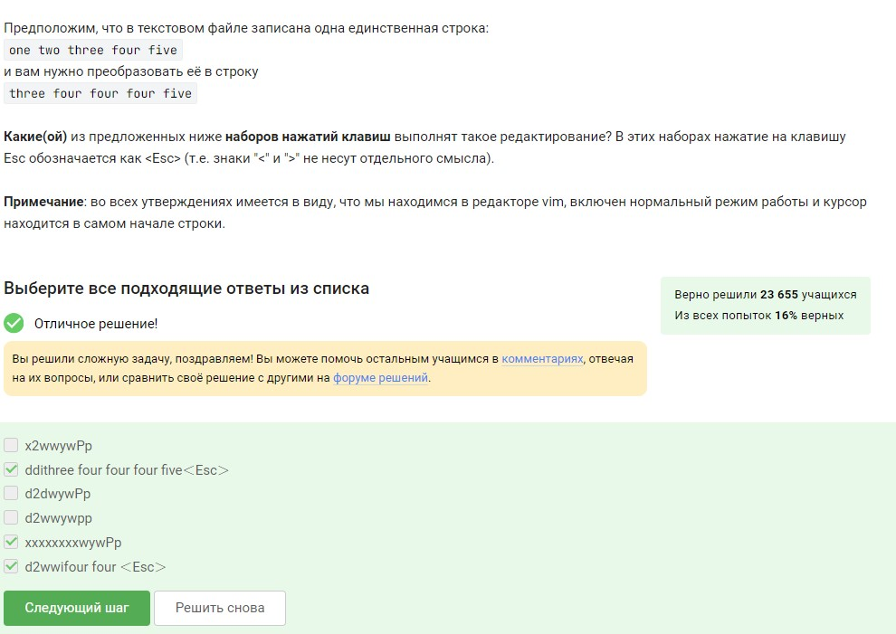{#fig:056 width=70%}


- `%` указывает, что замена будет применена ко всему файлу.
- `s/Windows/Linux/` означает замену всех вхождений строки "Windows" на "Linux".
- `g` указывает на глобальную замену в каждой строке, то есть все случаи "Windows" в строке будут заменены на "Linux", а не только первое вхождение.

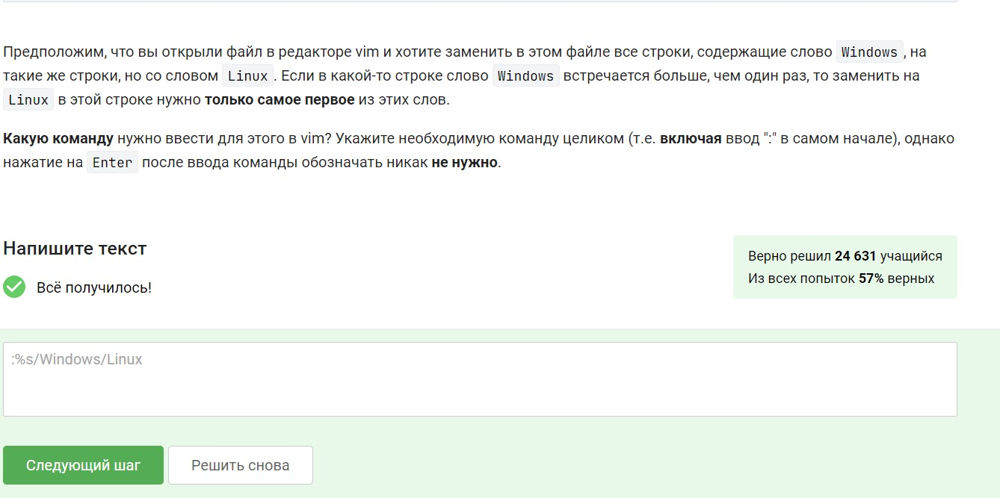{#fig:057 width=70%}

Когда вы находитесь в нормальном режиме Vim и нажимаете клавишу "v", вы переходите в режим визуального выделения (Visual). В этом режиме можно выделять текст с помощью клавиш навигации или других команд, например, W, e, $. Выделенный фрагмент будет подсвечен, и в нижней части редактора появится надпись "VISUAL", указывающая, что вы находитесь в режиме выделения.

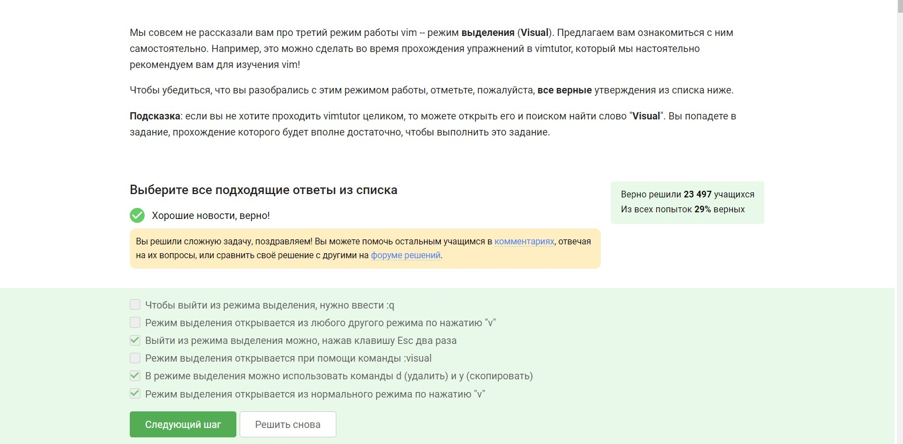{#fig:058 width=70%}

Когда вы используете стрелки вверх/вниз для перемещения по истории команд в терминале, вы просматриваете историю команд текущей оболочки. Если вы запускаете оболочку `sh` из `bash`, а затем из `sh` запускаете `bash`, и вводите команды в каждой из этих оболочек, то истории команд в них будут отдельными и не будут пересекаться.

Поэтому, когда вы используете стрелки вверх/вниз в самой последней запущенной оболочке (`bash`), вы будете перемещаться только по истории команд этой конкретной оболочки, то есть по истории, созданной в наборе С.

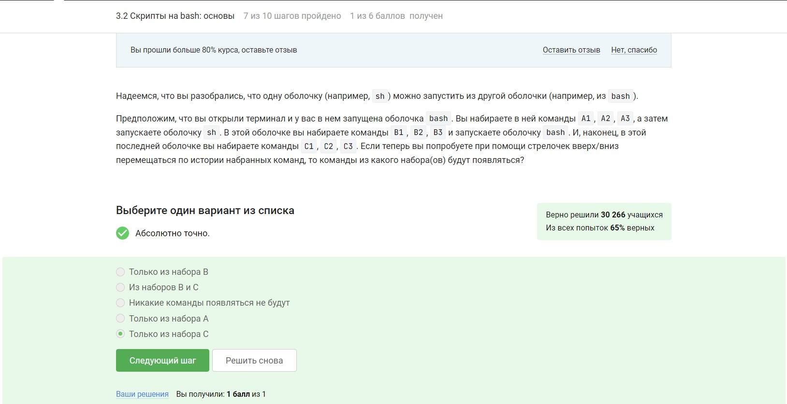{#fig:059 width=70%}

После запуска скрипта файл file1.txt будет создан в директории, определенной перед командой `touch`. Поскольку перед командой `cd` указан абсолютный путь `/home/bi/`, файл file1.txt будет создан в директории `/home/bi/`.

Таким образом, полный путь к файлу file1.txt будет `/home/bi/file1.txt`.

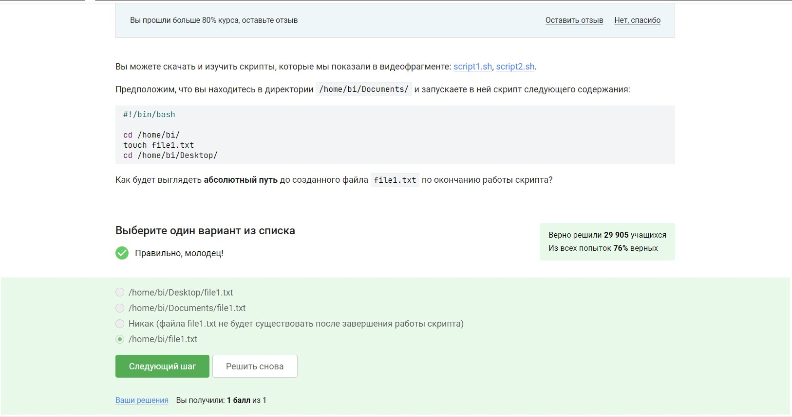{#fig:060 width=70%}

Да, `variable_123` может быть именем переменной в bash. В Bash имена переменных могут содержать буквы (в верхнем или нижнем регистре), цифры и символ подчеркивания, но должны начинаться с буквы или символа подчеркивания.


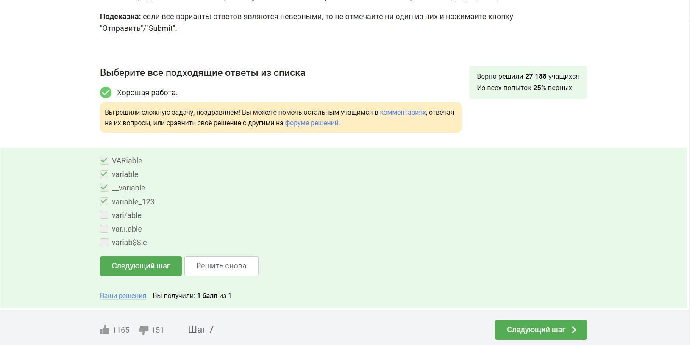{#fig:061 width=70%}

В данном скрипте:

1. **`#!/bin?/bash`**: Эта строка определяет путь к оболочке (в данном случае, к Bash). Обычно она используется в начале исполняемого скрипта, чтобы указать системе, какой интерпретатор должен быть применен для выполнения скрипта. Ошибка в пути (например, опечатка в `#!/bin?/bash`) может привести к неправильному выполнению скрипта или к ошибке "Неверный интерпретатор".

2. **`var1=$1` и `var2=$2`**: Эти строки назначают значения переменным `var1` и `var2`, соответствующим первому и второму аргументам командной строки соответственно. Переменная `$1` содержит первый аргумент, а `$2` - второй.

3. **`echo "Arguments are: \$1=$var1 \$2=$var2"`**: Эта команда выводит сообщение в стандартный вывод (консоль). Используется экранирование символов `\$1` и `\$2`, чтобы они не трактовались как переменные, а отображались как текст. В результате этой команды будет напечатано: "Arguments are: $1=значение_первого_аргумента $2=значение_второго_аргумента", где переменные заменяются на значения, переданные скрипту в качестве первого и второго аргументов.


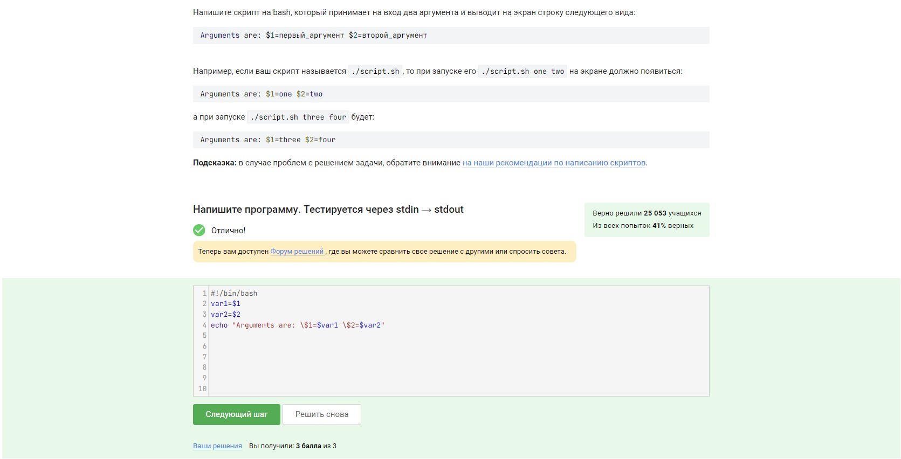{#fig:062 width=70%}

- **`5 -ge 5`**: Это условие проверяет, больше или равно ли число 5 числу 5. Поскольку 5 равно 5, условие истинно.

- **`-e $0`**: Это условие проверяет, существует ли файл с именем, указанным в переменной `$0`. В `$0` хранится имя скрипта, который выполняется. Если файл с таким именем существует, условие верно.

- **`-s $0`**: Это условие проверяет, существует ли файл с именем, указанным в `$0`, и не является ли он пустым. Если файл существует и не пуст, условие будет истинно.

- **`! (4 -le 3)`**: Эта конструкция означает "не" перед условием. Так как 4 не меньше или равно 3, условие ложно, но отрицание ложного условия даст истину.

- **`$# -ge 0`**: Это условие проверяет, передано ли в скрипт ноль или больше аргументов. Поскольку всегда существует хотя бы ноль аргументов, условие будет верно.

- **`$`**: Этот символ используется для обращения к переменной в bash. В данном контексте он не может быть условием.

- **`$var1 == `**: Это некорректное условие, так как оператор сравнения равенства (`==`) должен иметь значение справа от него.

- **`$var2 || `**: Это некорректное условие, так как оператор логического "или" (`||`) должен также иметь значение справа от него.

- **`$var1 != `**: Это также некорректное условие, потому что оператор неравенства (`!=`) должен быть с значением справа.

- **`$var2`**: Это обращение к переменной, но без контекста это не является условием.

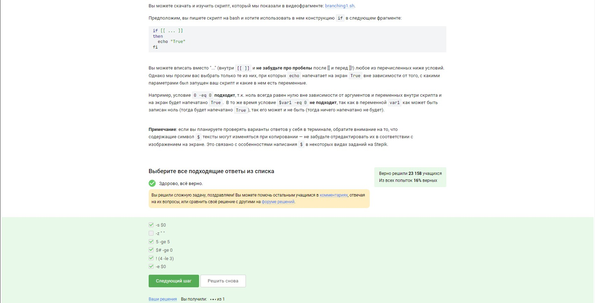{#fig:063 width=70%}

Когда переменная `var` установлена в значение 3, скрипт выведет "four", потому что значение 3 не удовлетворяет ни одному из условий в блоке `if-elif-else`.

Когда переменная `var` установлена в значение 5, скрипт также выведет "four". Это происходит потому, что в блоке `if-elif-else` скрипт проверяет условия последовательно, и после нахождения первого подходящего условия остальные проверки игнорируются. В случае с `var=5`, первое условие `[[ $var -gt 5 ]]` возвращает `false`, а остальные условия также не выполняются, потому что 5 не меньше 3 и не равно 4. Поэтому выполняется ветвь `else`, которая и выводит "four".

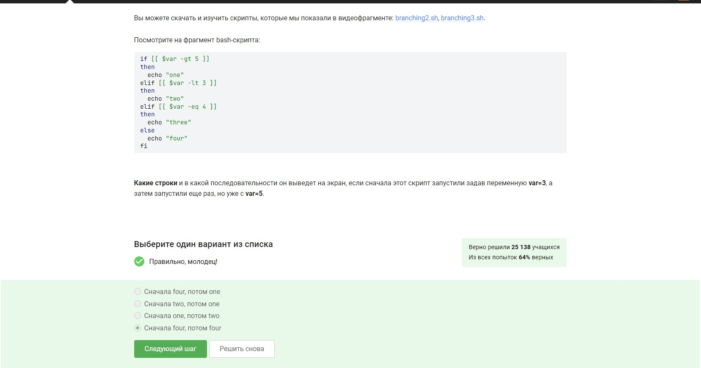{#fig:064 width=70%}

Этот скрипт на Bash демонстрирует использование оператора `case` для выбора действий на основе значения переменной.

1. **`#!/bin/bash`**: Эта строка указывает на то, что скрипт должен интерпретироваться оболочкой Bash.

2. **`v=student`**: Переменной `v` присваивается значение "student", которое будет использоваться в последующих строках вывода.

3. **`case $1 in`**: Здесь начинается блок `case`, который будет проверять значение первого аргумента (`$1`), переданного скрипту при его запуске.

4. **`0) res="No ${v}s";;`**: Если значение `$1` равно 0, переменной `res` присваивается строка "No students".

5. **`1) res="$1 ${v}";;`**: Если значение `$1` равно 1, переменной `res` присваивается строка "1 student".

6. **`[2-4]) res="$1 ${v}s";;`**: Если значение `$1` в диапазоне от 2 до 4 включительно, переменной `res` присваивается строка, отражающая соответствующее количество студентов, например, "2 students", "3 students", или "4 students".

7. **`*) res="A lot of ${v}s";;`**: Если значение `$1` не соответствует ни одному из перечисленных условий, переменной `res` присваивается строка "A lot of students".

8. **`esac`**: Завершает блок `case`.

9. **`echo "$res"`**: Выводит значение переменной `res` на экран.

Таким образом, скрипт проверяет значение первого аргумента при запуске и в зависимости от него выводит строку, которая указывает на количество студентов.

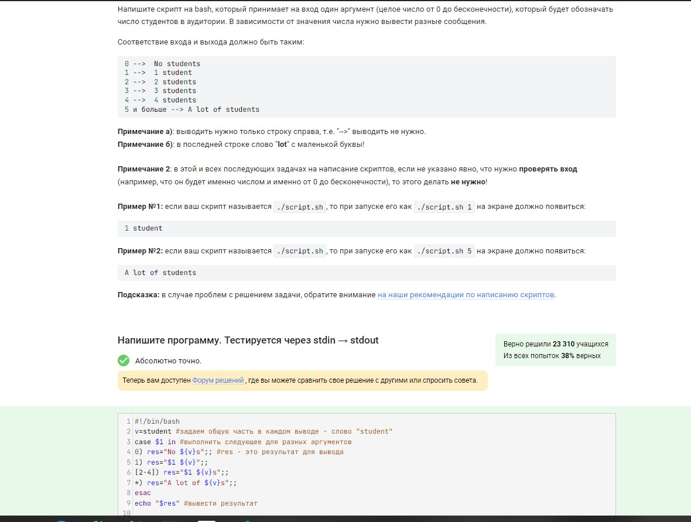{#fig:065 width=70%}


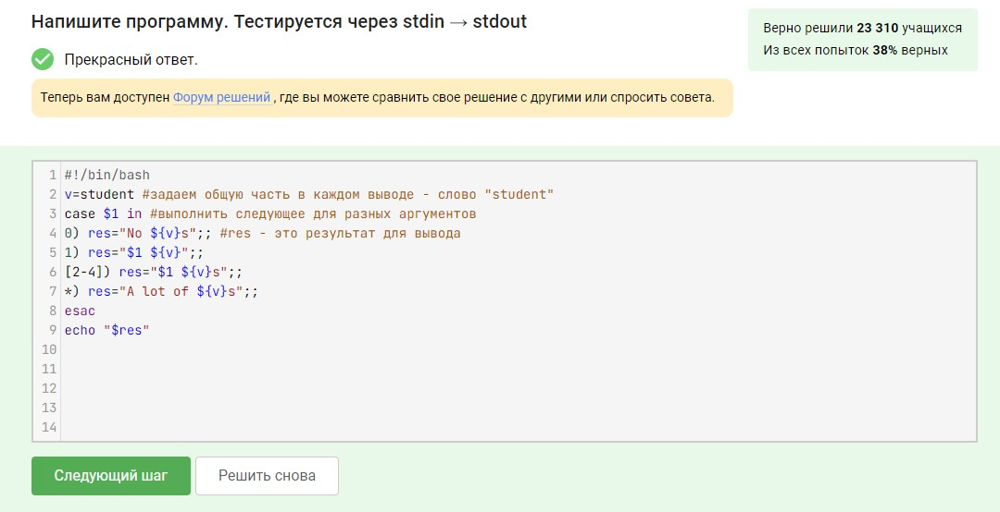{#fig:066 width=70%}

В данном скрипте используется цикл `for`, который проходит по списку из следующих строк: "a", ",", "b", ",", "c_d". В каждой итерации сначала выводится слово "start", затем выполняется проверка условия `if`.

1. Если переменная `str` равна "a", условие `$str > "c"` не выполняется. Выводится "start", затем "finish".
2. Если переменная `str` равна ",", то условие также не выполнено, и снова выводятся "start" и "finish".
3. Если переменная `str` равна "b", выводы аналогичны: "start" и "finish".
4. Если переменная `str` равна ",", результат тот же: "start" и "finish".
5. Если переменная `str` равна "c_d", условие `$str > "c"` выполняется (поскольку "c_d" больше "c"). Оператор `continue` прерывает текущую итерацию, пропуская вывод "finish" и переходя к следующей итерации.
6. Если переменная `str` равна "", условие `$str > "c"` не выполняется, поэтому выводятся "start" и "finish".

Таким образом, слово "start" будет выведено 5 раз, а слово "finish" — 4 раза.

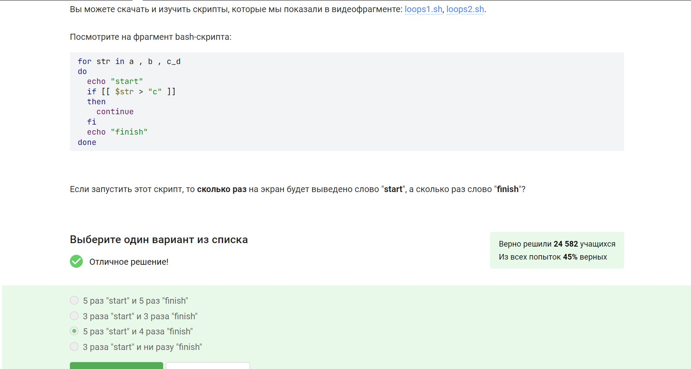{#fig:067 width=70%}

Этот скрипт демонстрирует использование циклов `while`, условных операторов `if-elif-else` и операторов сравнения в bash.

1. В первых трех строках определяются переменные `child`, `adult` и `stdout`, которым присваиваются определенные значения.
2. Основной цикл `while` выполняется до тех пор, пока `stdout` не станет равным 1.
3. Внутри этого цикла пользователь получает приглашение ввести свое имя (`"enter your name: "`), и введенное значение сохраняется в переменную `name`.
4. После этого проверяются условия:
   - Если введенное имя пустое или равно 0, выводится "bye", переменная `stdout` становится 1, и программа завершает работу.
   - Если введенное имя не пустое, далее запрашивается возраст (`"enter your age: "`), который сохраняется в переменную `age`.
5. Далее следует вложенный цикл `while`, который также выполняется, пока `stdout` не станет 1.
6. Внутри вложенного цикла проводится проверка возраста:
   - Если возраст равен 0 или пуст, выводится "bye", `stdout` устанавливается в 1, и программа завершает работу.
   - Если возраст меньше или равен значению переменной `child`, выводится сообщение о том, что пользователь относится к группе "child".
   - Если возраст больше переменной `adult`, выводится сообщение о том, что пользователь относится к группе "adult".
   - В других случаях, если возраст находится в диапазоне от 17 до 25 лет, выводится сообщение о том, что пользователь в группе "youth".
7. После каждой итерации вложенного цикла оператор `break` завершает выполнение вложенного цикла и возвращает программу в основной цикл.
8. Если пользователь ввел имя, но не указал возраст, программа вновь попросит ввести возраст.
9. Если возраст введен, программа завершится, только если возраст равен 0 или пуст.

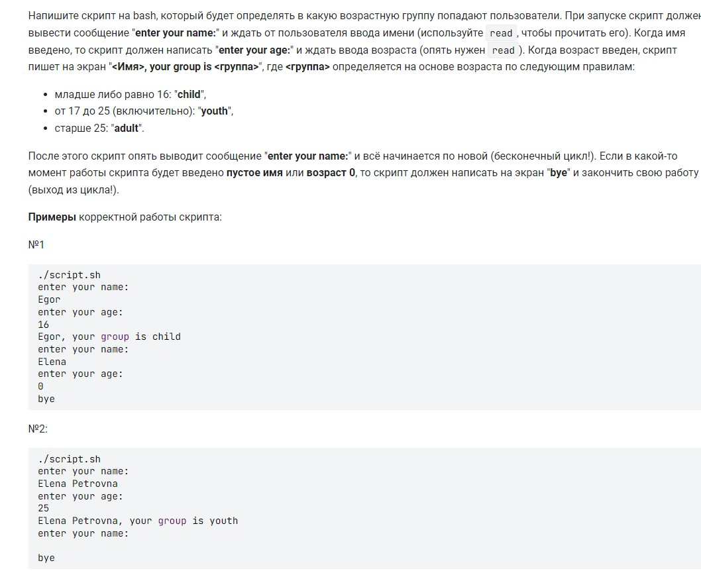{#fig:068 width=70%}


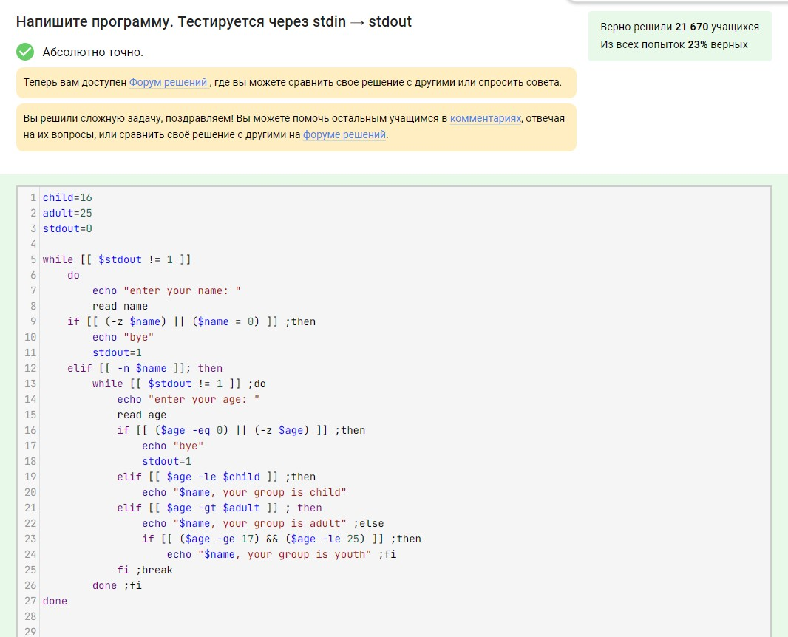{#fig:069 width=70%}

Эти примеры показывают арифметические операции, в которых значение переменной `a` увеличивается на значение переменной `b`. Результат записывается обратно в `a`.

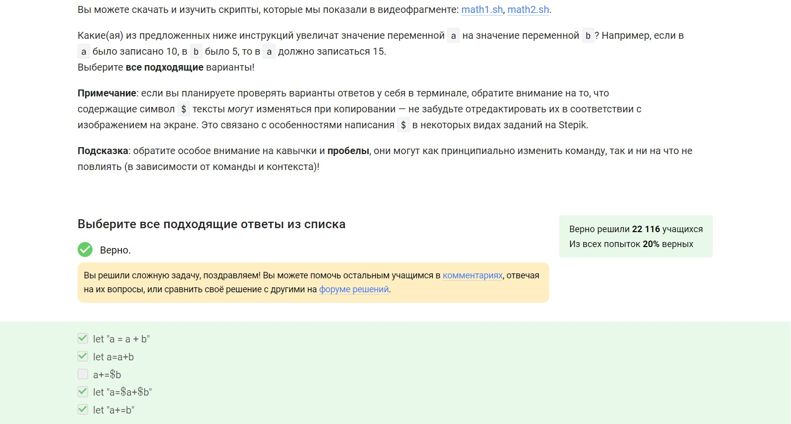{#fig:070 width=70%}

Команда `echo` отобразит строку, представляющую результат выполнения команды `pwd`, которая показывает текущий рабочий каталог. В этом сценарии скрипт сначала переходит в директорию `/home/bi/`, а затем выводит ее полный путь с помощью `pwd`. 

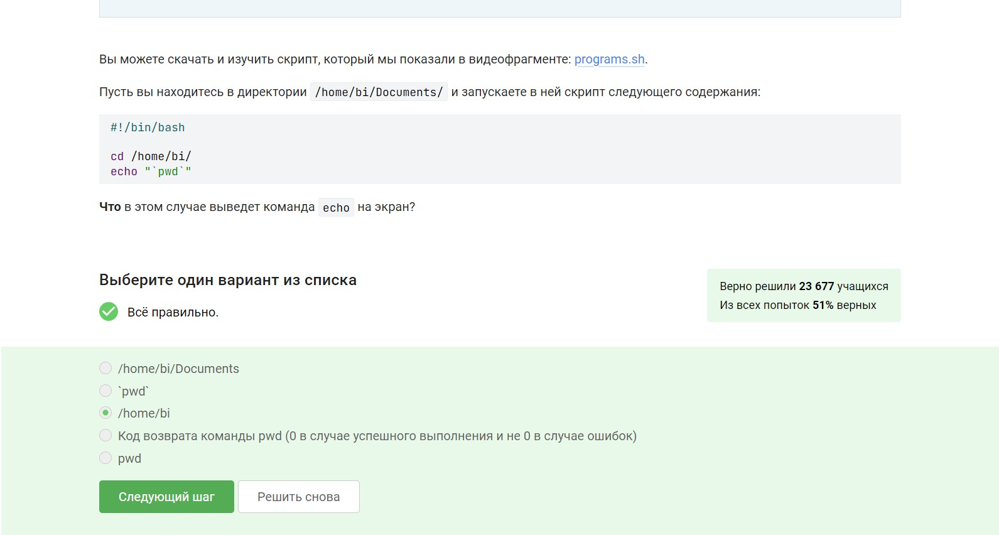{#fig:071 width=70%}

Если требуется сначала запустить программу, а затем проверить её код возврата, можно воспользоваться следующим подходом:

```bash
program
if [[ $? -eq 0 ]]
then
    # Ваши действия, если код возврата программы равен 0
fi
```

Если программа выводит данные в stdout, но нужно узнать её код возврата, можно перенаправить вывод в файл, а затем проверить содержимое файла в условии `if`. Однако, это может быть неэффективным, особенно если программа генерирует большой объем данных или если вы не хотите сохранять вывод в файл. Пример:  


```bash
if program > output.txt ; then
    # Ваши действия, если код возврата программы равен 0
fi
```

В этой ситуации программа `program` будет запущена, ее вывод будет перенаправлен в файл `output.txt`, а затем код возврата программы будет проверен в условии `if`.

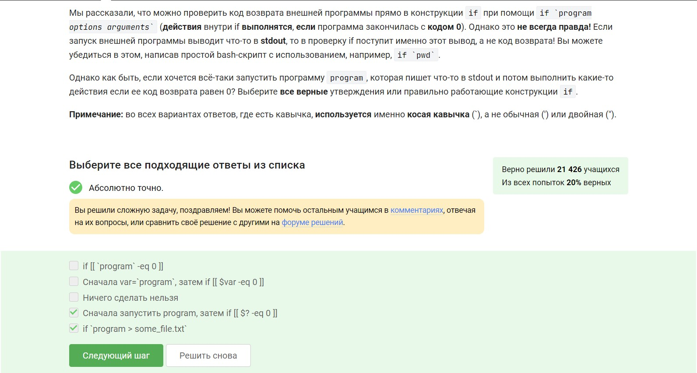{#fig:072 width=70%}

Команда `echo "counters are $c1 and $c2"`, находящаяся в скрипте после десяти вызовов функции `counter` с аргументами от 1 до 10 включительно, выведет строку:


```
counters are 55 and 110
```

Вывод команды `echo "counters are $c1 and $c2"` в скрипте после десяти вызовов функции `counter` с аргументами от 1 до 10 включительно будет следующим:

- После первого вызова с параметром 1, `c1` увеличивается на 1, а `c2` удваивается, получая 2.
- После второго вызова с параметром 2, `c1` увеличивается на 2, а `c2` удваивается, становясь 4.
- После всех десяти вызовов функциям `counter`, где последний аргумент 10, `c1` суммирует значения от 1 до 10, что составляет 55, а `c2` суммирует удвоенные значения, получая 110.

Таким образом, когда вы используете команду `echo "counters are $c1 and $c2"`, она выведет:

"counters are 55 and 110"

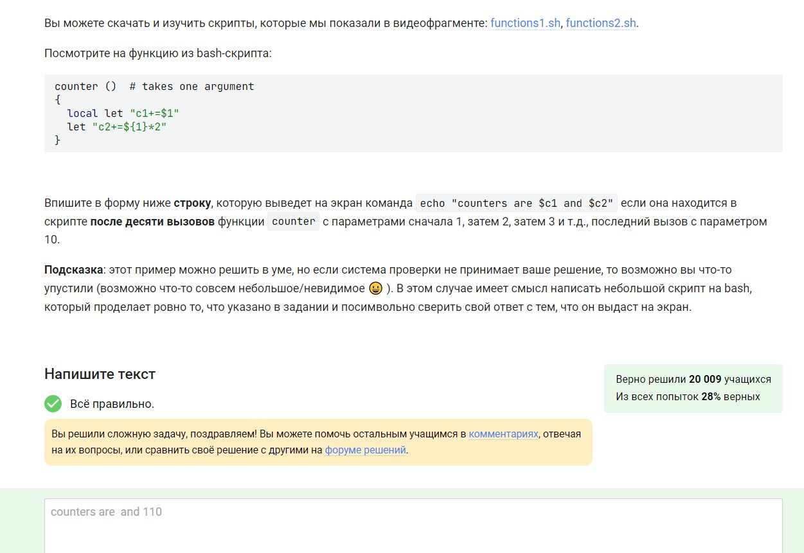{#fig:073 width=70%}

Этот Bash-скрипт вычисляет наибольший общий делитель (НОД) двух чисел, введенных пользователем. Основная логика скрипта заключена в бесконечном цикле `while`, который продолжает работать, пока условие `[ true ]` истинно.

- Сначала скрипт запрашивает два числа `n1` и `n2`, которые пользователь вводит с клавиатуры.
- Если `n1` пустое (т.е. пользователь нажал Enter, не вводя никакое значение), то скрипт срабатывает на условии `if [ -z $n1 ]

` и выводит сообщение "bye", после чего завершает цикл с помощью команды `break`.
- Если переменная `n1` не пустая, то скрипт определяет функцию `gcd`, которая использует алгоритм Евклида для вычисления НОД двух чисел. Алгоритм заключается в серии делений с остатком, пока не получен остаток ноль.
- После завершения вычислений, скрипт выводит "GCD is $n1", где `$n1` — результат работы функции `gcd`.

Таким образом, скрипт запрашивает ввод двух чисел для вычисления их НОД и повторяет этот процесс до тех пор, пока пользователь не введет пустую строку, нажав Enter.

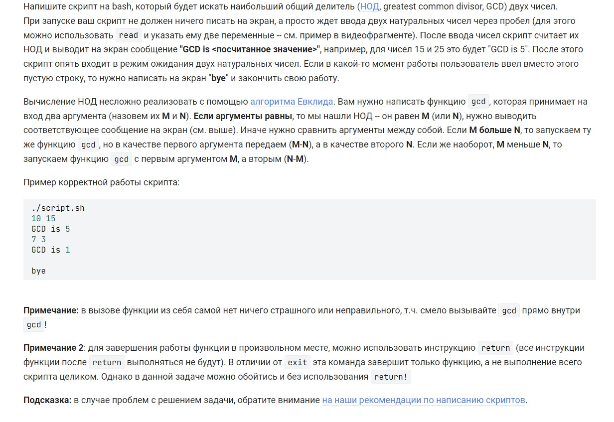{#fig:074 width=70%}

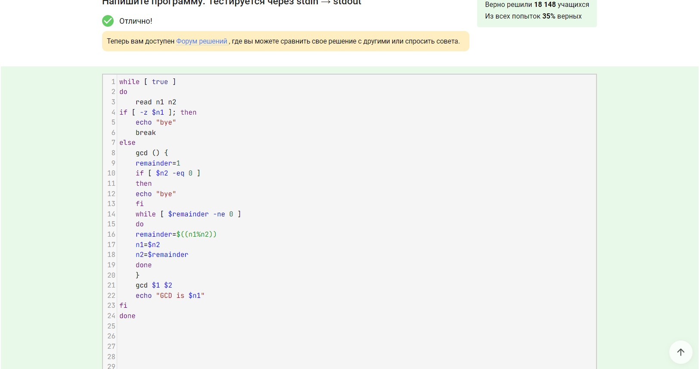{#fig:075 width=70%}

Этот скрипт работает следующим образом:

- В бесконечном цикле `while true` выполняется команда `read`, считывающая ввод пользователя.
- Затем проверяется, совпадает ли первый операнд со строкой "exit". Если это так, выводится сообщение "bye", и цикл завершается.
- Далее проверяется, являются ли оба операнда целыми числами. Если хотя бы один из них не целое число, выводится сообщение "error", и цикл прекращается.
- Если оба операнда целые, выполняется соответствующая математическая операция, основываясь на операторе (`+`, `-`, `*`, `/`, `%`, `**`).
- После выполнения операции ее результат выводится на экран.
- Если оператор не соответствует ни одной из допустимых операций, скрипт выводит "error" и завершает цикл.


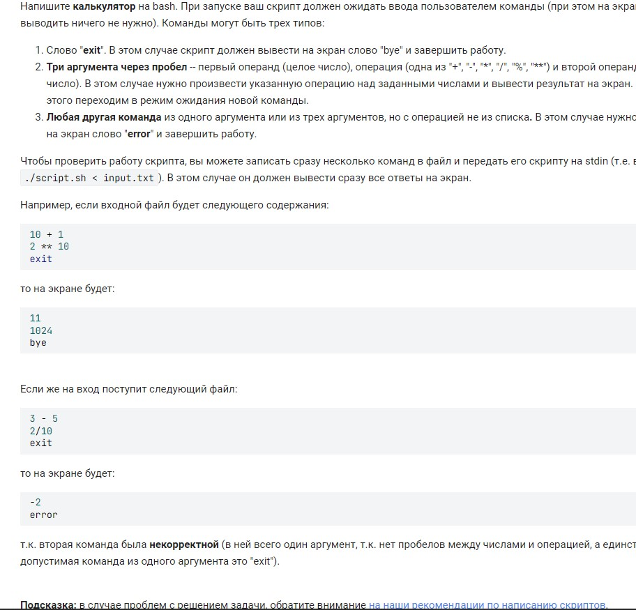{#fig:076 width=70%}


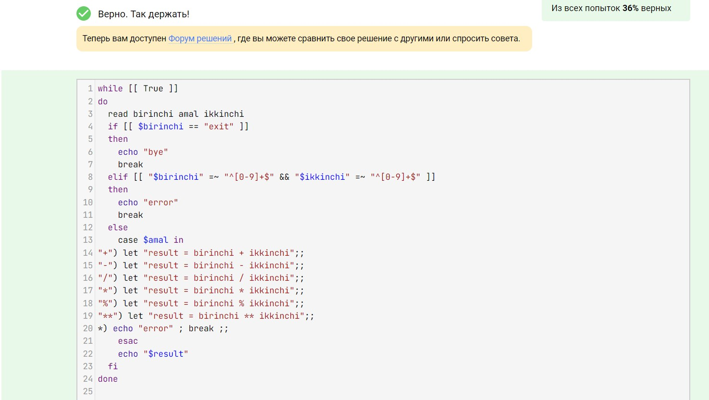{#fig:077 width=70%}

Команда `find /home/bi -iname "star*"` ищет все файлы в каталоге `/home/bi`, названия которых начинаются со строки "star", без учета регистра. Таким образом, она найдет файлы, такие как "Star_Wars.avi", "star_trek_OST.mp3", "STARS.txt", и "stardust.mpeg".

В отличие от этого, команда `find /home/bi -name "star*"` также ищет файлы, начинающиеся с "star", но уже с учетом регистра. Это значит, что файлы, которые начинаются с "Star" или "STARS", пропускаются. Следовательно, эта команда найдет только те файлы, в названии которых слово "star" написано строчными буквами.

Таким образом, файлы, которые будут найдены первой командой, но не будут найдены второй, это "STARS.txt" и "Star_Wars.avi".

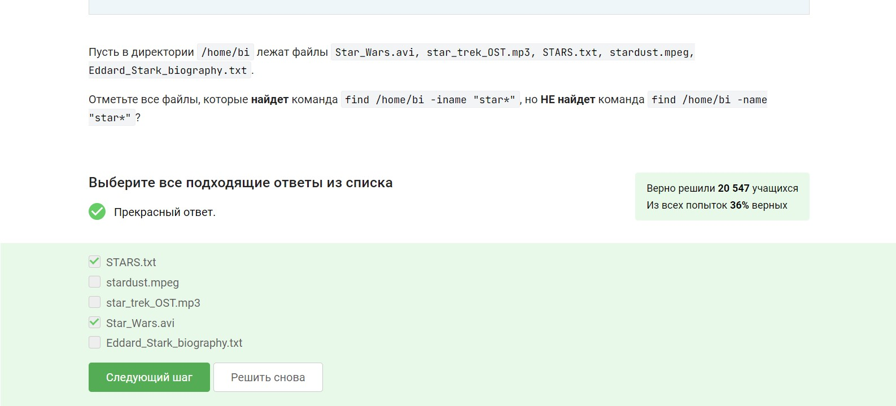{#fig:078 width=70%}

1. Если в команде поиска заменить `-name` на `-path`, результат поиска иногда может остаться прежним. - **Это утверждение верное.** Это потому, что оба параметра (`-name` и `-path`) используются для поиска по имени файла, но `-name` проверяет только название самого файла, а `-path` включает в себя полный путь к файлу. Если в результатах поиска нет вложенных директорий, то замена `-name` на `-path` не изменит результат.

2. В некоторых случаях, `find` с параметром `-name` найдет меньше файлов, чем с аналогичным запросом, но с параметром `-path`. - **Это утверждение верное.** Это возможно, если некоторые файлы находятся в вложенных директориях, а их полные пути содержат искомую строку, даже если сами имена файлов не соответствуют ей. В этом случае `-path` найдет больше файлов, потому что он учитывает весь путь, а не только имя файла.

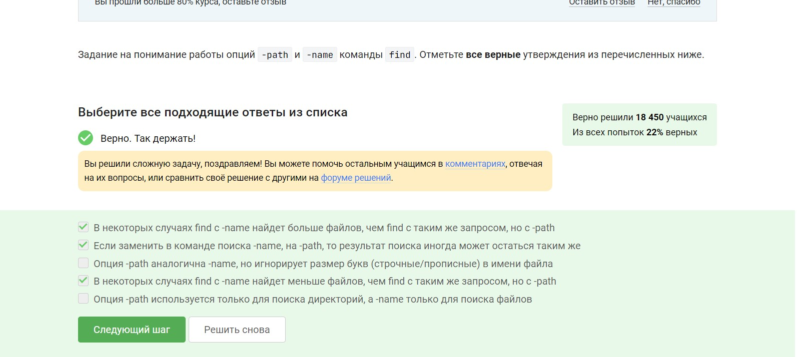{#fig:079 width=70%}

Команда `find /home/bi -mindepth 2 -maxdepth 3 -name "file*"` ищет файлы в каталоге /home/bi/ и его подкаталогах с глубиной от 2 до 3 уровней, имена которых начинаются с "file".

1. **file1**: Будет найден, так как находится на глубине 2 и его имя начинается с "file".

2. **file2**: Будет найден, потому что расположен на глубине 3 и его имя также начинается с "file".

3. **file3**: Не будет найден, поскольку находится на глубине 4, которая выходит за пределы указанного диапазона глубины поиска.

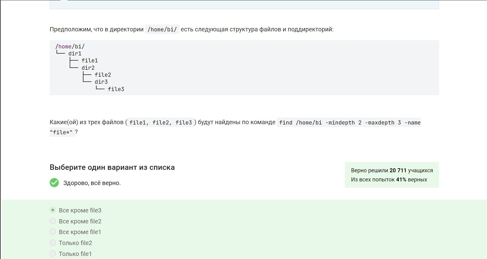{#fig:080 width=70%}

Эти четыре команды создают файл `results.txt` одинакового размера, поскольку количество символов, записываемых в файл, не меняется из-за характера команд:

- `grep "word" file.txt > results.txt`: записывает все строки из файла `file.txt`, которые содержат слово "word", в `results.txt`.
- `grep -A 1 "word" file.txt > results.txt`: добавляет в `results.txt` строки, содержащие "word", а также одну строку после каждой строки, содержащей "word".
- `grep -B 1 "word" file.txt > results.txt`: добавляет в `results.txt` строки, содержащие "word", и одну строку перед каждой строкой, содержащей "word".
- `grep -C 1 "word" file.txt > results.txt`: сохраняет в `results.txt` строки, содержащие "word", а также одну строку перед и одну строку после каждой строки, содержащей "word".

Таким образом, все четыре команды создадут файл `results.txt` одинакового размера.

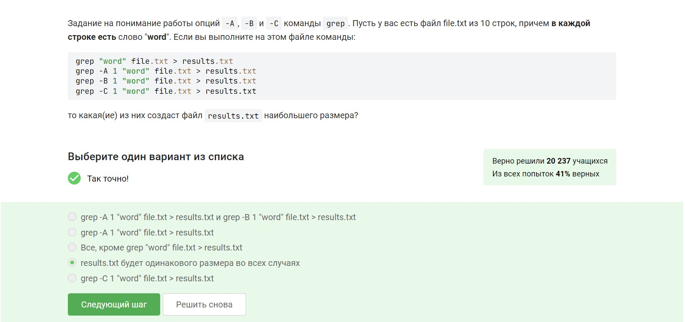{#fig:081 width=70%}

Команда `grep -E "[xklXKL]?[uU]buntu$" text.txt` будет искать строки в файле `text.txt`, которые заканчиваются на "ubuntu" или "Ubuntu", с опциональным символом перед этим окончанием. Этот дополнительный символ, если он есть, может быть одним из следующих: "x", "k", "l", "X", "K", или "L".

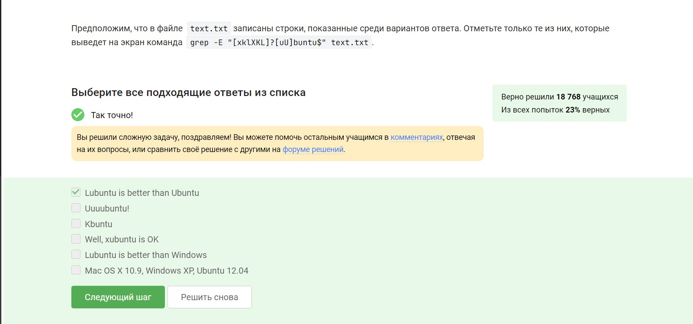{#fig:082 width=70%}

Если в команде `sed "/[a-z]*/p" text.txt` не использовать опцию `-n`, sed по умолчанию будет выводить каждую строку после обработки, независимо от того, была ли она изменена. 

Команда `sed "/[a-z]*/p" text.txt` будет искать строки, содержащие ноль или более символов в нижнем регистре, и печатать их. Однако, поскольку опция `-n` не указана, sed также напечатает оригинальные строки из файла, которые не были изменены, что приведет к удвоенному выводу. 

В итоге каждая строка из файла будет выведена дважды: сначала оригинальная строка, затем строка после обработки sed.

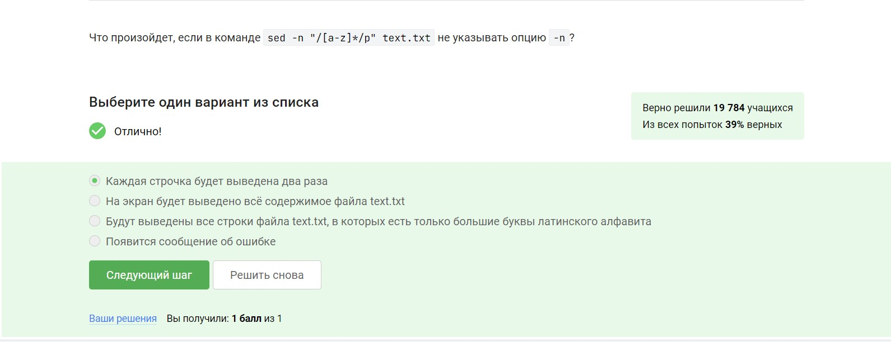{#fig:083 width=70%}

Эта команда `sed` заменяет последовательности из двух или более прописных букв, за которыми следует пробел, на строку "abbreviation ".

Вот объяснение, как эта команда работает:

1. **`sed`**: Это инструмент в системах Unix/Linux, который используется для редактирования текста в потоке.
2. **`'s/.../.../g'`**: Это синтаксис для команды замены в `sed`. Первый набор точек - это шаблон, который мы хотим найти, второй набор - текст, который его заменяет. Флаг `g` указывает, что замена выполняется для всех вхождений шаблона в строке.
3. **`[A-Z]\{2,\} `**: Это регулярное выражение, обозначающее последовательность из двух или более прописных букв (от A до Z) с пробелом в конце. Число в фигурных скобках указывает на минимальное количество повторений (2 или более).
4. **`abbreviation `**: Это строка, которая заменяет найденные последовательности. В данном случае она заменяет найденные последовательности прописных букв на "abbreviation ".
5. **`g`**: Этот флаг говорит, что замена применяется ко всей строке, а не только к первому вхождению.

Таким образом, эта команда `sed` ищет все последовательности из двух или более прописных букв, за которыми идет пробел, и заменяет их на "abbreviation " в файле `input.txt`, записывая результат в файл `edited.txt`.

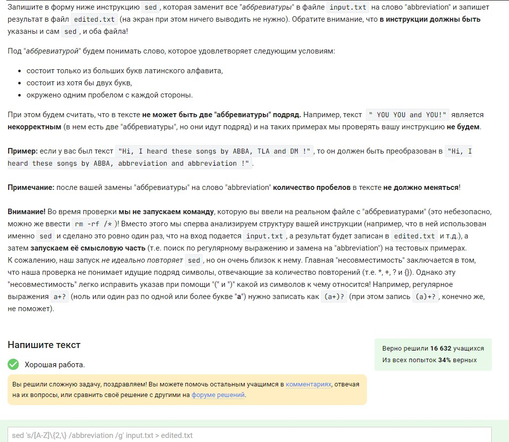{#fig:084 width=70%}

Эта опция сохраняет все созданные графики после закрытия gnuplot, так что они не будут автоматически закрыты. Это удобно, если вы хотите сохранить графики для дальнейшего просмотра или анализа.

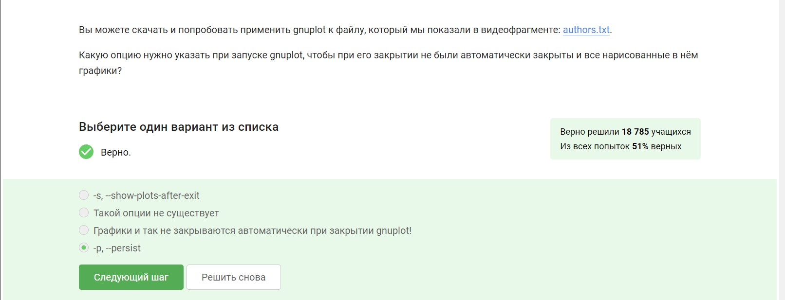{#fig:085 width=70%}

Название ряда данных будет установлено по первому значению во втором столбце, поскольку используется опция `autotitle columnhead` для автоматического определения заголовков столбцов. На графике появится 9 точек, потому что точка из первой строки файла данных не будет учтена при построении графика.

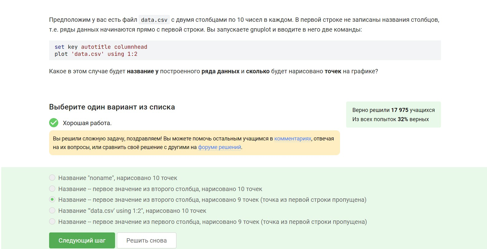{#fig:086 width=70%}

- `"point 1, value ".x1 x1` указывает, что для первого деления на оси x будет установлена метка "point 1, value", которая будет соответствовать значению `x1`.
- `"point 2, value ".x2 x2` означает, что для второго деления на оси x будет установлена метка "point 2, value", соответствующая значению `x2`.
- `"point 3, value ".x3 x3` предполагает, что для третьего деления на оси x будет метка "point 3, value", которая будет соответствовать значению `x3`.

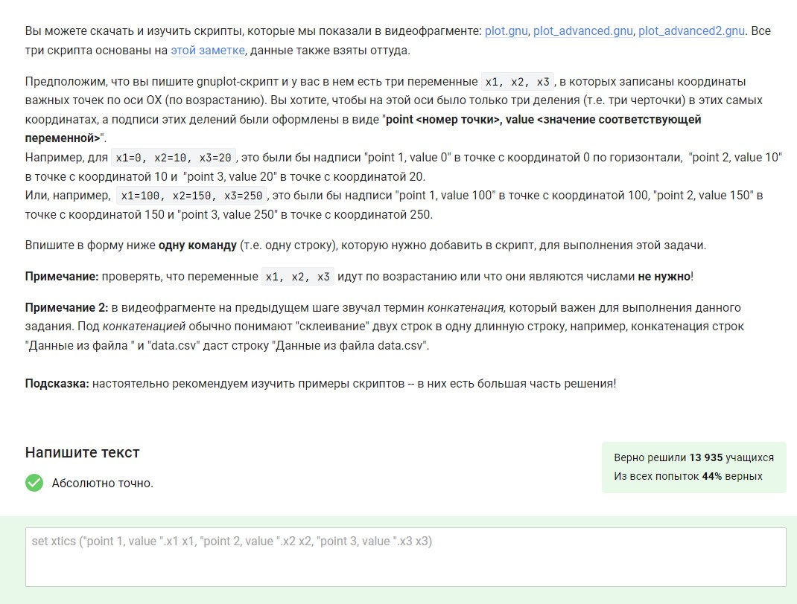{#fig:087 width=70%}

1. `a=a+1`: Эта строка увеличивает значение переменной `a` на 1.

2. `zrot=(zrot+350)%360`: В этой строке переменная `zrot` увеличивается на 350, затем к ней применяется оператор остатка при делении на 360, что позволяет реализовать вращение по оси Z в рамках 360 градусов.

3. `set view xrot,zrot`: Эта команда устанавливает углы поворота графика вокруг осей X и Z.

4. `splot -x**2-y**2`: Эта команда строит трехмерный график функции `-x**2-y**2`.

5. `pause 0.1`: Эта команда делает паузу в скрипте длительностью 0.1 секунды.

6. `if (a<50) reread`: Эта строка проверяет условие `a < 50`. Если условие выполняется, команда `reread` перечитывает текущий скрипт, чтобы он продолжал выполняться. Таким образом, цикл повторяется до тех пор, пока `a` не достигнет значения 50.

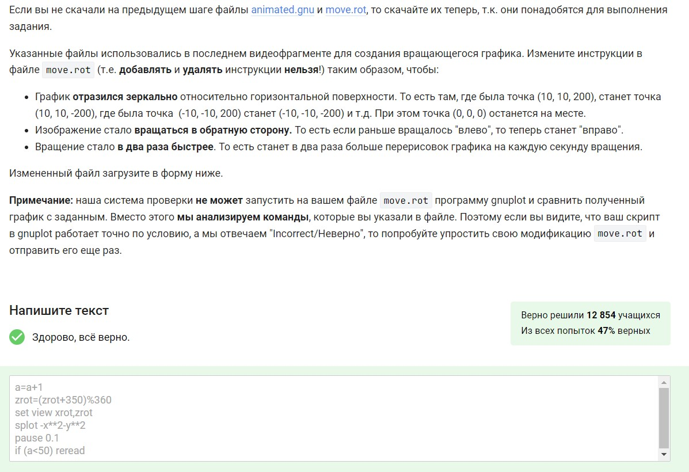{#fig:088 width=70%}

1. `chmod 764 file.txt`: Эта команда задает права доступа к файлу `file.txt`, предоставляя владельцу полные права (чтение, запись и выполнение), группе — права на чтение и запись, а всем остальным — только право на чтение.

2. `chmod ug+w file.txt; chmod u+x file.txt`: Здесь сначала добавляются права на запись для владельца и группы (`ug+w`), а затем устанавливается право на выполнение только для владельца (`u+x`).

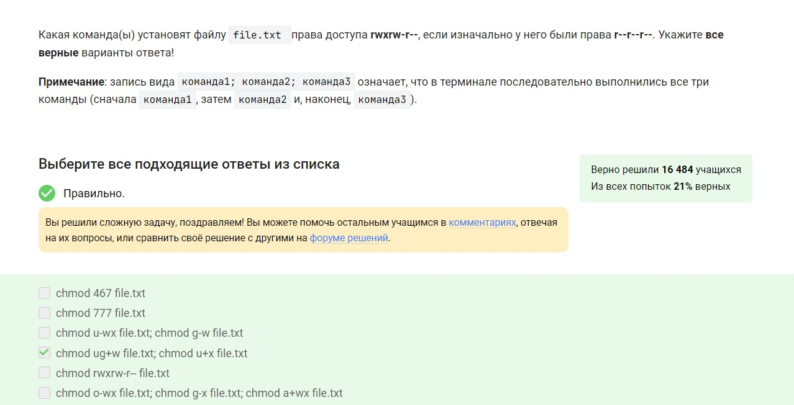{#fig:089 width=70%}

1. `sudo chown user dir`: Эта команда назначит пользователя `user` владельцем каталога `dir`.

2. `sudo chmod o+w dir`: Эта команда добавит право на запись для остальных (other) пользователей для каталога `dir`.

3. `sudo chown user:group dir`: Эта команда изменит владельца и группу каталога `dir` на `user` и `group` соответственно.

4. `sudo chmod a+w dir`: Эта команда предоставит право на запись всем пользователям (владельцу, группе и другим) для каталога `dir`.

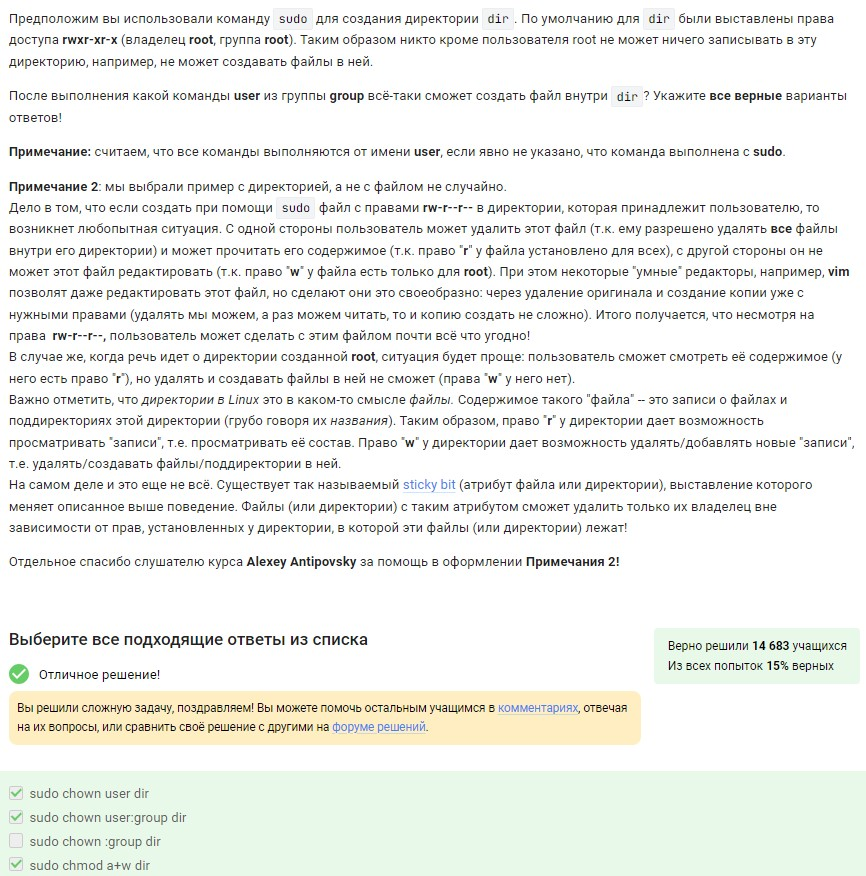{#fig:090 width=70%}

- **Количество символов**: Это общее количество всех символов в файле, включая пробелы, табуляции и символы новой строки.
  
- **Количество слов**: Это общее количество слов в файле. Слово определяется как последовательность символов, отделенных пробелами, табуляцией или символами новой строки.
  
- **Количество строк**: Это количество строк в файле. Каждая строка заканчивается символом новой строки.
  
- **Размер файла в байтах**: Это полный размер файла в байтах, включая все символы и структуры данных.

{#fig:091 width=70%}

- `-s` (или `--summarize`) указывает команде выводить только общий размер директории, а не перечислять размеры всех вложенных файлов и поддиректорий.
- `-h` (или `--human-readable`) обозначает вывод информации в удобном для чтения формате, с использованием человекочитаемых единиц, таких как Кб, Мб, Гб.

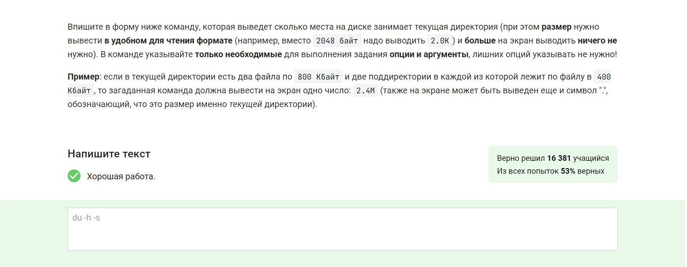{#fig:092 width=70%}

Команда `mkdir dir{1..3}` создаст три поддиректории в текущем каталоге. Их имена будут dir1, dir2 и dir3, сгенерированные с помощью фигурных скобок и числового диапазона.

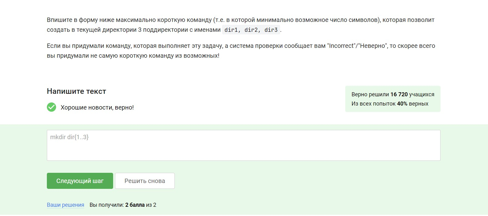{#fig:093 width=70%}

# Выводы

Я понял тему и готов продолжить изучение Linux.

