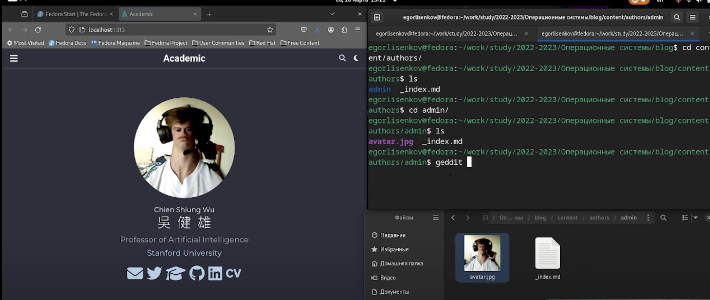
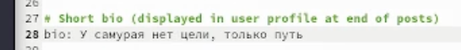
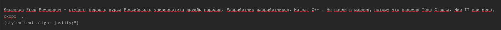
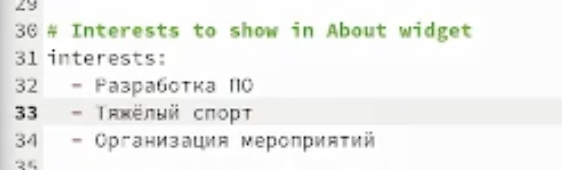
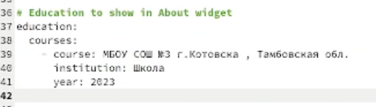
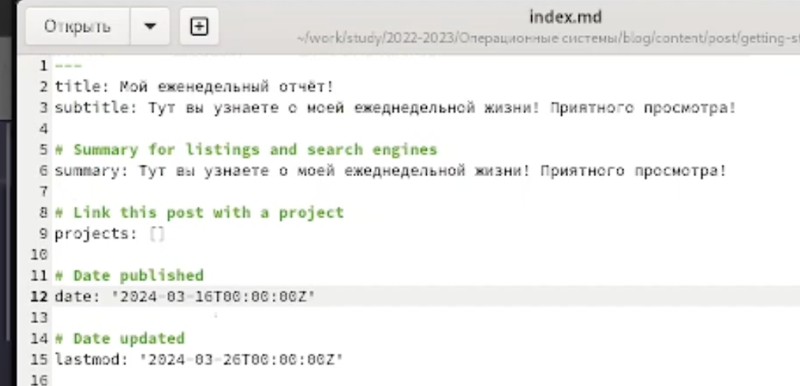
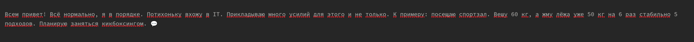
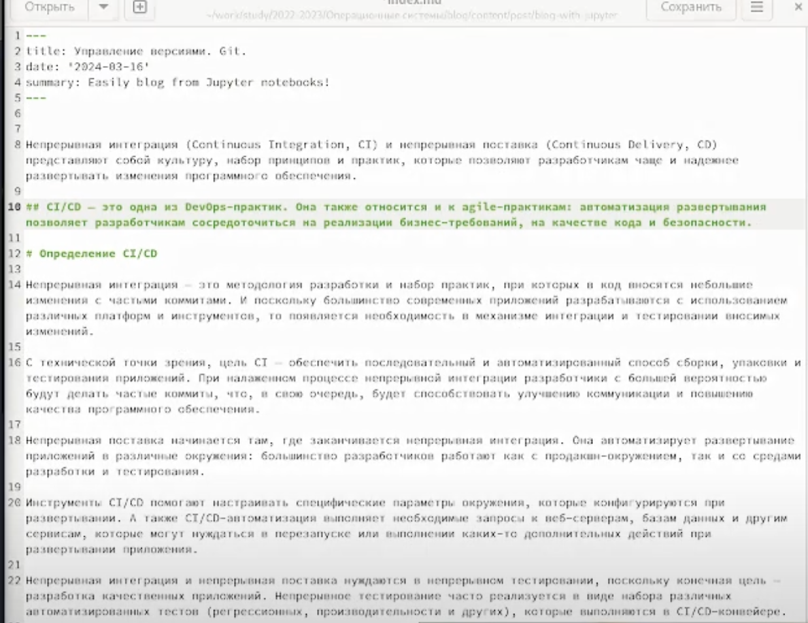

---
## Front matter
lang: ru-RU
title: Отчёт по выполнению личного проекта / Этап 2
subtitle: Jперационные системы
author:
  - Лисенков Е.Р.
institute:
  - Российский университет дружбы народов, Москва, Россия

## i18n babel
babel-lang: russian
babel-otherlangs: english

## Formatting pdf
toc: false
toc-title: Содержание
slide_level: 2
aspectratio: 169
section-titles: true
theme: metropolis
header-includes:
 - \metroset{progressbar=frametitle,sectionpage=progressbar,numbering=fraction}
 - '\makeatletter'
 - '\beamer@ignorenonframefalse'
 - '\makeatother'
---

# Информация

## Докладчик

:::::::::::::: {.columns align=center}
::: {.column width="70%"}

  * Лисенков Егор Романович
  * студент
  * Российский университет дружбы народов
  * [1132232881@rudn.ru](mailto:1132232881@rudn.ru)
  * <https://github.com/erlisenkov>

:::
::: {.column width="30%"}

:::
::::::::::::::

# Вводная часть

# Цель работы

Приобретение практических навыков взаимодействия пользователя с системой посредством командной строки.

# Задание

Добавить к сайту данные о себе.

    Список добавляемых данных.
        Разместить фотографию владельца сайта.
        Разместить краткое описание владельца сайта (Biography).
        Добавить информацию об интересах (Interests).
        Добавить информацию от образовании (Education).
    Сделать пост по прошедшей неделе.
    Добавить пост на тему по выбору:
        Управление версиями. Git.
        Непрерывная интеграция и непрерывное развертывание (CI/CD).

# Выполнение лабораторной работы

# Список добавляемых данных. 

## Размещу фотографию владельца сайта.

Выполню пару действий, которые изменят мой сайт.

{#fig:016 width=100%}

## Размещу краткое описание владельца сайта (Biography).

Изменю код и изменится информация на сайте.

{#fig:016 width=100%}

{#fig:016 width=100%}

## Добавлю информацию об интересах (Interests).

Изменю информацию

{#fig:016 width=100%}

## Добавлю информацию от образовании (Education).

Изменю информацию

{#fig:016 width=100%}

# Сделаю пост по прошедшей неделе.

Изменю информацию

{#fig:016 width=100%}

# Сделаю пост по прошедшей неделе.

{#fig:016 width=100%}

# Добавлю пост: 

    Управление версиями. Git.

    Непрерывная интеграция и непрерывное развертывание (CI/CD).

{#fig:016 width=100%}

# Вывод

Я научился делать сайты и даже их редактировать.
