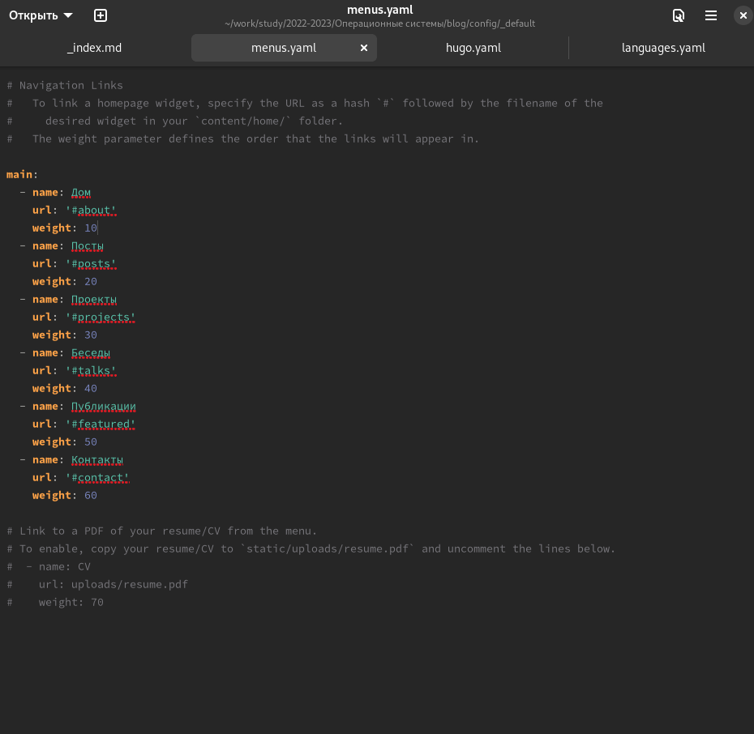
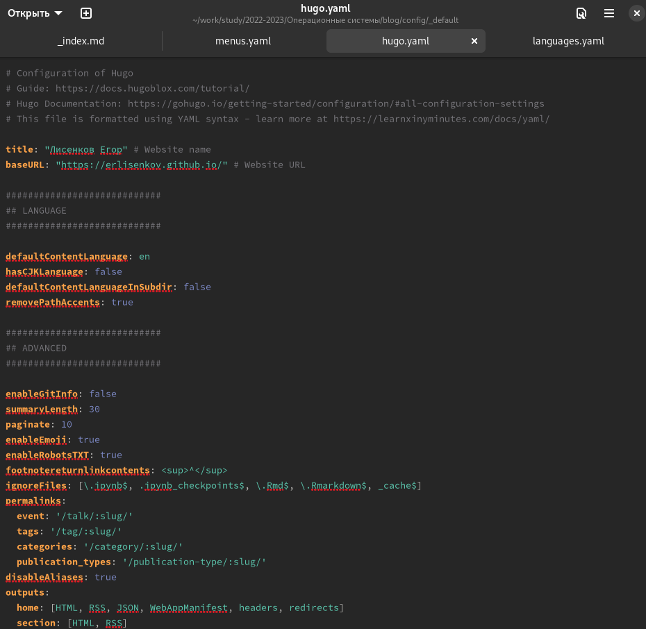
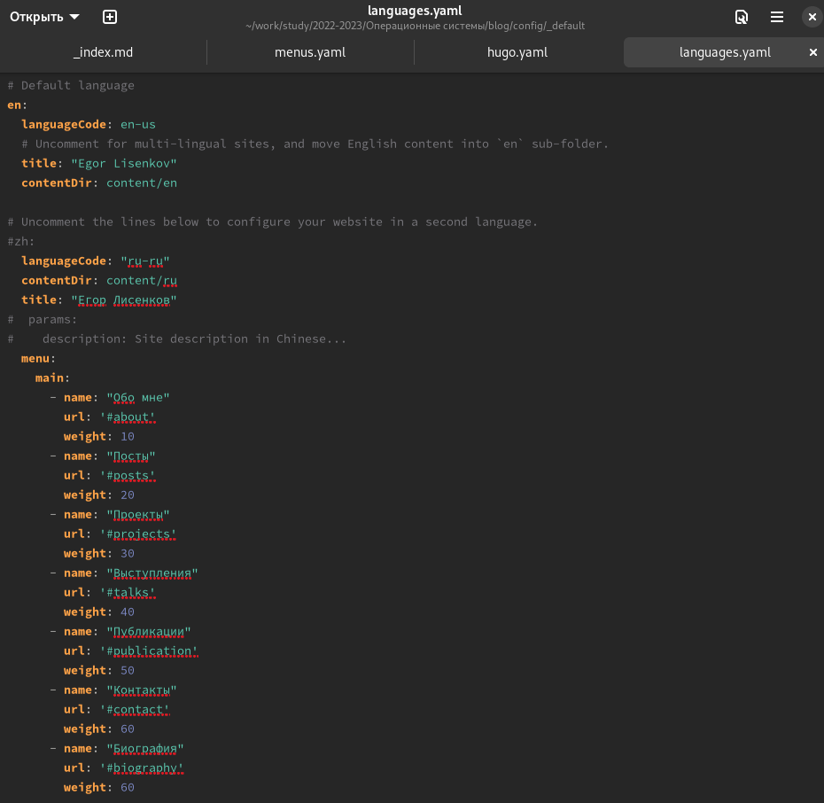
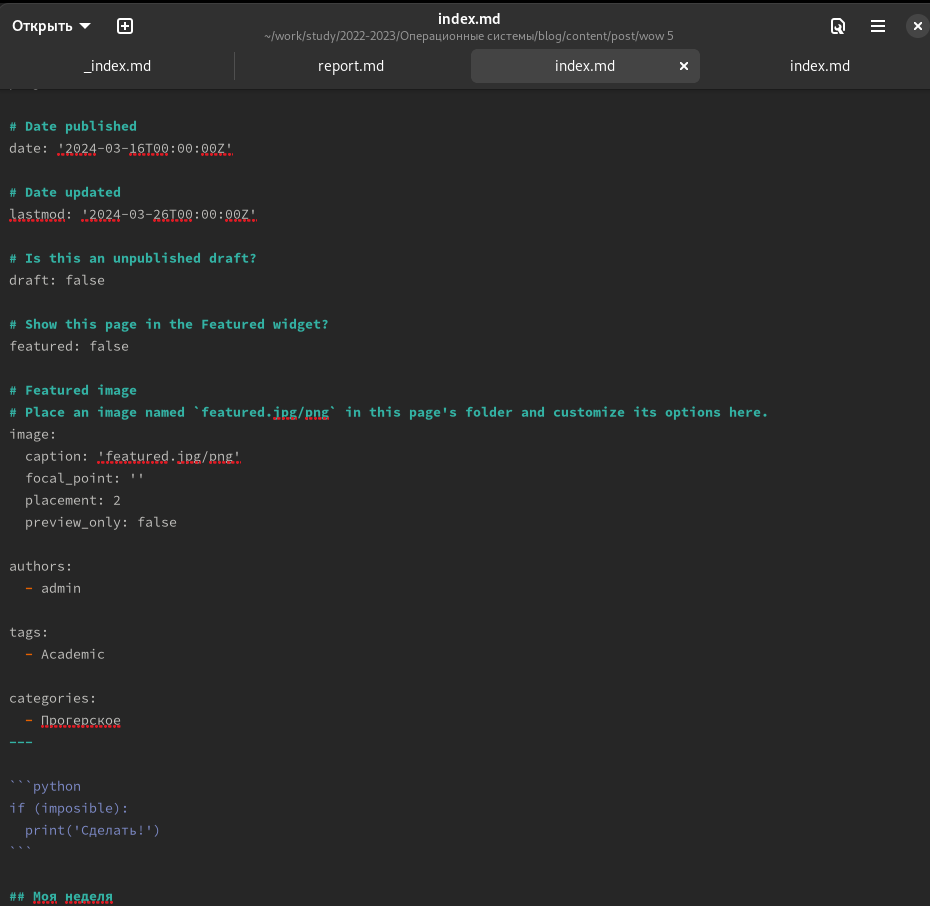
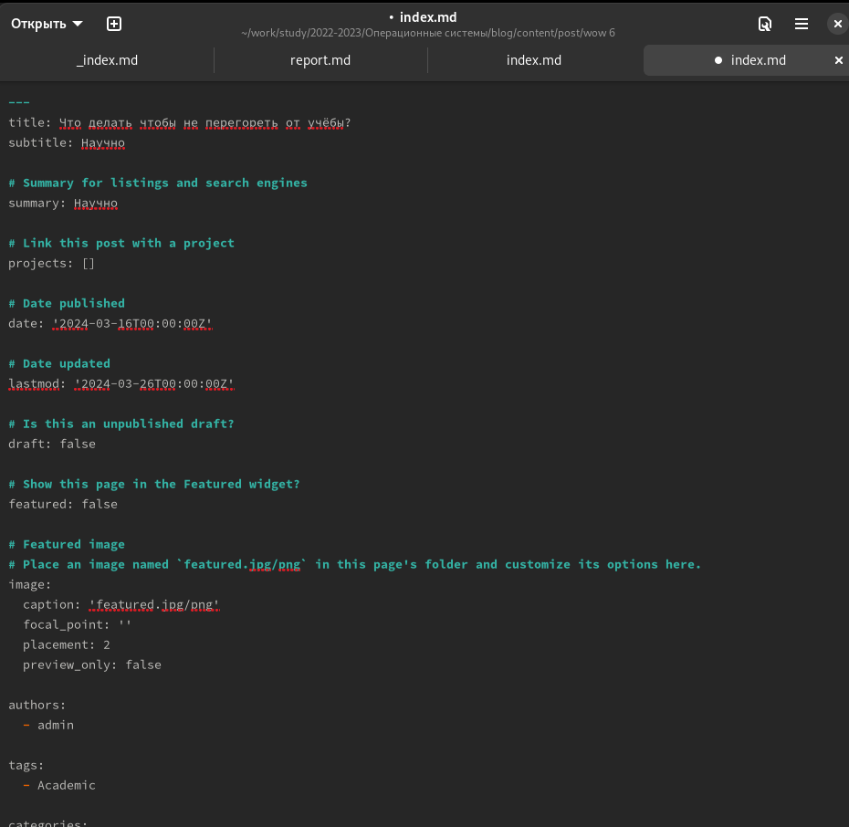

---
## Front matter
lang: ru-RU
title: Отчёт по выполнению личного проекта / Этап 6
subtitle: Oперационные системы
author:
  - Лисенков Е.Р.
institute:
  - Российский университет дружбы народов, Москва, Россия

## i18n babel
babel-lang: russian
babel-otherlangs: english

## Formatting pdf
toc: false
toc-title: Содержание
slide_level: 2
aspectratio: 169
section-titles: true
theme: metropolis
header-includes:
 - \metroset{progressbar=frametitle,sectionpage=progressbar,numbering=fraction}
 - '\makeatletter'
 - '\beamer@ignorenonframefalse'
 - '\makeatother'
---

# Информация

## Докладчик

:::::::::::::: {.columns align=center}
::: {.column width="70%"}

  * Лисенков Егор Романович
  * студент
  * Российский университет дружбы народов
  * [1132232881@rudn.ru](mailto:1132232881@rudn.ru)
  * <https://github.com/erlisenkov>

:::
::: {.column width="30%"}

:::
::::::::::::::

# Цель работы

Приобретение практических навыков взаимодействия пользователя с системой посредством командной строки.

# Задание

Размещение двуязычного сайта на Github.

    Сделать поддержку английского и русского языков.
    Разместить элементы сайта на обоих языках.
    Разместить контент на обоих языках.
    Сделать пост по прошедшей неделе.
    Добавить пост на тему по выбору (на двух языках).

# Выполнение лабораторной работы

# Список добавляемых данных. 

## Редактирую файлы для 2 языков 

Начну редактирование файлов.

{#fig:001 width=100%}

## Файлы

2 файл.

{#fig:002 width=100%}

## Файлы

3 файл.

{#fig:016 width=100%}

## А вот и сам пост о недели

{#fig:016 width=100%}

# Добавить пост на тему как быть на плаву в IT

{#fig:016 width=100%}

# Вывод

У меня есть свой сайт и я умею его редактировать!
